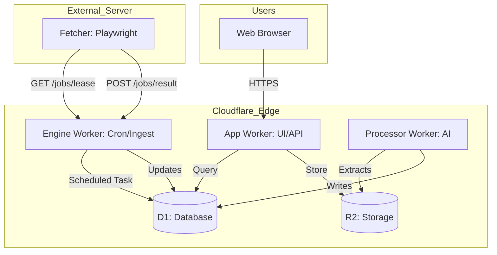
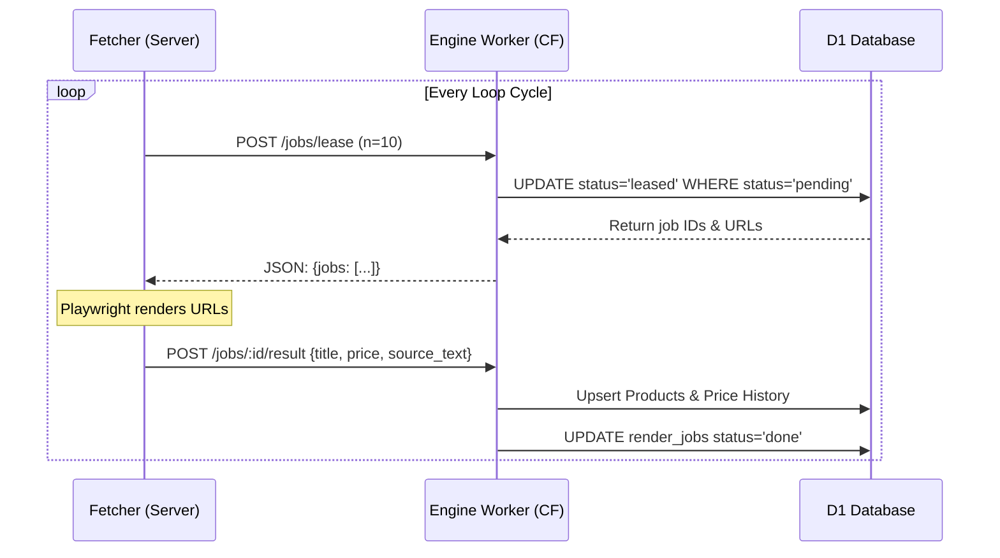

<details>
<summary>Relevant source files</summary>

The following files were used as context for generating this wiki page:

- [README.md](README.md)
- [DESIGN.md](DESIGN.md)
- [PROPOSAL-hopslagen-app.md](PROPOSAL-hopslagen-app.md)
- [infra/schema.sql](infra/schema.sql)
- [engine/src/index.ts](engine/src/index.ts)
- [app/public/app.js](app/public/app.js)
</details>

# Home & Introduction

Product Describer is an AI-powered platform designed to generate Swedish product descriptions, maintain a comprehensive product catalog, and provide financial assistance documentation. Migrated from a Flask/Docker architecture to Cloudflare Workers, the system leverages a "Cloudflare = Brain + Memory, Server = Muscle" philosophy. It utilizes Cloudflare D1 for structured data, R2 for file storage, and Workers for logic, while offloading resource-heavy web rendering to a stateless Playwright fetcher.

The platform serves two primary functions: a professional tool for AI-generated product descriptions via file uploads, and a public-facing catalog for price tracking and social service application support (Ansökningsunderlag). This hybrid approach centralizes data durability in Cloudflare's edge network while maintaining cost-efficiency through the use of free-tier services like D1 and custom lease/ack job queues.

Sources: [README.md:1-12](README.md#L1-L12), [DESIGN.md:20-29](DESIGN.md#L20-L29), [PROPOSAL-hopslagen-app.md:10-15](PROPOSAL-hopslagen-app.md#L10-L15)

## Core Architecture Overview

The system architecture is divided into four distinct Cloudflare Workers and an external "Muscle" server. The transition to Cloudflare ensures that all durable data resides in D1/R2, protecting the system's "memory" even if the rendering hardware fails.

### System Components

| Component | Role | Technologies |
| :--- | :--- | :--- |
| **App Worker** | UI & API: Auth, uploads, catalog, admin panel | Workers, D1, R2 |
| **Processor Worker** | Content Extraction & AI Generation (Queued) | Workers, Queues, AI APIs |
| **Engine Worker** | Catalog Management: Crawl scheduling, Price alerts | Workers, D1, Cron |
| **Fetcher (External)** | Stateless web rendering (Playwright) | Python, Playwright |
| **Token Rotator** | Automated API token maintenance | Workers, Cron |

Sources: [README.md:15-28](README.md#L15-L28), [DESIGN.md:31-48](DESIGN.md#L31-L48)

### High-Level Data Flow

The following diagram illustrates how Cloudflare acts as the central hub for logic and storage, while the external server acts as a worker for the Engine.



The diagram shows the interaction between Cloudflare Workers (App, Engine, Processor), their respective storage backends, and the external stateless Fetcher.
Sources: [DESIGN.md:40-61](DESIGN.md#L40-L61), [README.md:15-30](README.md#L15-L30)

## Key System Domains

### 1. Unified Product Catalog
The system maintains a catalog of approximately 32,000 products. This catalog is populated by the "Muscle" server (Fetcher) which polls the Engine Worker for `render_jobs`. The Fetcher renders URLs using Playwright and returns structured data (titles, prices, source text) to be stored in D1.

*  **Discovery (List Jobs):** Crawls listing pages to find new product URLs.
*  **Enrichment (Detail Jobs):** Fetches individual product pages for deep metadata.
*  **Price History:** Logs price changes over time for tracking and alerts.

Sources: [DESIGN.md:63-75](DESIGN.md#L63-L75), [engine/src/index.ts:153-240](engine/src/index.ts#L153-L240)

### 2. AI Description Engine
The platform supports multi-provider AI generation using Anthropic, OpenAI, Gemini, and Azure OpenAI. Descriptions can be generated in two ways:
*  **Bulk Processing:** Users upload files (CSV, XLSX, PDF, etc.) to the App Worker. The Processor Worker extracts rows and generates descriptions sequentially via Cloudflare Queues.
*  **On-Demand:** Specific catalog items are described when viewed or added to an application, with results cached in D1.

Sources: [README.md:18-23](README.md#L18-L23), [engine/src/index.ts:335-385](engine/src/index.ts#L335-L385)

### 3. Financial Assistance (Bistånd)
A specialized module allows users to search the catalog, add products to a personal list, and write motivations for why they need specific items (e.g., for social service applications). The system then generates a print-ready PDF or HTML document.

Sources: [PROPOSAL-hopslagen-app.md:27-30](PROPOSAL-hopslagen-app.md#L27-L30), [app/src/bistand.ts:133-160](app/src/bistand.ts#L133-L160)

## Technical Implementation Details

### Database Schema (D1)
The system uses a custom `render_jobs` table to implement a lease/ack pattern, avoiding the cost of Cloudflare Queues Paid tier for catalog tasks.

```sql
CREATE TABLE render_jobs (
  id INTEGER PRIMARY KEY,
  url TEXT NOT NULL,
  site_id INTEGER REFERENCES sites(id),
  type TEXT NOT NULL,               -- 'list' | 'detail'
  status TEXT NOT NULL DEFAULT 'pending', -- pending | leased | done | error
  attempts INTEGER NOT NULL DEFAULT 0,
  lease_until INTEGER,
  last_error TEXT,
  created_at INTEGER NOT NULL,
  updated_at INTEGER NOT NULL
);
```

Sources: [infra/schema.sql:108-120](infra/schema.sql#L108-L120), [DESIGN.md:92-108](DESIGN.md#L92-L108)

### Job Leasing Sequence
The Fetcher operates in a pull-based loop to remain stateless and bypass the need for incoming tunnels (e.g., Cloudflare Tunnel).



This sequence shows the stateless pull model where the external server requests work and reports results back to Cloudflare.
Sources: [DESIGN.md:31-39](DESIGN.md#L31-L39), [engine/src/index.ts:79-115](engine/src/index.ts#L79-L115)

## Conclusion
Product Describer (Cloudflare Edition) represents a transition toward a highly resilient, edge-first architecture. By separating the "Brain" (Cloudflare logic and storage) from the "Muscle" (rendering servers), the project achieves high data durability and horizontal scalability for the fetcher component without incurring the typical costs associated with edge-based browser rendering.

Sources: [DESIGN.md:20-29](DESIGN.md#L20-L29), [README.md:1-12](README.md#L1-L12)
