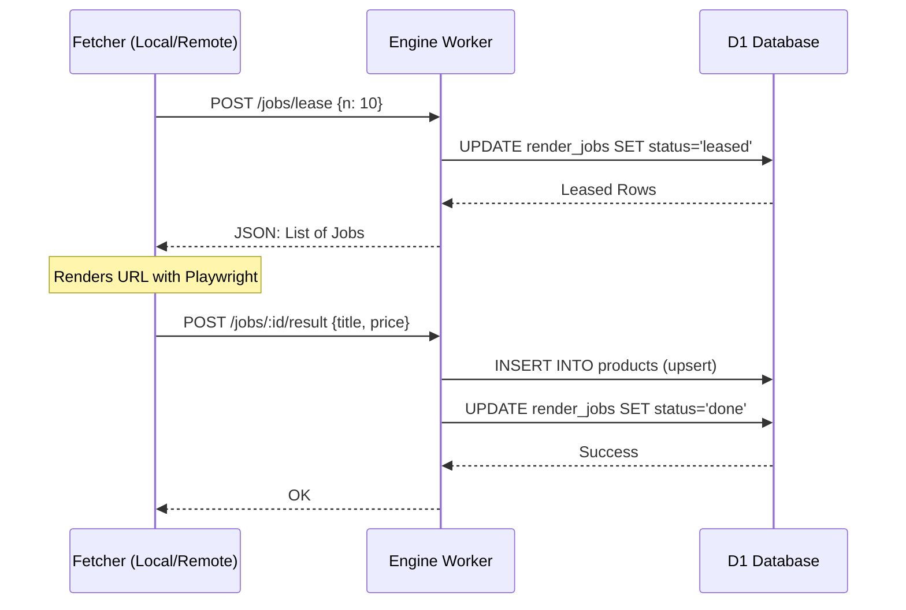

<details>
<summary>Relevant source files</summary>

The following files were used as context for generating this wiki page:

- [README.md](README.md)
- [app/package.json](app/package.json)
- [processor/package.json](processor/package.json)
- [engine/package.json](engine/package.json)
- [infra/schema.sql](infra/schema.sql)
- [SECURITY.md](SECURITY.md)
- [DESIGN.md](DESIGN.md)
</details>

# Local Setup & Development

The local setup and development environment for the Product Describer project is designed to simulate a Cloudflare Workers ecosystem on a local machine. The project is structured as a monorepo containing multiple Workers—`app`, `processor`, and `engine`—that communicate through shared databases (D1) and state. Developing locally requires the use of the Cloudflare Wrangler CLI to manage worker isolates, secrets, and local persistence for D1 and R2 storage.

Sources: [README.md:1-20](README.md#L1-L20), [DESIGN.md:28-45](DESIGN.md#L28-L45)

## Environment Prerequisites

Before initiating the local development environment, the following dependencies and configurations must be in place across the various sub-directories of the repository.

### Dependency Management
Each worker directory contains its own `package.json` and requires independent installation of dependencies.

| Component | Directory | Purpose |
| :--- | :--- | :--- |
| **App** | `app/` | Web UI and API gateway. |
| **Processor** | `processor/` | Background AI processing and file extraction. |
| **Engine** | `engine/` | Catalog logic, crawling, and cron management. |

Sources: [app/package.json](app/package.json), [processor/package.json](processor/package.json), [engine/package.json](engine/package.json), [README.md:30-40](README.md#L30-L40)

### Security & Encryption Keys
A critical requirement for local operation is the `PROVIDER_CONFIG_KEY`. This key is used by the `app` worker to encrypt provider credentials (such as Anthropic or OpenAI keys) and by the `processor` worker to decrypt them for AI calls. This key must be identical across both environments.

To generate a key locally:

```bash
openssl rand -base64 32
```

This value must be placed in a `.dev.vars` file in both `app/` and `processor/` directories.

Sources: [SECURITY.md:13-18](SECURITY.md#L13-L18), [README.md:73-82](README.md#L73-L82)

## Initializing the Local Database

The project uses Cloudflare D1 as its relational database. For local development, you must execute the provided SQL schema against a local D1 instance.

```bash
cd app && npx wrangler d1 execute product_describer --local --file=../infra/schema.sql
```

The schema initializes several critical tables required for the system to function:
*  `accounts`: User management and roles.
*  `products`: The central catalog for scraped and described items.
*  `render_jobs`: A lease/ack based job queue for the fetcher.
*  `bistand_items`: User-specific product lists for social assistance applications.

Sources: [README.md:84-86](README.md#L84-L86), [infra/schema.sql:1-120](infra/schema.sql#L1-L120)

## Running Workers Locally

Wrangler allows running workers in a local dev mode. However, because the system relies on shared state (D1 and R2), the workers must be configured to use the same persistence directory.

### Simulation Architecture
The following diagram illustrates how the local development environment simulates the Cloudflare infrastructure:

```mermaid
graph TD
    subgraph LocalMachine[Local Development Machine]
        W_App[Wrangler Dev: App]
        W_Proc[Wrangler Dev: Processor]
        W_Eng[Wrangler Dev: Engine]
        
        subgraph Persistence[/tmp/pd-state]
            D1[(Local D1 DB)]
            R2[(Local R2 Storage)]
        end
        
        W_App --> D1
        W_App --> R2
        W_Proc --> D1
        W_Proc --> R2
        W_Eng --> D1
    end
    
    Fetcher[External Fetcher] -- API Calls --> W_Eng
```

The diagram shows three Wrangler processes sharing a single persistence directory to maintain data consistency between workers.
Sources: [README.md:88-93](README.md#L88-L93), [DESIGN.md:32-48](DESIGN.md#L32-L48)

### Unified Local Start
To test the interaction between the `app` (which creates jobs) and the `processor` (which consumes them), they must be started together with shared persistence:

```bash
cd app && npx wrangler dev --local --persist-to /tmp/pd-state -c wrangler.jsonc -c ../processor/wrangler.jsonc
```

Note: Wrangler's built-in queue simulation is isolated per process unless persistent state is explicitly shared.

Sources: [README.md:88-93](README.md#L88-L93)

## Local Development Scripts

Each sub-directory contains scripts to facilitate development tasks such as type checking and secret management.

| Command | File Path | Description |
| :--- | :--- | :--- |
| `npm run dev` | `engine/package.json` | Starts the engine worker in remote dev mode. |
| `npm run typecheck` | `engine/package.json` | Runs the TypeScript compiler for validation. |
| `npm run secret:set-provider-key` | `app/package.json` | Interaction with Wrangler to set secrets in the environment. |
| `npm run secret:set-ingest-key` | `engine/package.json` | Sets the API key for the fetcher-to-engine ingestion. |

Sources: [app/package.json:6-10](app/package.json#L6-L10), [engine/package.json:6-10](engine/package.json#L6-L10), [processor/package.json:6-10](processor/package.json#L6-L10)

## Development Workflow: The Muscle & The Brain

The architecture separates the project into the "Brain" (Cloudflare Workers + D1) and the "Muscle" (External Python/Playwright Fetcher). When developing features related to web scraping or product discovery:

1.  **Engine Development:** Modify `engine/src/index.ts` to update job leasing logic or result ingestion.
2.  **Fetcher Testing:** Run a local version of the fetcher (from the parent or related repository) pointed at the local engine endpoint.
3.  **Database Inspection:** Use `wrangler d1` commands to inspect the state of the `render_jobs` table to ensure the lease/ack cycle is functioning.

### Lease/Ack Sequence Diagram
The following sequence shows the interaction that must be verified during local development when working on the scraping engine:



Sources: [DESIGN.md:44-55](DESIGN.md#L44-L55), [engine/src/index.ts:75-150](engine/src/index.ts#L75-L150)

## Summary
Local setup for the Product Describer project requires a coordinated multi-worker approach using Cloudflare Wrangler. By sharing a persistence directory and a unified encryption key, developers can simulate the production environment, including job queues, D1 databases, and R2 bucket interactions, ensuring that cross-worker logic (like the App-to-Processor queue chain) is fully functional before deployment.
