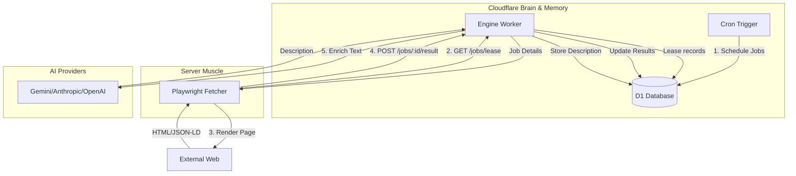

Relevant source files

The following files were used as context for generating this wiki page:

- [README.md](README.md)
- [DESIGN.md](DESIGN.md)
- [PROPOSAL-hopslagen-app.md](PROPOSAL-hopslagen-app.md)
- [infra/schema.sql](infra/schema.sql)
- [engine/src/index.ts](engine/src/index.ts)

# Migration from Flask & Docker

## Introduction

The project has undergone a significant architectural shift, migrating from a traditional Flask and Docker-based infrastructure to a serverless model primarily hosted on Cloudflare Workers. The original system relied on a local server running a Playwright-based scraper and a PostgreSQL database as the single source of truth. Following hardware failures and reliability issues, the design was overhauled to move the "brain and memory" to Cloudflare, while relegating the server to an interchangeable "muscle" role for rendering.

Sources: [DESIGN.md:1-24](DESIGN.md#L1-L24), [README.md:1-15](README.md#L1-L15)

## Architectural Evolution

The migration follows the principle: **Cloudflare = Brain + Memory, Server = Muscle**. All durable data and logic reside in Cloudflare D1 (SQL), R2 (Storage), and Workers. The local server no longer maintains state; it runs a stateless Playwright fetcher that renders pages on demand and polls Cloudflare for jobs.

### Component Comparison

| Feature | Old Architecture (Flask/Docker) | New Architecture (Cloudflare) |
| :--- | :--- | :--- |
| **Backend Framework** | Flask (Python) | Cloudflare Workers (TypeScript) |
| **Database** | PostgreSQL | Cloudflare D1 (SQLite-compatible) |
| **File Storage** | Local Filesystem | Cloudflare R2 |
| **Queue System** | Background Threads / Executor | D1-based Lease/Ack or Cloudflare Queues |
| **Task Scheduling** | Local Cron / Loops | Cloudflare Cron Triggers |
| **Crawl Logic** | Server-side Push | Fetcher-side Pull |

Sources: [DESIGN.md:26-34](DESIGN.md#L26-L34), [README.md:5-18](README.md#L5-L18)

### System Data Flow

The diagram below illustrates the pull-based communication between the stateless server muscle and the Cloudflare brain.

The fetcher polls for jobs via the `lease` endpoint, executes rendering, and posts results back to Cloudflare. 
Sources: [DESIGN.md:36-74](DESIGN.md#L36-L74), [engine/src/index.ts:16-30](engine/src/index.ts#L16-L30)

## Key Migration Modules

### 1. D1 Database Migration
The PostgreSQL database was replaced by Cloudflare D1. The schema was redesigned to handle job leasing and state management natively.

*  **Lease/Ack Pattern:** Instead of persistent queues (which require Workers Paid), a `render_jobs` table handles task distribution via a status-based lease system.
*  **Centralized Truth:** Catalog data, source text, AI descriptions, and price history are all consolidated into D1 tables.

Sources: [DESIGN.md:76-100](DESIGN.md#L76-L100), [infra/schema.sql:57-118](infra/schema.sql#L57-L118)

### 2. The Engine Worker (Cron & Ingest)
The `engine/` worker replaces the original `scraper.py` loop and `sync` cron. It utilizes a single Cron Trigger (`*/5 * * * *`) to perform multiple sequential tasks:
1.  **reclaimExpiredLeases()**: Resets jobs that exceeded their lease time to `pending`.
2.  **scheduleDueCrawls()**: Identifies sites needing new crawls based on `scrape_interval`.
3.  **describeMissing()**: Uses AI (Gemini/Haiku) to generate descriptions for products with extracted source text.

Sources: [DESIGN.md:108-124](DESIGN.md#L108-L124), [engine/src/index.ts:311-350](engine/src/index.ts#L311-L350)

### 3. Stateless Playwright Fetcher
Everything remaining on the server was condensed into a small Python/Playwright process.
*  **Pull Mechanism:** It uses `GET /jobs/lease` to receive work.
*  **Result Reporting:** It uses `POST /jobs/:id/result` to submit extracted data.
*  **No Database:** The fetcher has no local DB or incoming routes; it only needs outgoing HTTPS.

Sources: [DESIGN.md:65-74](DESIGN.md#L65-L74), [engine/src/index.ts:80-137](engine/src/index.ts#L80-L137)

## Implementation Details

### API Contract (Engine Worker)
The Engine worker exposes internal endpoints protected by `X-API-Key`.

| Endpoint | Method | Purpose |
| :--- | :--- | :--- |
| `/jobs/lease` | POST | Fetcher claims N jobs for processing. |
| `/jobs/:id/result` | POST | Fetcher returns rendered content or errors. |
| `/describe` | POST | On-demand description generation/caching. |
| `/ingest` | POST | Bulk upsert for migration or list crawl results. |

Sources: [engine/src/index.ts:139-310](engine/src/index.ts#L139-L310)

### Configuration & Secrets
Environment variables and secrets were migrated from `.env` files to Wrangler secrets.
*  **PROVIDER_CONFIG_KEY**: Used for AES-GCM encryption of user-specific AI keys in D1.
*  **INGEST_API_KEY**: Secures communication between the fetcher and the Engine worker.
*  **AI API Keys**: Stored as secrets for the Engine and Processor workers.

Sources: [README.md:62-79](README.md#L62-L79), [engine/src/index.ts:35-50](engine/src/index.ts#L35-L50)

## Migration Roadmap

The migration was planned in six phases to ensure continuity:

1.  **Phase 1 (Fundamentals):** Establish D1 tables and lease/result endpoints.
2.  **Phase 2 (Fetcher):** Build the new Playwright pull-loop fetcher.
3.  **Phase 3 (Migration):** Export PostgreSQL data to NDJSON and import into D1.
4.  **Phase 4 (Cron):** Move scheduling and description loops to Workers-cron.
5.  **Phase 5 (Alerts & UI):** Implement price watching and the unified catalog UI.
6.  **Phase 6 (Decommissioning):** Retire local PostgreSQL and legacy scraper-API.

Sources: [DESIGN.md:135-144](DESIGN.md#L135-L144), [PROPOSAL-hopslagen-app.md:75-80](PROPOSAL-hopslagen-app.md#L75-L80)

## Conclusion

The transition from Flask/Docker to Cloudflare Workers transforms the system into a resilient, event-driven architecture. By moving logic and data to the edge, the project eliminates risks associated with local hardware failure. The resulting infrastructure is cost-effective, using Cloudflare's free tier resources (D1, Workers, R2) to replace dedicated server components while maintaining performance.

Sources: [DESIGN.md:126-133](DESIGN.md#L126-L133), [README.md:1-25](README.md#L1-L25)
