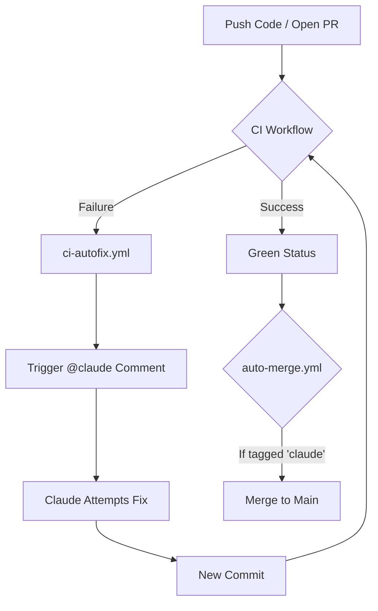
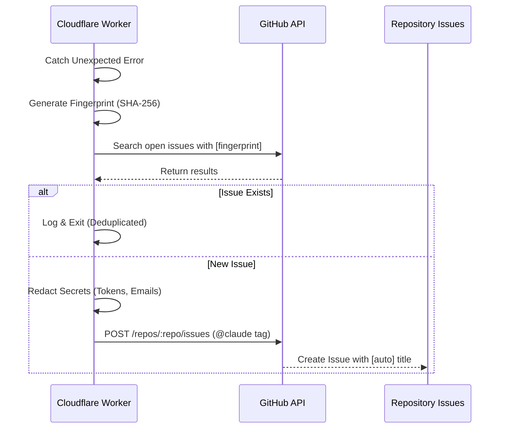

Relevant source files

The following files were used as context for generating this wiki page:

- [guldstandard.md](guldstandard.md)
- [shared/github-report.ts](shared/github-report.ts)
- [README.md](README.md)
- [engine/src/index.ts](engine/src/index.ts)
- [SECURITY.md](SECURITY.md)

# GitHub Workflows & Standards

This page defines the automated workflows, repository configuration standards, and reporting protocols used within the `product-describer-cloudflare` project. It serves as a technical reference for maintaining consistency across the repository's CI/CD pipelines and administrative settings.

The project adheres to a "Gold Standard" (Guldstandard) for repository setup, emphasizing automation for code fixing, dependency management, and error reporting. This ensures that the system remains robust while operating within the Cloudflare Workers environment.

## Workflow Automation

The project utilizes a suite of GitHub Actions to automate routine tasks, ranging from code quality checks to automated releases.

### Standard Workflows
The following table describes the standard workflows implemented or recommended for the repository:

| Workflow File | Purpose | Key Details |
| :--- | :--- | :--- |
| `claude.yml` | AI Automation | Handles PRs or issues tagged for Claude Code. |
| `auto-merge.yml` | Automated Merging | Merges PRs from `dependabot`, `security-autofix`, or tagged with `claude`. |
| `ci-autofix.yml` | CI Failure Recovery | Triggers `@claude` comments to fix code when the "CI" workflow fails. |
| `auto-release.yml` | Semantic Versioning | Automates tagging (e.g., `vX.Y.Z`) based on conventional commits. |
| `dependency-review.yml`| Security | Blocks PRs introducing high-severity vulnerable dependencies. |
| `ci.yml` | Testing & Validation | Repository-specific; typically runs type-checking and matrix tests for Workers. |

Sources: [guldstandard.md:7-22](guldstandard.md#L7-L22), [README.md:37-43](README.md#L37-L43)

### Workflow Interaction Flow
The following diagram illustrates how the CI failure and auto-fix mechanism interacts with the repository:

This "auto-fix-until-green" mechanism is a core component of the repository's automation strategy.
Sources: [guldstandard.md:12-14](guldstandard.md#L12-L14)

## Automated Error Reporting

The project features a specialized reporting system that converts runtime errors into GitHub Issues. This allows the automated workflows (specifically `claude.yml`) to respond to production failures.

### Logic and Sanitization
The `reportErrorToGitHub` function in `shared/github-report.ts` manages the lifecycle of an error report. To prevent sensitive data leakage, the system applies strict redaction rules before posting to GitHub.

- **Deduplication**: Errors are fingerprinted using a SHA-256 hash of the error name and the first line of the stack trace. The system searches for existing open issues with the same fingerprint to avoid duplicates.
- **Redaction**: Patterns matching emails, home paths, and security tokens (e.g., `sk-`, `ghp_`, `Bearer`) are replaced with `[REDACTED]`.

Sources: [shared/github-report.ts:25-70](shared/github-report.ts#L25-L70)

### Error Reporting Sequence

Sources: [shared/github-report.ts:72-120](shared/github-report.ts#L72-L120), [README.md:46-56](README.md#L46-L56)

## Repository Standards & Settings

The project enforces specific repository-level configurations via the GitHub API to ensure security and branch integrity.

### Branch Protection Rules
Protection is applied to the `main` branch using GitHub Rulesets rather than legacy protection:
- **Restriction**: Deletions and non-fast-forward pushes are prohibited.
- **Reviews**: Required approving reviews can be set to 0, as CI and CodeRabbit are considered sufficient for automated PRs.
- **Status Checks**: Must include all repository-specific check names (e.g., CodeQL, specific Worker type-checks).

Sources: [guldstandard.md:41-47](guldstandard.md#L41-L47)

### Labeling Convention
Standard GitHub labels are augmented with project-specific tags to facilitate automation:

| Label | Usage |
| :--- | :--- |
| `claude` | Identifies PRs created or fixed by AI; eligible for auto-merge once CI is green. |
| `dependencies` | Used for automated dependency updates (Renovate/Dependabot). |
| `auto-reported` | Applied to issues created by the application's internal error reporter. |
| `app` / `engine` | Used for directory-based auto-labeling via `labeler.yml`. |

Sources: [guldstandard.md:50-54](guldstandard.md#L50-L54), [shared/github-report.ts:114](shared/github-report.ts#L114)

## Security Standards

The repository maintains a strict security policy centered on the principle that Cloudflare holds the "brain and memory" while servers act as "muscles."

- **Credential Management**: No keys or tokens are ever committed. The project uses Wrangler secrets for `PROVIDER_CONFIG_KEY` and various AI provider keys.
- **Vulnerability Reporting**: Confidential reporting is required via GitHub's private reporting feature rather than public issues.
- **Data Protection**: Provider configuration is stored encrypted, and raw credentials must never be logged or echoed.

Sources: [SECURITY.md:1-21](SECURITY.md#L1-L21), [DESIGN.md:10-15](DESIGN.md#L10-L15)

## Technical Summary

GitHub Workflows and Standards in this project create a self-healing environment. By integrating automated CI fixing via `ci-autofix.yml`, automated error reporting via `shared/github-report.ts`, and strict branch protection, the project minimizes manual intervention. This architecture supports the transition of logic to Cloudflare Workers while maintaining high standards for code quality and security.
