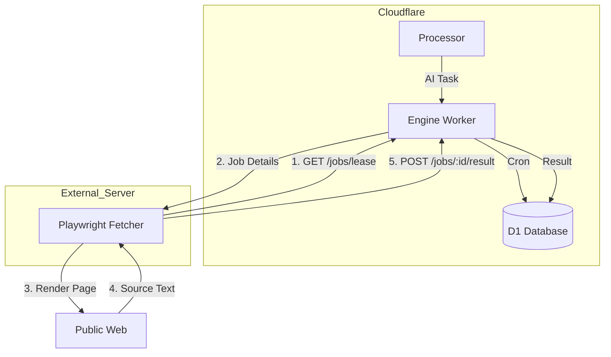
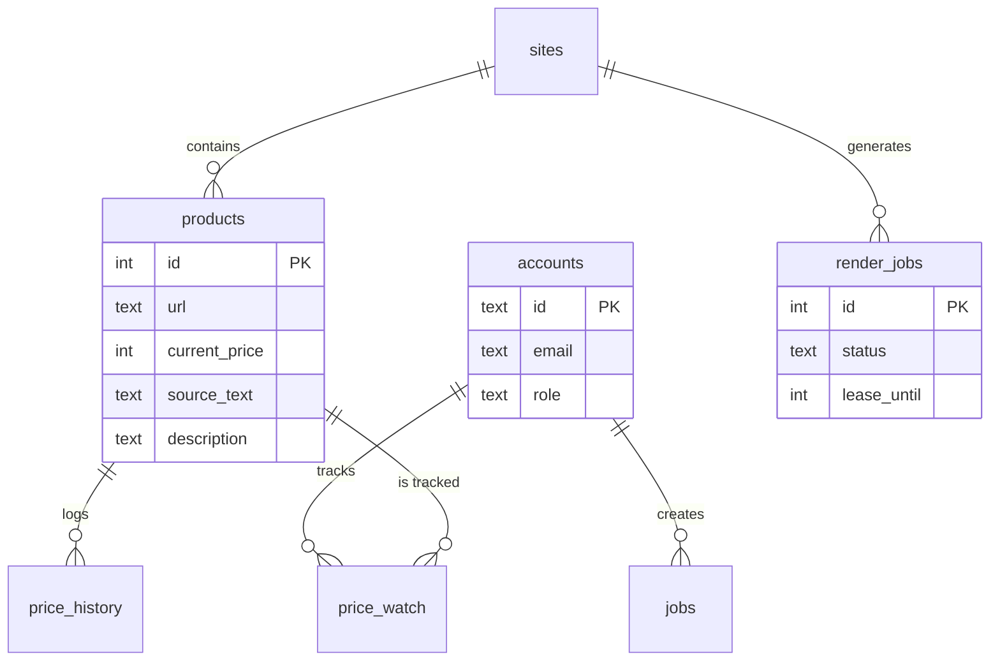

Relevant source files

The following files were used as context for generating this wiki page:

- [README.md](README.md)
- [DESIGN.md](DESIGN.md)
- [PROPOSAL-hopslagen-app.md](PROPOSAL-hopslagen-app.md)
- [infra/schema.sql](infra/schema.sql)
- [engine/src/index.ts](engine/src/index.ts)
- [app/public/index.html](app/public/index.html)
- [app/public/app.js](app/public/app.js)

# Home & Introduction

Product Describer is a technical migration of the original Flask/Docker-based system to a unified Cloudflare Workers-centric architecture. The project serves two primary purposes: generating high-quality Swedish product descriptions using AI (Anthropic, OpenAI, Gemini, Azure OpenAI) and providing a suite of consumer-facing tools including a public product catalog, price tracking, and social service application support.

The system transition centers on the principle that Cloudflare acts as the "Brain and Memory" (D1/Workers/R2), while an external server acts as a "Disposable Muscle" for headless browser rendering via Playwright. This architecture ensures high durability for data—stored in D1 and R2—while minimizing operational costs by leveraging Cloudflare's free tier resources.
Sources: [README.md:1-20](README.md#L1-L20), [DESIGN.md:9-25](DESIGN.md#L9-L25), [PROPOSAL-hopslagen-app.md:7-15](PROPOSAL-hopslagen-app.md#L7-L15)

## System Architecture

The project is structured into four primary Cloudflare Workers and a stateless external fetcher. This architecture uses a "pull" rather than "push" model, where the external fetcher polls the Cloudflare `engine` for jobs.

### Component Overview

| Component | Role | Technology |
| :--- | :--- | :--- |
| **App Worker** | UI, API, Authentication, Catalog access | Workers, D1, R2, KV |
| **Processor Worker** | Queue consumer for heavy AI processing | Workers, Queues |
| **Engine Worker** | Scheduling, Cron triggers, Crawler API | Workers, D1 |
| **Fetcher** | Playwright-based page rendering | Python/Playwright (External) |
| **Token Rotator** | Automated API token management | Workers, Cron |

Sources: [README.md:22-40](README.md#L22-L40), [DESIGN.md:27-50](DESIGN.md#L27-L50)

### Core Data Flow

The diagram below illustrates how jobs are scheduled by the Engine, leased by the Fetcher, and eventually processed by the AI engine.

This diagram shows the "Lease/Ack" pattern used to replace Cloudflare Queues for job distribution to ensure free-tier compatibility.
Sources: [DESIGN.md:30-45](DESIGN.md#L30-L45), [engine/src/index.ts:75-100](engine/src/index.ts#L75-L100)

## Functional Modules

The application is divided into several "Departments" managed through a unified interface.

### 1. Product Catalog & Price Tracking
The system maintains a catalog of approximately 32,000 products. The `engine` worker runs a Cron trigger every 5 minutes to identify price drops. Users can subscribe to alerts via channels like Slack, Telegram, or Webhooks.
Sources: [PROPOSAL-hopslagen-app.md:46-60](PROPOSAL-hopslagen-app.md#L46-L60), [engine/src/index.ts:515-535](engine/src/index.ts#L515-L535)

### 2. AI Description Tools
Users provide their own AI API keys to generate descriptions for files (CSV, XLSX, PDF, DOCX). The system supports different tones (factual, enthusiastic, humorous, luxury) and lengths.
Sources: [app/public/index.html:84-115](app/public/index.html#L84-L115), [README.md:25-30](README.md#L25-L30)

### 3. Social Service Application (Bistånds-underlag)
A specialized tool for creating printable PDFs for social service applications. Users select products from the catalog, add personal motivations, and generate a formatted document.
Sources: [app/src/bistand.ts:150-180](app/src/bistand.ts#L150-L180), [PROPOSAL-hopslagen-app.md:40-45](PROPOSAL-hopslagen-app.md#L40-L45)

## Data Model & Schema

The system uses Cloudflare D1 (SQLite) as the single source of truth, replacing the legacy PostgreSQL setup.

This diagram represents the core entities in the `infra/schema.sql` file.
Sources: [infra/schema.sql:1-125](infra/schema.sql#L1-L125), [DESIGN.md:95-120](DESIGN.md#L95-L120)

## Security & Environment

Security is managed through Wrangler secrets and Cloudflare's infrastructure.
- **Provider Encryption**: AI API keys are stored in D1 as AES-GCM encrypted blobs.
- **Access Control**: The system uses a mix of role-based access (`admin` vs `user`) and OAuth (Google/Microsoft).
- **GitHub Integration**: Critical errors in the `processor` or `engine` workers are automatically reported as GitHub Issues.

Sources: [SECURITY.md:15-22](SECURITY.md#L15-L22), [README.md:47-58](README.md#L47-L58), [infra/schema.sql:31-40](infra/schema.sql#L31-L40)

## Conclusion
Product Describer Cloudflare is a robust, serverless-first re-architecture of a product metadata platform. By moving scheduling and data storage to Cloudflare's edge and utilizing a stateless rendering "muscle," the project achieves high availability and low operating costs while providing AI-driven content generation and market monitoring.
