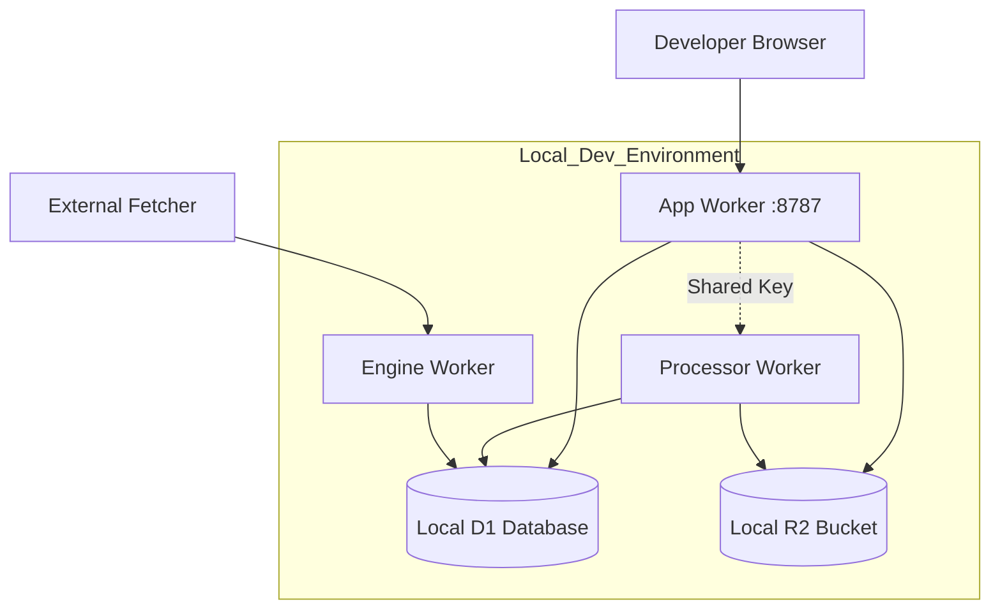

<details>
<summary>Relevant source files</summary>

The following files were used as context for generating this wiki page:

- [README.md](README.md)
- [app/package.json](app/package.json)
- [engine/package.json](engine/package.json)
- [processor/package.json](processor/package.json)
- [infra/schema.sql](infra/schema.sql)
- [SECURITY.md](SECURITY.md)
</details>

# Local Setup & Development

Local development of the Product Describer Cloudflare version involves simulating a multi-worker environment using Cloudflare's Wrangler CLI. The project is structured as a monorepo containing multiple Workers that handle the UI, file processing, and the product catalog engine.

The local environment requires a shared encryption key and a local D1 database instance to ensure that the `app` worker can encrypt provider credentials that the `processor` worker can subsequently decrypt.

Sources: [README.md:1-25](README.md#L1-L25), [README.md:88-95](README.md#L88-L95)

## Prerequisites & Environment Configuration

Before starting the development servers, dependencies must be installed in each worker directory, and environment variables must be configured. A critical component is the `PROVIDER_CONFIG_KEY`, which must be identical across the `app` and `processor` services.

### Essential Environment Variables
| Variable | Purpose | Security Requirement |
| --- | --- | --- |
| `PROVIDER_CONFIG_KEY` | Symmetric key for encrypting/decrypting AI provider keys | Must match between `app/` and `processor/` |
| `INGEST_API_KEY` | Authentication for the engine's ingestion and lease endpoints | Used by the external fetcher |
| `GITHUB_ERROR_REPORT_TOKEN` | Enables automated error reporting to GitHub | Optional for local dev |

Sources: [SECURITY.md:14-18](SECURITY.md#L14-L18), [README.md:104-106](README.md#L104-L106), [engine/package.json:7](engine/package.json#L7)

### Initial Setup Commands

```bash
# Install dependencies for each component
cd app && npm install
cd ../processor && npm install
cd ../engine && npm install

# Generate the shared provider config key
openssl rand -base64 32
```

Sources: [README.md:88-92](README.md#L88-L92), [app/package.json:6-12](app/package.json#L6-L12), [processor/package.json:6-11](processor/package.json#L6-L11)

## Database Initialization

The project uses Cloudflare D1 for persistent storage. For local development, the schema must be applied to a local D1 instance.

```bash
cd app && npx wrangler d1 execute product_describer --local --file=../infra/schema.sql
```

Sources: [README.md:97-99](README.md#L97-L99), [infra/schema.sql](infra/schema.sql)

### Local Data Flow Architecture
The following diagram illustrates how the different workers interact with shared local resources during development.



The diagram shows the interaction between the App, Processor, and Engine workers with local D1 and R2 resources.
Sources: [README.md:12-45](README.md#L12-L45), [README.md:101-102](README.md#L101-L102)

## Running Workers Locally

Individual workers can be started using standard Wrangler commands, but specific steps are required to test the interaction between the `app` and `processor` workers due to limitations in Wrangler's default queue simulation.

### Standard Worker Execution
| Component | Command | Port (Default) |
| --- | --- | --- |
| **App** | `npm run dev` | 8787 |
| **Processor** | `npm run dev` | Random / Assigned |
| **Engine** | `npm run dev` | Random / Assigned |

Sources: [app/package.json:7](app/package.json#L7), [processor/package.json:7](processor/package.json#L7), [engine/package.json:7](engine/package.json#L7)

### Integrated Multi-Worker Testing
To test the queue-based interaction between file uploads in the `app` and extraction in the `processor`, both configurations must be passed to a single Wrangler instance pointing to a shared persistence directory.

```bash
cd app && npx wrangler dev --local --persist-to /tmp/pd-state -c wrangler.jsonc -c ../processor/wrangler.jsonc
```

Sources: [README.md:101-102](README.md#L101-L102)

## Development Workflow: Feature Modules

The repository is divided into specific functional areas that developers may focus on during local setup:

### 1. Web UI & API (app/)
Handles authentication (including Google/Microsoft OAuth), settings, and file uploads. It places extraction tasks into the Cloudflare Queue.
Sources: [README.md:21-25](README.md#L21-L25), [infra/schema.sql:5-24](infra/schema.sql#L5-L24)

### 2. Queue Consumer (processor/)
Processes CSV, XLSX, TXT, DOCX, and PDF files. It performs row-by-row AI description generation using the shared encryption key to access provider credentials stored in D1.
Sources: [README.md:26-30](README.md#L26-L30), [processor/package.json:13-17](processor/package.json#L13-L17)

### 3. Catalog Engine (engine/)
Drivers the crawl discovery logic and scheduled tasks. It provides HTTP endpoints (`/jobs/lease`, `/jobs/:id/result`) for the external Playwright fetcher.
Sources: [README.md:31-35](README.md#L31-L35), [infra/schema.sql:100-112](infra/schema.sql#L100-L112)

## Conclusion
Local development of the Product Describer project requires a coordinated setup of environment variables and a shared D1 state. By utilizing the integrated `wrangler dev` command with multiple configuration files, developers can simulate the production queue environment locally to verify the end-to-end flow from file upload to AI-generated product descriptions.
