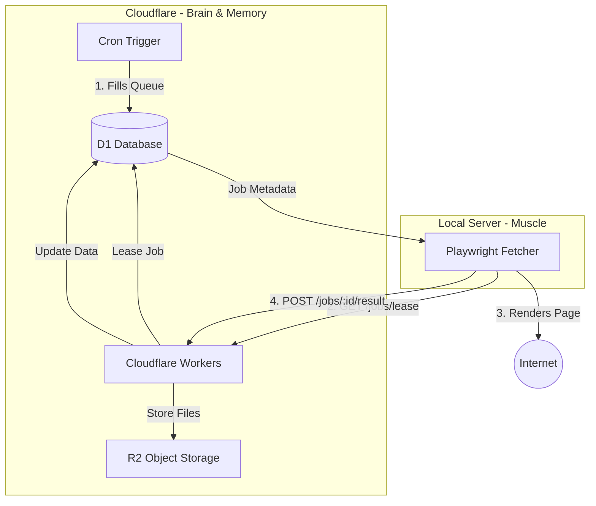

<details>
<summary>Relevant source files</summary>

The following files were used as context for generating this wiki page:

- [DESIGN.md](DESIGN.md)
- [README.md](README.md)
- [PROPOSAL-hopslagen-app.md](PROPOSAL-hopslagen-app.md)
- [engine/src/index.ts](engine/src/index.ts)
- [infra/schema.sql](infra/schema.sql)
</details>

# Migration from Flask & Docker

The migration of the Product Describer system represents a architectural shift from a localized Flask and Docker-based infrastructure to a serverless architecture powered by Cloudflare Workers, D1, and R2. The primary objective is to move the "brain and memory" (logic and data storage) to Cloudflare's edge while reducing the local server to a "stateless muscle" responsible only for resource-intensive web rendering.

This migration addresses critical reliability issues identified with previous local server hardware (specifically USB disk failures causing data loss) and aims to achieve a zero-added-cost operational model by leveraging Cloudflare's free tier resources.

Sources: [DESIGN.md:5-23](DESIGN.md#L5-L23), [README.md:1-15](README.md#L1-L15)

## Architectural Shift: Brain vs. Muscle

The new design follows the principle that Cloudflare acts as the persistent brain and memory, while the local server becomes an interchangeable muscle. All durable data and logic reside in Cloudflare D1 (SQL), Workers (Logic), and R2 (Storage). The server retains only a stateless Playwright fetcher that renders pages on demand. If the server fails, no data is lost, and the "muscle" can be redeployed in minutes.

Sources: [DESIGN.md:25-31](DESIGN.md#L25-L31)

### Comparison of Architectures

| Component | Old Architecture (Flask/Docker) | New Architecture (Cloudflare) |
| :--- | :--- | :--- |
| **Backend Framework** | Flask (Python) | Cloudflare Workers (TypeScript) |
| **Database** | PostgreSQL / SQLite (disk) | Cloudflare D1 |
| **File Storage** | Local Filesystem | Cloudflare R2 |
| **Job Queue** | ThreadPoolExecutor / Background Threads | Cloudflare Queues / D1 `render_jobs` table |
| **Scraper Trigger** | Local cron / Loops | Cloudflare Cron Triggers |
| **Rendering** | Local Playwright (Server-bound) | Stateless Playwright Fetcher (Remote-bound) |

Sources: [README.md:5-15](README.md#L5-L15), [DESIGN.md:33-40](DESIGN.md#L33-L40)

## Component Migration

### 1. Data Persistence (Postgres to D1)
The PostgreSQL instance, which previously served as the source of truth for ~32k products, price history, and descriptions, is retired in favor of Cloudflare D1. The migration involves exporting data to NDJSON and importing it via the Wrangler CLI.

```sql
CREATE TABLE products (
  id INTEGER PRIMARY KEY,
  url TEXT UNIQUE NOT NULL,
  site_id INTEGER REFERENCES sites(id),
  title TEXT,
  current_price INTEGER,
  source_text TEXT,
  category TEXT,
  description TEXT,
  last_updated INTEGER NOT NULL
);
```

Sources: [DESIGN.md:55-75](DESIGN.md#L55-L75), [infra/schema.sql:58-75](infra/schema.sql#L58-L75)

### 2. Job Handling (Push to Pull Model)
The previous architecture pushed jobs to the scraper. The new model uses a **Pull approach** where the local Fetcher polls Cloudflare for rendering jobs. This eliminates the need for incoming routes or Cloudflare Tunnels (e.g., `scraper-api.denied.se`).

#### Rendering Job Lifecycle
1.  **Lease**: Fetcher requests N jobs via `POST /jobs/lease`.
2.  **Execute**: Fetcher renders URLs using Playwright and extracts data.
3.  **Result**: Fetcher posts data back via `POST /jobs/:id/result`.

Sources: [DESIGN.md:33-40](DESIGN.md#L33-L40), [engine/src/index.ts:79-140](engine/src/index.ts#L79-L140)

### 3. Logic & Scheduling (Cron Triggers)
A single Cloudflare Cron Trigger (`*/5 * * * *`) replaces multiple local scripts. This handler performs sequence tasks:
*  `reclaimExpiredLeases()`: Recovers jobs from failed fetchers.
*  `scheduleDueCrawls()`: Initiates new site crawls.
*  `describeMissing()`: Triggers AI generation for products lacking descriptions.

Sources: [DESIGN.md:94-110](DESIGN.md#L94-L110), [engine/src/index.ts:505-520](engine/src/index.ts#L505-L520)

## Data Flow Diagram

The following diagram illustrates the interaction between the Cloudflare "Brain" and the Server "Muscle" under the new architecture.



This diagram shows the pull-based communication where the server initiates requests to the Cloudflare-hosted logic.
Sources: [DESIGN.md:42-53](DESIGN.md#L42-L53), [engine/src/index.ts:21-45](engine/src/index.ts#L21-L45)

## Security and Access Migration

The migration also involves a change in the security model. Previously, the application was hidden behind **Cloudflare Access**. In the new architecture, it transitions to **Application-based Accounts**:
*  **OAuth**: Integration with Google, Microsoft, and Apple.
*  **Roles**: Differentiation between `user` and `admin` roles within the application logic rather than at the network perimeter.
*  **Encrypted Config**: Provider API keys (Anthropic, OpenAI, etc.) are stored as AES-GCM encrypted blobs in D1, managed via a `PROVIDER_CONFIG_KEY` secret.

Sources: [PROPOSAL-hopslagen-app.md:18-35](PROPOSAL-hopslagen-app.md#L18-L35), [infra/schema.sql:31-38](infra/schema.sql#L31-L38)

## Migration Phases

The migration is executed in six additive phases to ensure stability:

| Phase | Title | Description |
| :--- | :--- | :--- |
| **1** | Foundation | Deployment of D1 tables and basic lease/result endpoints. |
| **2** | Fetcher | Introduction of the Playwright pull-loop to replace old scraper scripts. |
| **3** | Migration | Bulk transfer of data from Postgres to D1. |
| **4** | Cron | Transfer of scheduling and description loops to Workers. |
| **5** | Alerts & UI | Implementation of price watch features and the new UI. |
| **6** | Demolition | Retirement of local Postgres and old Scraper API routes. |

Sources: [DESIGN.md:120-132](DESIGN.md#L120-L132)

## Conclusion
The migration successfully decouples the high-risk server environment from the application's data integrity. By transitioning to a serverless architecture on Cloudflare, the system gains increased reliability, simplified deployment (via `wrangler deploy`), and a robust "pull-based" rendering workflow that maintains a zero-cost profile.

Sources: [README.md:110-120](README.md#L110-L120), [DESIGN.md:112-118](DESIGN.md#L112-L118)
