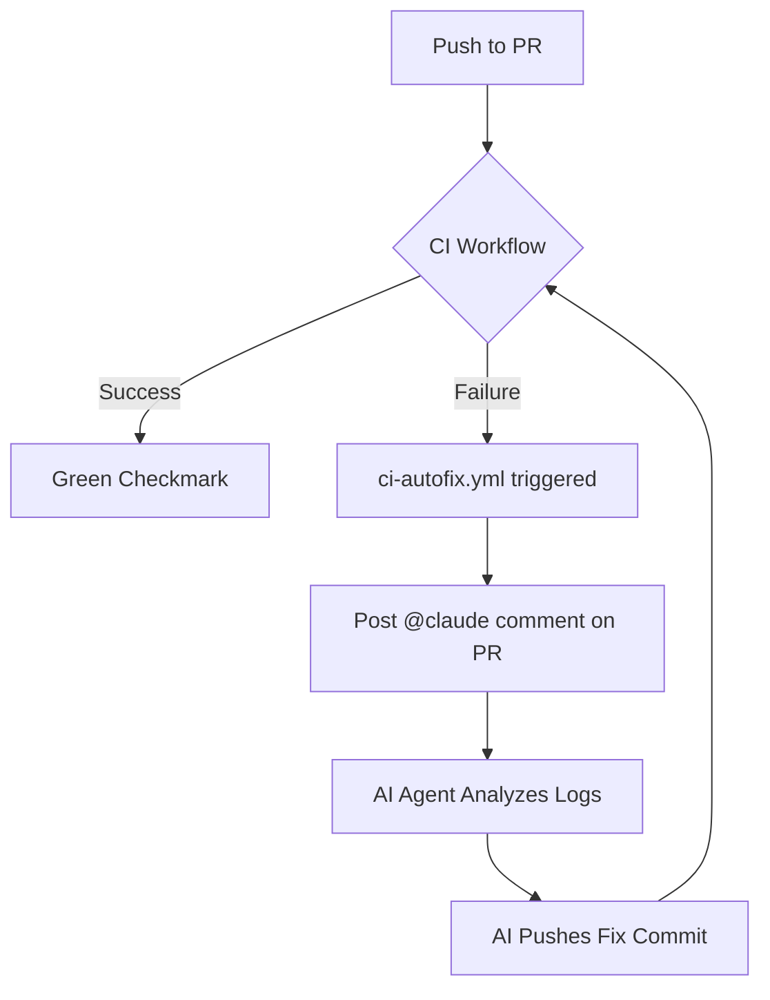
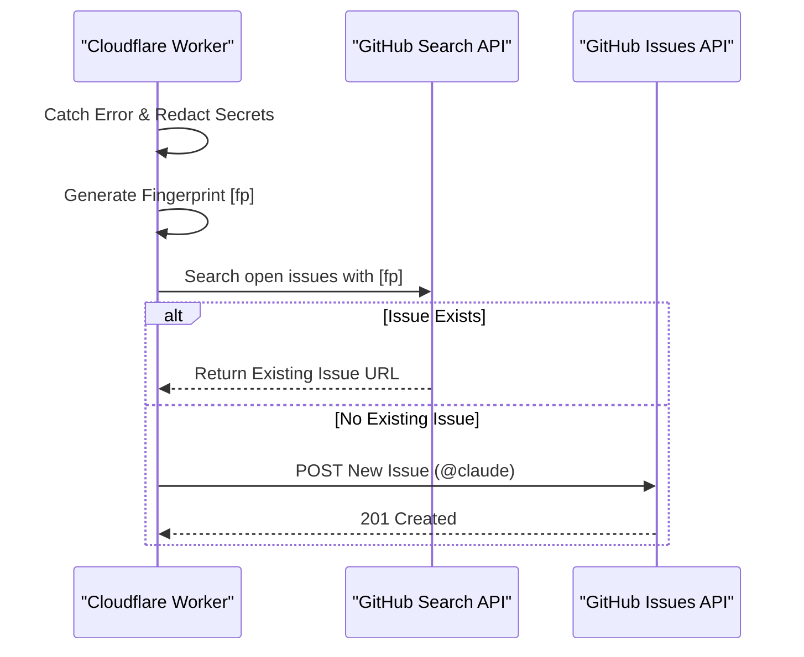

Relevant source files

The following files were used as context for generating this wiki page:

- [guldstandard.md](guldstandard.md)
- [shared/github-report.ts](shared/github-report.ts)
- [README.md](README.md)
- [engine/src/index.ts](engine/src/index.ts)
- [SECURITY.md](SECURITY.md)
- [DESIGN.md](DESIGN.md)

# GitHub Workflows & Standards

GitHub Workflows and Standards in this project define the automated CI/CD pipelines, repository configurations, and error reporting mechanisms used to maintain code quality and operational stability. The project adheres to a "Gold Standard" (Guldstandard) for repository setup, emphasizing automation through GitHub Actions and tight integration with GitHub's issue tracking for autonomous error resolution by AI agents.

The core philosophy revolves around minimizing manual intervention. This includes automated dependency reviews, self-healing CI processes, and a specialized reporting system that allows AI agents like Claude to identify and fix production errors directly via GitHub issues.

Sources: [guldstandard.md:1-10](guldstandard.md#L1-L10), [README.md:36-47](README.md#L36-L47)

## Automated GitHub Workflows

The project employs a comprehensive suite of GitHub Actions workflows designed to handle everything from continuous integration to automatic versioning and labeling.

### Workflow Catalog

The following table summarizes the standard workflows expected in a project adhering to the project's internal standards:

| Workflow File | Purpose | Customization Notes |
| :--- | :--- | :--- |
| `claude.yml` | Automation for Claude AI agent | Used "as-is" across repos |
| `ci.yml` | Continuous Integration (Tests/Checks) | Must be rewritten per repo (TS Workers vs Python) |
| `ci-autofix.yml` | Trigger AI fixes on CI failure | Comments `@claude` on PRs when CI fails |
| `auto-merge.yml` | Automated PR merging | Targets `claude/` prefix and `claude` label |
| `auto-release.yml` | Semantic versioning and tagging | Tags `vX.Y.Z` based on conventional commits |
| `auto-label.yml` | Automated issue/PR labeling | Requires `.github/labeler.yml` configuration |
| `security-alerts-sync.yml` | Syncs Dependabot/CodeQL alerts | Requires a fine-grained `GH_TOKEN` secret |
| `dependency-review.yml` | Block vulnerable dependencies | Blocks high-severity vulnerability introductions |

Sources: [guldstandard.md:12-32](guldstandard.md#L12-L32)

### CI Failure Recovery Flow
The `ci-autofix.yml` workflow acts as the "auto-fix-until-green" mechanism. When the primary CI workflow fails, this action automatically requests assistance from the AI agent.

The diagram shows the iterative loop where CI failures trigger an AI-driven fix attempt to restore the build to a passing state.
Sources: [guldstandard.md:18-20](guldstandard.md#L18-L20)

## Repository Standards & Configuration

The project specifies exact repository settings that must be applied (often via the GitHub API) to ensure consistency across the organization's repositories.

### Branch Protection & Rulesets
The `main` branch is protected using GitHub rulesets rather than legacy branch protection. Requirements include:
*  **Protection against deletion**: Blocks `deletion` and `non_fast_forward` pushes.
*  **Pull Request Requirements**: `required_approving_review_count` is set to `0`, as CI and AI reviews (CodeRabbit) are considered sufficient.
*  **Status Checks**: Must list all specific check names (e.g., Worker typechecks, CodeQL Analyze lines).
*  **Merge Methods**: All methods (`squash`, `merge`, `rebase`) are allowed, with squash titles defaulting to the PR title.

Sources: [guldstandard.md:50-59](guldstandard.md#L50-L59), [guldstandard.md:71-73](guldstandard.md#L71-L73)

### Labeling System
Standard labels are supplemented with project-specific tags to facilitate automation:
*  `claude`: Assigned to PRs created or fixed by Claude; eligible for auto-merge.
*  `auto-reported`: Applied to issues generated by the application's internal error reporting system.
*  **Directory Labels**: Labels corresponding to specific Workers/folders (e.g., `app`, `engine`, `processor`).

Sources: [guldstandard.md:65-70](guldstandard.md#L65-L70), [shared/github-report.ts:85](shared/github-report.ts#L85)

## Autonomous Error Reporting

A critical standard in the project is the `shared/github-report.ts` module, which ports error reporting logic to the Cloudflare Workers environment. This system monitors production failures and reports them as GitHub issues.

### Reporting Logic
1.  **Redaction**: Before reporting, the system redacts sensitive information such as API keys, tokens, email addresses, and home paths.
2.  **Fingerprinting**: It generates a SHA-256 fingerprint based on the error name and the first line of the stack trace to de-duplicate reports.
3.  **Issue Creation**: If no open issue with the same fingerprint exists, it creates a new issue tagged with `@claude` and the `auto-reported` label.

This sequence ensures that production errors are visible to the AI automation for immediate remediation without flooding the repository with duplicate reports.
Sources: [shared/github-report.ts:18-87](shared/github-report.ts#L18-L87), [README.md:36-47](README.md#L36-L47)

### Sanitization Rules
The `redact` function uses specific markers and regex patterns to scrub logs:

| Marker/Pattern | Target | Example Action |
| :--- | :--- | :--- |
| `SECRET_ENV_MARKERS` | Env variables like KEY, TOKEN, SECRET | Replace value with `[REDACTED]` |
| `KEY_PATTERN_RE` | Patterns for sk-*, ghp_*, AKIA* | Replace key with `[REDACTED]` |
| `EMAIL_RE` | Email addresses | Replace with `[EMAIL REDACTED]` |
| `HOME_PATH_RE` | User directories (/home/...) | Replace with `/home/[user]` |

Sources: [shared/github-report.ts:11-34](shared/github-report.ts#L11-L34)

## Security Standards

The project follows a strict security policy integrated with GitHub's native features.

*  **Vulnerability Reporting**: Users are directed to use GitHub's private reporting feature rather than opening public issues.
*  **Secret Management**: Wrangler secrets are mandatory for all credentials; hardcoding keys is strictly prohibited.
*  **Dependency Auditing**: The `dependency-review.yml` workflow and automated dependency alerts (Dependabot/Renovate) must be reviewed before deployment.

Sources: [SECURITY.md:1-18](SECURITY.md#L1-L18), [guldstandard.md:43-47](guldstandard.md#L43-L47)

## Conclusion

The GitHub Workflows and Standards implement a robust, AI-first operational model. By combining strict branch rules, automated "autofix" CI loops, and an autonomous error-to-issue reporting system, the project ensures that the "brain" (Cloudflare Workers) and the "muscle" (external fetchers) remain stable with minimal manual oversight.

Sources: [DESIGN.md:2-4](DESIGN.md#L2-L4), [README.md:36-40](README.md#L36-L40)
