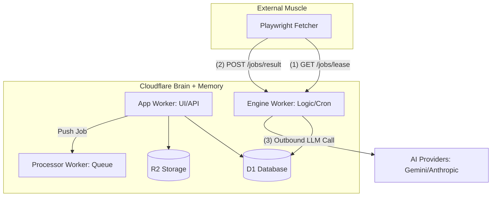
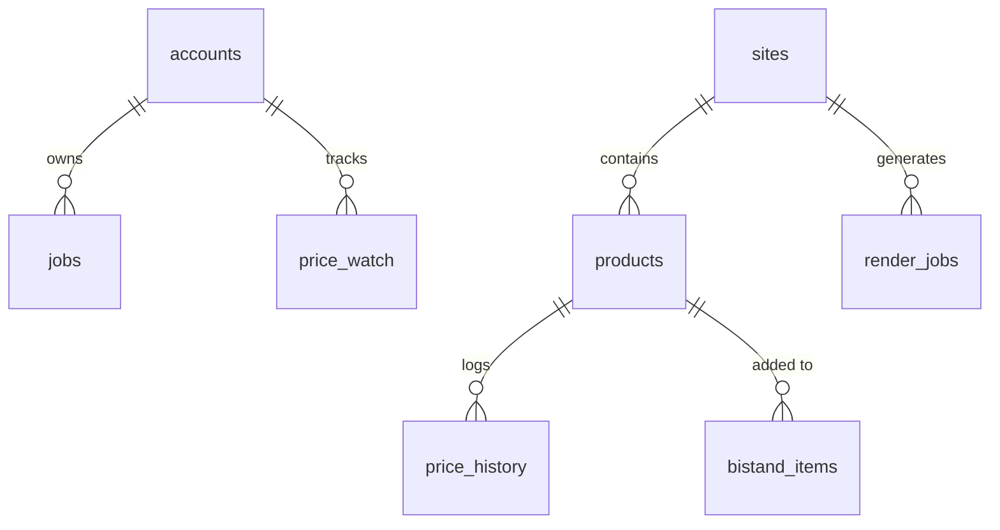

Relevant source files

The following files were used as context for generating this wiki page:

- [DESIGN.md](DESIGN.md)
- [README.md](README.md)
- [engine/src/index.ts](engine/src/index.ts)
- [infra/schema.sql](infra/schema.sql)
- [PROPOSAL-hopslagen-app.md](PROPOSAL-hopslagen-app.md)
- [app/public/app.js](app/public/app.js)

# Architecture Overview

The Product Describer project is a cloud-native system built on the Cloudflare ecosystem, designed to scrape product data, generate AI-driven descriptions, and manage price monitoring. The architecture follows a "Brain and Muscle" principle where Cloudflare (D1, Workers, R2) serves as the persistent memory and logic hub, while external server-bound fetchers act as stateless execution units for web rendering.

Sources: [DESIGN.md:21-25](DESIGN.md#L21-L25), [README.md:5-15](README.md#L5-L15)

## System Core Components

The system is partitioned into several specialized Cloudflare Workers and external components:

| Component | Technology | Role |
| :--- | :--- | :--- |
| **App Worker** | Cloudflare Workers | Handles UI/API, authentication, file uploads, and user-specific data like "bistånds-underlag". |
| **Engine Worker** | Cloudflare Workers | The central logic hub. Manages the catalog, cron triggers for scraping/AI, and fetcher APIs. |
| **Processor Worker** | Cloudflare Workers | A Queue consumer that extracts data from uploaded files and generates descriptions per row. |
| **D1 Database** | Cloudflare D1 | The single source of truth for accounts, jobs, products, and price history. |
| **R2 Storage** | Cloudflare R2 | Stores uploaded raw files and generated CSV output files. |
| **Stateless Fetcher** | Python/Playwright | External "muscle" that renders URLs on demand and returns structured text to the Engine. |

Sources: [DESIGN.md:38-55](DESIGN.md#L38-L55), [README.md:18-35](README.md#L18-L35)

## High-Level Architecture Flow

The following diagram illustrates the relationship between the Cloudflare "Brain" and the external "Muscle" fetcher.

The diagram shows the pull-based communication where the Fetcher polls the Engine for tasks. 
Sources: [DESIGN.md:38-55](DESIGN.md#L38-L55), [engine/src/index.ts:13-26](engine/src/index.ts#L13-L26)

## Job Scheduling and Data Flow

The system utilizes a lease/ack pattern within D1 to manage scraping tasks, replacing traditional Cloudflare Queues for catalog tasks to maintain a zero-cost profile.

### The Scraping Loop (Pull Model)
1. **Cron Trigger**: The Engine Worker's `scheduled()` handler runs every 5 minutes. It identifies sites due for crawling and creates `render_jobs` in the D1 table.
2. **Leasing**: The external Fetcher calls `POST /jobs/lease`. The Engine atomically updates jobs to `leased` status and returns details like URL and CSS selectors.
3. **Execution**: The Fetcher renders the page using Playwright and extracts the `source_text`.
4. **Result Submission**: The Fetcher calls `POST /jobs/:id/result`. The Engine upserts the product data and price history into D1.

Sources: [DESIGN.md:65-75](DESIGN.md#L65-L75), [engine/src/index.ts:60-100](engine/src/index.ts#L60-L100), [engine/src/index.ts:178-220](engine/src/index.ts#L178-L220)

### Database Schema Overview
The database uses Cloudflare D1 to store all relational data. Key tables include:

Sources: [infra/schema.sql:5-150](infra/schema.sql#L5-L150)

### AI Description Pipeline
AI descriptions are generated via two paths:
* **On-Demand**: Triggered when a user views a product in the catalog or adds it to a "bistånd" underlag.
* **Background Cron**: The Engine Worker processes a capped number of products missing descriptions during each 5-minute tick.

The system supports multiple providers (Anthropic, OpenAI, Gemini, Azure) using a `ProviderChain` for failover.

Sources: [engine/src/index.ts:320-370](engine/src/index.ts#L320-L370), [README.md:25-28](README.md#L25-L28)

## API and Auth Architecture

The architecture recently transitioned from Cloudflare Access to an internal account-based model with OAuth support.

| Route | Worker | Purpose | Auth |
| :--- | :--- | :--- | :--- |
| `/api/catalog` | App | Search products in D1 | Public/Account |
| `/api/upload` | App | Upload files for processing | Account |
| `/jobs/lease` | Engine | Fetcher task polling | `X-API-Key` |
| `/describe` | Engine | On-demand AI description | Internal/API |

Sources: [PROPOSAL-hopslagen-app.md:25-45](PROPOSAL-hopslagen-app.md#L25-L45), [engine/src/index.ts:460-475](engine/src/index.ts#L460-L475), [app/public/app.js:1-50](app/public/app.js#L1-L50)

## Security and Secrets
The system enforces strict security practices regarding API keys and configuration:
* `PROVIDER_CONFIG_KEY`: Used to encrypt/decrypt provider credentials stored in D1. Must be identical across `app/` and `processor/`.
* `INGEST_API_KEY`: Secret used to authorize the external Fetcher's communication with the Engine.
* `Wrangler Secrets`: All AI API keys (Anthropic, etc.) must be stored as secrets and never committed.

Sources: [SECURITY.md:15-25](SECURITY.md#L15-L25), [README.md:68-75](README.md#L68-L75)

## Conclusion
The Cloudflare-based architecture of the Product Describer ensures resilience by decoupling the heavy web-rendering "muscle" from the stateful "brain". By leveraging D1 for job queuing and a central Engine Worker for orchestration, the system achieves a highly portable and cost-effective operational model.

Sources: [DESIGN.md:100-110](DESIGN.md#L100-L110)
