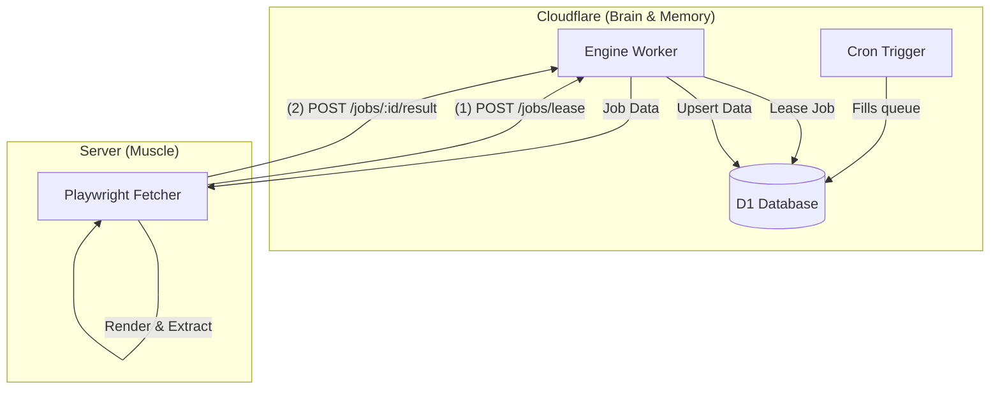
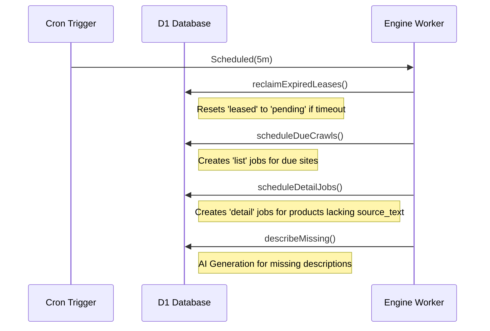

<details>
<summary>Relevant source files</summary>

The following files were used as context for generating this wiki page:

- [DESIGN.md](DESIGN.md)
- [engine/src/index.ts](engine/src/index.ts)
- [README.md](README.md)
- [app/public/app.js](app/public/app.js)
- [PROPOSAL-hopslagen-app.md](PROPOSAL-hopslagen-app.md)
</details>

# Playwright Fetcher & Pull Model

## Introduction
The Playwright Fetcher and Pull Model represent the "muscle" of the product-describer architecture, transitioning from a server-heavy push architecture to a Cloudflare-centric pull system. In this model, Cloudflare (via Workers and D1) acts as the "brain and memory," managing all durable data and logic, while an external, stateless server runs Playwright to render web pages on demand.

The primary purpose of this architecture is to ensure data durability and system portability. By moving the state to Cloudflare's D1 database, the system remains resilient even if the external rendering server fails, as the server holds no persistent state and can be redeployed in minutes.

Sources: [DESIGN.md:1-20](DESIGN.md#L1-L20), [README.md:88-92](README.md#L88-L92)

## Architecture & Data Flow

The system operates on a "Pull" principle where the external Fetcher polls Cloudflare for jobs instead of Cloudflare initiating connections to the server. This removes the need for incoming routes or tunnels (like Cloudflare Tunnel) on the rendering server.

### High-Level Component Interaction



The diagram shows the interaction between the Cloudflare "Brain" and the external "Muscle" Fetcher.
Sources: [DESIGN.md:37-65](DESIGN.md#L37-L65), [engine/src/index.ts:1-20](engine/src/index.ts#L1-L20)

### Job Lifecycle
Jobs transition through various states within the `render_jobs` table in D1. The Engine Worker facilitates these transitions through specific API endpoints.

| State | Description | Transition Trigger |
| :--- | :--- | :--- |
| `pending` | Initial state or returned from expired lease. | Cron Trigger or failed attempt. |
| `leased` | Job currently being processed by the Fetcher. | `POST /jobs/lease` call. |
| `done` | Successfully processed and data ingested. | `POST /jobs/:id/result` with success data. |
| `error` | Failed after maximum attempts (typically 5). | `POST /jobs/:id/result` with error after max attempts. |

Sources: [DESIGN.md:104-111](DESIGN.md#L104-L111), [engine/src/index.ts:50-52](engine/src/index.ts#L50-L52), [engine/src/index.ts:161-168](engine/src/index.ts#L161-L168)

## Fetcher Components & Logic

### Stateless Pull Loop
The Fetcher is a long-running process (Python + Playwright) that executes a continuous loop:
1.  **Lease:** Requests $N$ jobs from `POST /jobs/lease`.
2.  **Render:** Uses Playwright to render the URL and extract data based on provided selectors.
3.  **Submit:** Posts results (title, price, source text, or discovered links) to `POST /jobs/:id/result`.

Sources: [DESIGN.md:70-80](DESIGN.md#L70-L80), [engine/src/index.ts:74-128](engine/src/index.ts#L74-L128)

### Rendering Types
The system handles two primary types of rendering jobs:
*  **List Jobs:** Used for crawling listing pages to discover new product URLs. These jobs have longer lease times (e.g., 15 minutes) as they may involve pagination and multiple extractions.
*  **Detail Jobs:** Used for rendering individual product pages to extract source text and prices. These are prioritized for speed with shorter lease times (e.g., 2 minutes).

Sources: [engine/src/index.ts:48-49](engine/src/index.ts#L48-L49), [engine/src/index.ts:88-95](engine/src/index.ts#L88-L95)

## API Contract (Engine Worker)

The Engine Worker provides the endpoints used by the Fetcher. Authentication is handled via an `X-API-Key` matching the `INGEST_API_KEY` secret.

### Endpoints

| Endpoint | Method | Purpose |
| :--- | :--- | :--- |
| `/jobs/lease` | POST | Atomically leases $N$ pending jobs. Returns job data including selectors. |
| `/jobs/:id/result` | POST | Reports success or failure. Updates `products` and `price_history` tables. |
| `/ingest` | POST | Bulk upsert of products, used for migrations or large crawl results. |
| `/health` | GET | Operational health check. |

Sources: [DESIGN.md:113-118](DESIGN.md#L113-L118), [engine/src/index.ts:25-33](engine/src/index.ts#L25-L33), [engine/src/index.ts:74-80](engine/src/index.ts#L74-L80)

### Lease Response Data Structure
When a Fetcher leases a job, it receives a configuration object specific to the site being rendered:

```typescript
interface LeasedJob {
  id: number;
  url: string;
  type: string; // 'list' | 'detail'
  site_id: number | null;
  detail_selector: string;
  use_stealth: number;
  // Optional for list jobs
  product_selector?: string;
  title_selector?: string;
  price_selector?: string;
  link_selector?: string;
}
```

Sources: [engine/src/index.ts:54-70](engine/src/index.ts#L54-L70), [engine/src/index.ts:114-128](engine/src/index.ts#L114-L128)

## Control & Scheduling (The Brain)

The "Brain" uses a single Cron Trigger (`*/5 * * * *`) to drive the entire catalog loop.



The sequence diagram illustrates the sequential tasks performed by the Engine Worker during every 5-minute cron tick.
Sources: [DESIGN.md:121-131](DESIGN.md#L121-L131), [engine/src/index.ts:457-485](engine/src/index.ts#L457-L485)

### Self-Healing Mechanisms
*  **Lease Timeouts:** If a Fetcher dies mid-job, the Cron Trigger's `reclaimLeases` function resets the status to `pending` once the `lease_until` timestamp is passed.
*  **Attempt Tracking:** Each job tracks `attempts`. If a job fails more than `MAX_ATTEMPTS` (5), it is marked as `error` to prevent infinite retry loops.

Sources: [DESIGN.md:144-146](DESIGN.md#L144-L146), [engine/src/index.ts:49-51](engine/src/index.ts#L49-L51), [engine/src/index.ts:310-316](engine/src/index.ts#L310-L316)

## Summary
The Playwright Fetcher and Pull Model decentralizes the heavy rendering workload while centralizing data integrity within Cloudflare. By utilizing a lease/ack pattern within a D1 database table, the system avoids the costs and complexities of Cloudflare Queues or Browser Rendering while maintaining a highly portable and resilient scraping infrastructure.

Sources: [DESIGN.md:37-45](DESIGN.md#L37-L45), [DESIGN.md:135-142](DESIGN.md#L135-L142)
