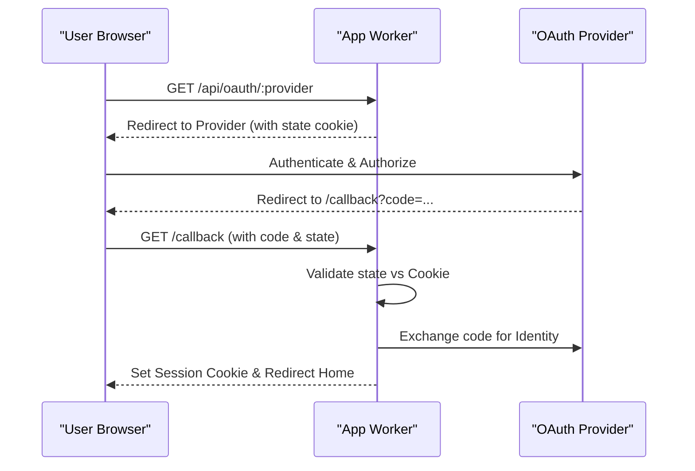
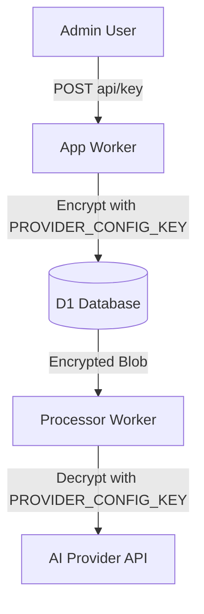

<details>
<summary>Relevant source files</summary>

The following files were used as context for generating this wiki page:

- [SECURITY.md](SECURITY.md)
- [PROPOSAL-hopslagen-app.md](PROPOSAL-hopslagen-app.md)
- [infra/schema.sql](infra/schema.sql)
- [app/src/index.ts](app/src/index.ts)
- [engine/src/index.ts](engine/src/index.ts)
- [app/public/app.js](app/src/app.js)

</details>

# Security, Authentication, & Roles

The Security, Authentication, and Roles system in the product-describer-cloudflare project provides a robust framework for managing user access, securing sensitive API credentials, and enforcing administrative boundaries. The project transitioned from a restrictive Cloudflare Access model to a self-contained application-level authentication system to support public catalog browsing while maintaining secure areas for user-specific data and administrative tools.

Sources: [PROPOSAL-hopslagen-app.md:21-31](PROPOSAL-hopslagen-app.md#L21-L31), [app/src/index.ts:1-10](app/src/index.ts#L1-L10)

Authentication is handled through a combination of traditional email/password credentials and OAuth 2.0 integration with major providers. Role-based access control (RBAC) distinguishes between standard users and administrators, gating features such as AI configuration and catalog management.

## Authentication Methods

The system supports multiple authentication flows to provide flexibility for users.

### OAuth 2.0 Integration
The application integrates with Google and Microsoft for third-party authentication. This flow uses a state-nonce stored in a cookie to prevent Cross-Site Request Forgery (CSRF).



The sequence above illustrates the secure handover between the application and external identity providers.
Sources: [app/src/index.ts:167-200](app/src/index.ts#L167-L200), [infra/schema.sql:14-23](infra/schema.sql#L14-L23)

### Traditional Credentials
Users can register and log in using an email address and password. Passwords are secured using a hashing and salting mechanism. To prevent brute-force attacks, the system implements rate limiting on both signup and login endpoints.
Sources: [app/src/index.ts:210-234](app/src/index.ts#L210-L234), [infra/schema.sql:4-12](infra/schema.sql#L4-L12)

| Endpoint | Method | Security Measure | Rate Limit |
| :--- | :--- | :--- | :--- |
| `/signup` | POST | Password Hashing + Salt | 5 attempts / hour |
| `/login` | POST | Password Hashing + Salt | 10 attempts / 10 min |

Sources: [app/src/index.ts:210-234](app/src/index.ts#L210-L234), [infra/schema.sql:4-12](infra/schema.sql#L4-L12)

## Role-Based Access Control (RBAC)

The project defines two primary roles: `user` and `admin`. Access is enforced through a centralized routing logic in the `app` Worker.

### User Roles and Permissions
- **Public User:** Can browse the product catalog and view FAQ sections without logging in.
- **Authenticated User (`user`):** Can save products to personal "underlag" (assistance documentation), manage price watches, and configure notification channels.
- **Administrator (`admin`):** Has full access to the "Beskriv-verktyg" (AI description tools), provider API key management, catalog-wide operations, and account role management.

Sources: [PROPOSAL-hopslagen-app.md:27-31](PROPOSAL-hopslagen-app.md#L27-L31), [app/src/index.ts:85-115](app/src/index.ts#L85-L115)

### Administrative Gating
Administrative endpoints are grouped under `/api/admin/` and protected by a role check. Any attempt by a non-admin to access these or AI configuration settings results in a `403 Forbidden` response.
Sources: [app/src/index.ts:102-115](app/src/index.ts#L102-L115)

## Data Security & Encryption

Sensitive information, particularly AI provider API keys, is never stored in plain text.

### Provider Configuration Encryption
The system uses AES-GCM encryption for storing provider configurations (API keys for Anthropic, OpenAI, Gemini, and Azure). A global `PROVIDER_CONFIG_KEY` must be set as a secret in both the `app` and `processor` Workers to allow successful encryption and decryption.



This architecture ensures that even if the database is compromised, raw API keys remain protected.
Sources: [SECURITY.md:12-16](SECURITY.md#L12-L16), [infra/schema.sql:28-33](infra/schema.sql#L28-L33), [app/src/index.ts:316-335](app/src/index.ts#L316-L335)

### Secrets Management
The project mandates the use of Cloudflare Wrangler secrets for all credentials.
- `PROVIDER_CONFIG_KEY`: Must match across workers for AES-GCM operations.
- `INGEST_API_KEY`: Used to authenticate the server-bound Playwright fetcher.
- `SCRAPER_API_KEY`: Required for legacy scraper interactions.

Sources: [SECURITY.md:10-14](SECURITY.md#L10-L14), [engine/src/index.ts:21-25](engine/src/index.ts#L21-L25)

## API Security

Internal API communication is secured via API Keys and dedicated endpoints.

### Engine Ingestion Security
The `engine` Worker, which acts as the "brain" for the catalog, exposes endpoints for the external "muscle" (the Playwright fetcher). These endpoints are protected by the `X-API-Key` header, which must match the `INGEST_API_KEY` secret.

```typescript
function authorized(req: Request, env: Env): boolean {
  const key = req.headers.get("X-API-Key");
  return !!env.INGEST_API_KEY && key === env.INGEST_API_KEY;
}
```

Sources: [engine/src/index.ts:21-25](engine/src/index.ts#L21-L25), [engine/src/index.ts:77-80](engine/src/index.ts#L77-L80)

## Database Schema (Security Entities)

The D1 database maintains several tables specifically for security and identity management.

| Table | Purpose | Key Fields |
| :--- | :--- | :--- |
| `accounts` | Core user records | `id`, `email`, `password_hash`, `password_salt`, `role` |
| `oauth_identities` | Links OAuth IDs to accounts | `account_id`, `provider`, `provider_user_id` |
| `provider_configs` | Encrypted AI credentials | `account_id`, `provider`, `encrypted_config` |
| `alert_channels` | Secured notification targets | `account_id`, `kind`, `target` (e.g., webhook URL) |

Sources: [infra/schema.sql:4-33](infra/schema.sql#L4-L33), [infra/schema.sql:151-160](infra/schema.sql#L151-L160)

## Conclusion

Security in the product-describer-cloudflare project is centered on a defense-in-depth strategy. By combining robust authentication (OAuth/Salted Hashing), strict RBAC, AES-GCM encryption for stored secrets, and rate-limited API endpoints, the system ensures that user data and expensive AI provider resources are protected while facilitating public access to the product catalog.

Sources: [SECURITY.md](SECURITY.md), [PROPOSAL-hopslagen-app.md:21-31](PROPOSAL-hopslagen-app.md#L21-L31)
