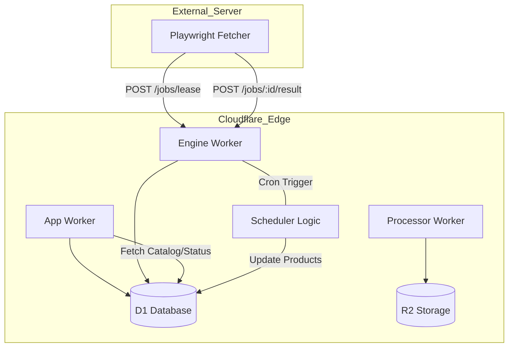
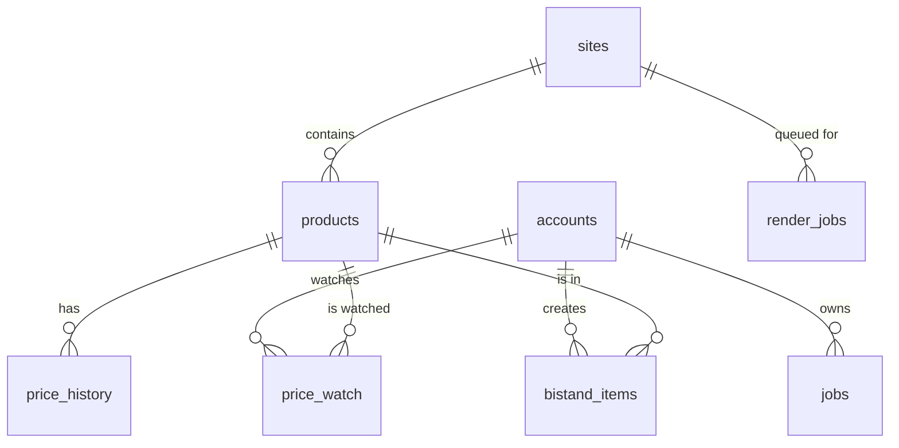
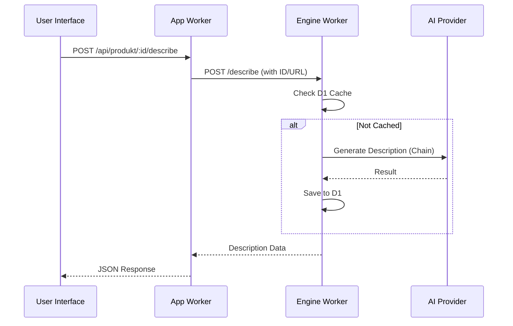

Relevant source files

The following files were used as context for generating this wiki page:

- [DESIGN.md](DESIGN.md)
- [PROPOSAL-hopslagen-app.md](PROPOSAL-hopslagen-app.md)
- [README.md](README.md)
- [engine/src/index.ts](engine/src/index.ts)
- [infra/schema.sql](infra/schema.sql)
- [app/public/app.js](app/public/app.js)

# Architecture Overview

The Product Describer system is a unified platform designed to scrape product data, generate AI-driven descriptions, and manage a product catalog with price monitoring. The architecture follows a "Cloudflare as Brain + Memory" principle, where durable data and logic reside in Cloudflare Workers and D1, while high-resource tasks like browser rendering remain on external servers acting as "stateless muscles."
Sources: [DESIGN.md:20-25](DESIGN.md#L20-L25), [README.md:5-10](README.md#L5-L10)

This system migrates from a fragmented legacy setup (Postgres on a local server) to a distributed model utilizing Cloudflare's edge network for high availability and zero ongoing costs beyond existing base tiers.
Sources: [DESIGN.md:10-18](DESIGN.md#L10-L18), [DESIGN.md:120-130](DESIGN.md#L120-L130)

## System Components

The architecture is divided into three primary Workers and an external Fetcher:

| Component | Role | Technology |
| :--- | :--- | :--- |
| **App Worker** | User Interface, Authentication, and API Gateway for users. | Workers, R2, D1 |
| **Processor Worker** | Queue consumer for extracting data from uploaded files and generating descriptions. | Workers, Queues, R2 |
| **Engine Worker** | The "Brain." Manages the catalog, cron tasks, and provides endpoints for the external Fetcher. | Workers, D1 |
| **Fetcher** | Stateless external service that performs actual browser rendering/scraping. | Python, Playwright |

Sources: [README.md:13-25](README.md#L13-L25), [DESIGN.md:40-50](DESIGN.md#L40-L50)

### Component Interaction Diagram
The following diagram illustrates the relationship between the Cloudflare-based "Brain" and the external "Muscle" fetcher.

Sources: [DESIGN.md:40-65](DESIGN.md#L40-L65), [engine/src/index.ts:130-150](engine/src/index.ts#L130-L150)

## Data Flow & Processing Logic

### The Pull-Based Scraping Model
Unlike traditional push models, the system uses a **lease/ack pattern** via a D1 table (`render_jobs`). This allows the external Fetcher to remain stateless and portable, requiring only outbound HTTPS access to poll Cloudflare for jobs.
Sources: [DESIGN.md:30-40](DESIGN.md#L30-L40), [engine/src/index.ts:75-100](engine/src/index.ts#L75-L100)

1. **Job Creation:** The Engine Worker's cron trigger identifies products missing `source_text` or sites due for a crawl and creates `pending` entries in `render_jobs`.
2. **Leasing:** The Fetcher calls `POST /jobs/lease`. The Engine Worker atomically marks jobs as `leased` and sets a `lease_until` timestamp.
3. **Execution:** The Fetcher renders the URL using Playwright, extracts data, and posts results.
4. **Completion:** Results are sent to `POST /jobs/:id/result`, which performs an upsert into the `products` and `price_history` tables and marks the job as `done`.
Sources: [engine/src/index.ts:155-200](engine/src/index.ts#L155-L200), [DESIGN.md:68-80](DESIGN.md#L68-L80)

### Cron Operations (Engine Worker)
A single Cron Trigger (`*/5 * * * *`) executes sequential, capped tasks to ensure the Worker stays within execution limits:
* **Reclaim Leases:** Resets expired leases to `pending`.
* **Schedule Crawls:** Generates `list` jobs for sites based on their `scrape_interval`.
* **Schedule Detail Jobs:** Generates `detail` jobs for discovered products.
* **Describe Missing:** Progressively generates AI descriptions for products in the background.
* **Check Price Drops:** Monitors price changes and triggers alerts.
Sources: [engine/src/index.ts:630-655](engine/src/index.ts#L630-L655), [DESIGN.md:105-115](DESIGN.md#L105-L115)

## Data Model (D1 Schema)

The D1 database acts as the single source of truth for all users, products, and operational states.

### Entity Relationship Diagram
The diagram below shows the relationships between core entities like Accounts, Products, and Price History.

Sources: [infra/schema.sql:5-150](infra/schema.sql#L5-L150)

### Key Tables
| Table | Description |
| :--- | :--- |
| `accounts` | User profile, role (`user`/`admin`), and description mode preference. |
| `products` | Main catalog including `source_text`, AI-generated `description`, and metadata. |
| `price_history` | Historical price points used for tracking price drops. |
| `render_jobs` | Queue replacement for scraping tasks (`list` or `detail`). |
| `bistand_items` | User-specific product motivations for social service applications. |

Sources: [infra/schema.sql:5-135](infra/schema.sql#L5-L135)

## AI Description Engine

AI descriptions are generated using a provider chain (Gemini, Anthropic, OpenAI, etc.). The system supports two modes of generation:

1. **On-Demand:** Triggered when a user views a product in the UI or adds it to an application. This provides immediate results and caches them in D1.
2. **Background (Cron):** The Engine Worker slowly processes the product backlog during each 5-minute tick to fill the catalog over time.
Sources: [engine/src/index.ts:470-520](engine/src/index.ts#L470-L520), [app/public/app.js:280-310](app/public/app.js#L280-L310)

### Sequence: On-Demand Description

Sources: [engine/src/index.ts:530-580](engine/src/index.ts#L530-L580), [app/public/app.js:330-360](app/public/app.js#L330-L360)

## Security and Authentication

The system moved from Cloudflare Access to an application-level account model using roles (`user`, `admin`) and OAuth providers (Google, Microsoft).
Sources: [PROPOSAL-hopslagen-app.md:25-35](PROPOSAL-hopslagen-app.md#L25-L35), [infra/schema.sql:18-25](infra/schema.sql#L18-L25)

* **Secrets Management:** Credentials like `PROVIDER_CONFIG_KEY` and API keys are stored as Wrangler secrets.
* **Encryption:** Provider-specific API keys are stored in D1 as AES-GCM encrypted JSON blobs in the `provider_configs` table.
Sources: [SECURITY.md:15-22](SECURITY.md#L15-L22), [infra/schema.sql:28-35](infra/schema.sql#L28-L35)

## Conclusion
The architecture leverages Cloudflare's serverless ecosystem to create a highly scalable, low-cost platform. By separating the data management (Engine/D1) from the resource-intensive browser tasks (External Fetcher), the system ensures data durability and operational reliability even if the scraping infrastructure fails.
Sources: [DESIGN.md:20-30](DESIGN.md#L20-L30), [README.md:120-130](README.md#L120-L130)
