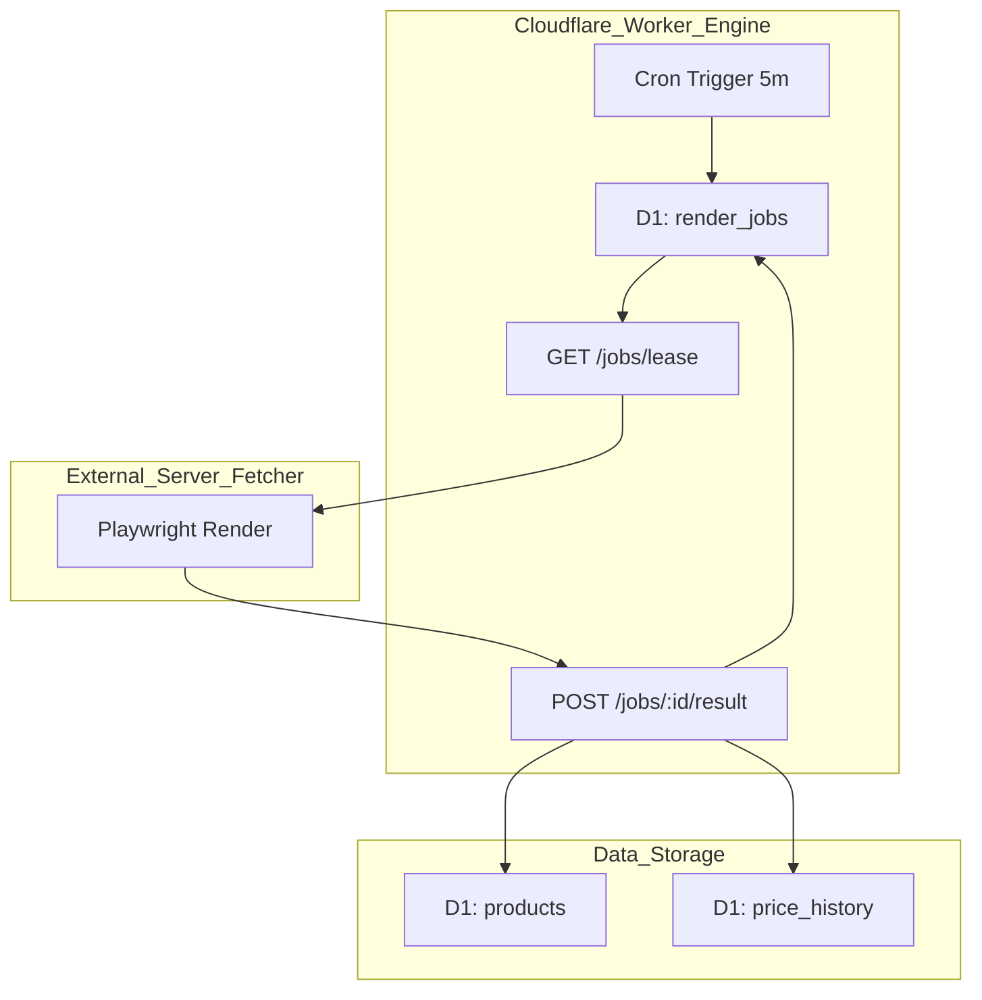
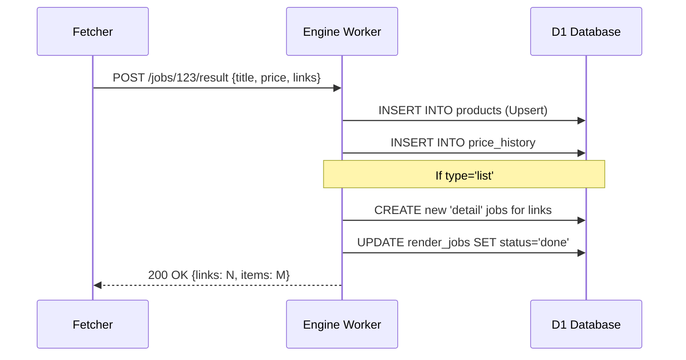

Relevant source files

The following files were used as context for generating this wiki page:

- [DESIGN.md](DESIGN.md)
- [engine/src/index.ts](engine/src/index.ts)
- [README.md](README.md)
- [engine/package.json](engine/package.json)
- [app/public/app.js](app/public/app.js)

# Playwright Fetcher & Pull Model

The Playwright Fetcher & Pull Model represents a fundamental shift in the project's architecture, moving from a server-centric model to a decentralized "Cloudflare as Brain" model. In this architecture, Cloudflare Workers and D1 databases serve as the logic and memory, while an external, stateless server acts as the "muscle" for heavy web rendering tasks.

The system utilizes a "Pull" mechanism where the external Fetcher polls Cloudflare for rendering jobs rather than Cloudflare pushing tasks to the server. This design eliminates the need for incoming routes or complex tunnels (like cloudflared) on the rendering server, making it highly portable and resilient to local hardware failures.

Sources: [DESIGN.md:14-25](DESIGN.md#L14-L25), [README.md:103-107](README.md#L103-L107)

## Architecture Overview

The architecture is divided into the Cloudflare environment (Hjärna + Minne) and the external Server (Muskel).

### System Components
*  **Cloudflare Workers (Engine):** Manages the job queue via D1, handles API requests from the fetcher, and runs cron triggers for scheduling.
*  **D1 Database:** Acts as the single source of truth for products, price history, and the `render_jobs` table.
*  **Stateless Fetcher:** A Python/Playwright process running on external hardware that renders URLs on demand and posts results back to Cloudflare.

Sources: [DESIGN.md:37-56](DESIGN.md#L37-L56), [engine/src/index.ts:5-15](engine/src/index.ts#L5-L15)

### High-Level Data Flow
The following diagram illustrates the interaction between the Cloudflare Engine and the external Playwright Fetcher.

*This diagram shows the circular pull-based relationship where the fetcher requests jobs and returns extracted data.*
Sources: [DESIGN.md:39-56](DESIGN.md#L39-L56), [engine/src/index.ts:88-118](engine/src/index.ts#L88-L118)

## Job Lifecycle and Lease Management

The pull model uses a Lease/Ack pattern implemented within a D1 table (`render_jobs`) to replace traditional message queues. This ensures the system remains within the Cloudflare Workers Free Tier.

### The Lease Pattern
1.  **Polling:** The fetcher requests $N$ jobs via `GET /jobs/lease`.
2.  **Atomicity:** The Engine atomically marks jobs as `leased` and sets a `lease_until` timestamp.
3.  **Self-Healing:** A cron task (`reclaimExpiredLeases`) identifies jobs where `status='leased'` and `lease_until < now`, resetting them to `pending` if the fetcher fails to report back.

Sources: [DESIGN.md:27-33](DESIGN.md#L27-L33), [engine/src/index.ts:92-114](engine/src/index.ts#L92-L114), [engine/src/index.ts:321-327](engine/src/index.ts#L321-L327)

### Job Types
| Type | Description | Lease Duration |
| :--- | :--- | :--- |
| `list` | Crawling listing pages to discover new product URLs. | 900,000 ms (15 min) |
| `detail` | Rendering a specific product page to extract text/price. | 120,000 ms (2 min) |

Sources: [engine/src/index.ts:74-75](engine/src/index.ts#L74-L75), [engine/src/index.ts:133-145](engine/src/index.ts#L133-L145)

## API Implementation (Engine)

The Engine worker provides the endpoints necessary for the fetcher to operate. All requests are authenticated via an `X-API-Key`.

### Key Endpoints
*  **`POST /jobs/lease`**: Claims a batch of pending jobs. It prioritizes `list` jobs to ensure fresh discovery doesn't get stuck behind a detail backlog.
*  **`POST /jobs/:id/result`**: Receives extraction results. It handles title, price, and source text. For `list` jobs, it creates new `detail` jobs for discovered links.
*  **`POST /ingest`**: Used for bulk migration of products and price history.

Sources: [engine/src/index.ts:17-25](engine/src/index.ts#L17-L25), [engine/src/index.ts:182-243](engine/src/index.ts#L182-L243), [engine/src/index.ts:251-277](engine/src/index.ts#L251-L277)

### Result Processing Logic

*Sequence of actions performed when the fetcher submits rendered product data.*
Sources: [engine/src/index.ts:182-247](engine/src/index.ts#L182-L247)

## Scheduling and Cron Orchestration

A single Cron Trigger (`*/5 * * * *`) in the Engine worker orchestrates the entire catalog loop. This sequential execution ensures the system stays within Workers' CPU and subrequest limits.

### Scheduled Tasks
The `scheduled()` handler executes the following steps in order:
1.  **`reclaimExpiredLeases()`**: Resets timed-out jobs to `pending`.
2.  **`scheduleDueCrawls()`**: Checks the `sites` table for enabled sites past their `scrape_interval` and creates `list` jobs.
3.  **`scheduleDetailJobs()`**: Identifies products missing `source_text` or `category` and creates `detail` jobs (capped by `SCHEDULE_LIMIT`).
4.  **`checkPriceDrops()`**: Analyzes price history to trigger alerts.
5.  **`describeMissing()`**: Uses AI (Gemini/Haiku) to generate descriptions for a small batch of products (capped by `DESCRIBE_LIMIT`).

Sources: [DESIGN.md:89-106](DESIGN.md#L89-L106), [engine/src/index.ts:515-534](engine/src/index.ts#L515-L534)

## Fetcher Technical Specifications

The Fetcher is a minimal, long-running Python process utilizing Playwright.

### Implementation Details
*  **Loop Logic:** Polling $\rightarrow$ Rendering $\rightarrow$ Extraction $\rightarrow$ Reporting.
*  **Extraction Strategy:** Reuses logic from the original `scraper.py`, focusing on JSON-LD, OpenGraph (og), and Meta tags.
*  **Stealth Mode:** Supports a `use_stealth` flag for rendering, configured per-site in D1.
*  **Error Handling:** Reports errors back to the Engine. If a job fails more than `MAX_ATTEMPTS` (5), it is marked as `error`.

Sources: [DESIGN.md:61-71](DESIGN.md#L61-L71), [engine/src/index.ts:76](engine/src/index.ts#L76), [engine/src/index.ts:192-199](engine/src/index.ts#L192-L199)

## Configuration and Security

Authentication and configuration are managed through environmental variables and secrets.

| Parameter | Source | Description |
| :--- | :--- | :--- |
| `INGEST_API_KEY` | Secret | Required for Fetcher to authenticate with Engine. |
| `SCHEDULE_LIMIT` | Var | Max detail jobs created per 5m tick (Default: 200). |
| `DESCRIBE_LIMIT` | Var | Max products described per 5m tick (Default: 10). |
| `MAX_ATTEMPTS` | Code | Max retries for a failed rendering job (Value: 5). |

Sources: [engine/src/index.ts:46-51](engine/src/index.ts#L46-L51), [engine/src/index.ts:76](engine/src/index.ts#L76), [README.md:95-101](README.md#L95-L101)

## Conclusion

The Playwright Fetcher & Pull Model successfully decouples the high-cost, high-maintenance rendering component from the application's core logic. By leveraging Cloudflare's D1 and Workers for state management and an external "muscle" for rendering, the system achieves significant resilience and cost-efficiency, maintaining a "zero running cost" profile while ensuring data durability.
