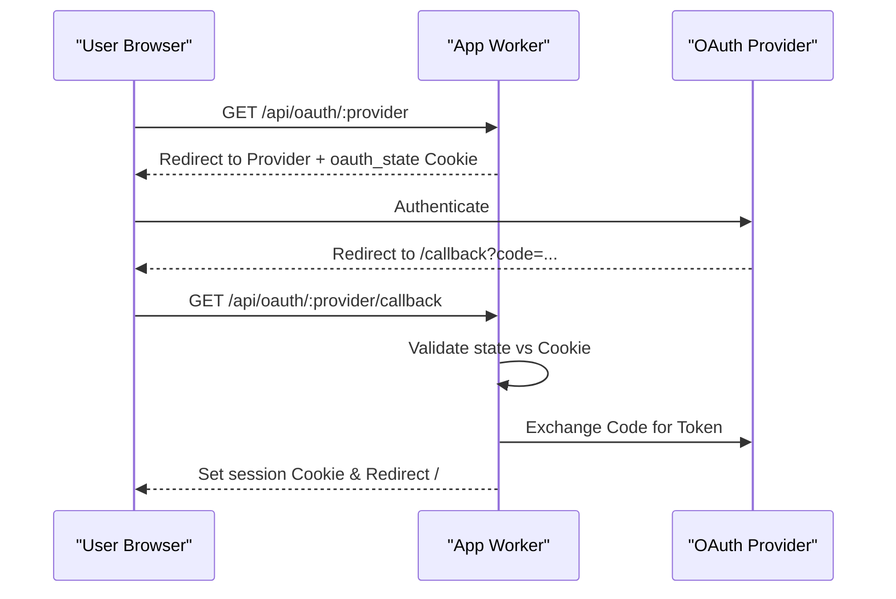
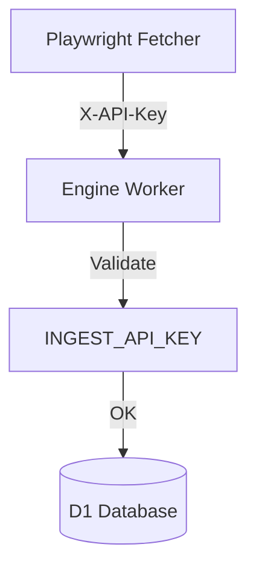

<details>
<summary>Relevant source files</summary>

The following files were used as context for generating this wiki page:

- [SECURITY.md](SECURITY.md)
- [PROPOSAL-hopslagen-app.md](PROPOSAL-hopslagen-app.md)
- [app/src/index.ts](app/src/index.ts)
- [engine/src/index.ts](engine/src/index.ts)
- [infra/schema.sql](infra/schema.sql)
- [app/public/app.js](app/public/app.js)
</details>

# Security, Auth & Roles

The Security, Auth & Roles system in this project manages user identity, access control, and data protection across a distributed Cloudflare Workers architecture. It transitions from a perimeter-based security model (Cloudflare Access) to an application-level identity model to support public access while maintaining strict administrative controls for internal tools.

The system ensures that sensitive credentials, such as AI provider API keys, are never committed to version control and are stored encrypted at rest. Access is governed by a role-based system (`user` vs `admin`) and internal service-to-service communication is secured via API keys.

## Authentication Architecture

The project employs a multi-faceted authentication strategy including traditional email/password login and modern OAuth 2.0 integrations with major providers (Google, Microsoft, Apple).

### Authentication Methods
*  **Email & Password:** Standard registration and login flow using hashed and salted passwords stored in D1.
*  **OAuth 2.0:** Support for social login providers to simplify user onboarding.
*  **Session Management:** Once authenticated, users are issued a secure session token stored in an `HttpOnly`, `Secure` cookie with a 30-day lifespan.

Sources: [app/src/index.ts:251-275](app/src/index.ts#L251-L275), [infra/schema.sql:5-13](infra/schema.sql#L5-L13), [PROPOSAL-hopslagen-app.md:38-45](PROPOSAL-hopslagen-app.md#L38-L45)

### OAuth Flow Logic
The OAuth process utilizes a state-nonce (stored in a temporary cookie) to prevent Cross-Site Request Forgery (CSRF).



Sources: [app/src/index.ts:277-310](app/src/index.ts#L277-L310)

## Authorization & Role-Based Access Control (RBAC)

The system distinguishes between standard users and administrators. Roles are defined in the `accounts` table and checked at the Worker level before processing requests.

### Role Definitions
| Role | Description | Access Scope |
| :--- | :--- | :--- |
| `user` | Standard authenticated user | Catalog browsing, price watches, and personal social assistance documents. |
| `admin` | System administrator | Full access + AI provider settings, bulk uploads, job management, and admin dashboard. |

Sources: [infra/schema.sql:9](infra/schema.sql#L9), [PROPOSAL-hopslagen-app.md:46-52](PROPOSAL-hopslagen-app.md#L46-L52)

### Administrative Grinds
The `app` Worker implements centralized role checks for administrative routes. For example, any route matching `/api/(settings|upload|jobs)` or `/api/admin/*` requires the `admin` role.

```typescript
// Example Role Check in app/src/index.ts
const account = await requireAccount(env, request);
if (pathname.startsWith("/api/admin/")) {
  if (account.role !== "admin") return json({ error: "Endast administratör" }, 403);
  // ... process admin logic
}
```

Sources: [app/src/index.ts:79-106](app/src/index.ts#L79-L106)

## Service-to-Service Security

Communication between different Workers or external "muscles" (like the Playwright fetcher) is secured using API keys rather than user sessions.

### Ingest & Engine Security
The `engine` Worker protects its ingest and job leasing endpoints using an `X-API-Key` header. This key must match the `INGEST_API_KEY` secret stored in the environment.



Sources: [engine/src/index.ts:23-28](engine/src/index.ts#L23-L28), [engine/src/index.ts:73-76](engine/src/index.ts#L73-L76)

## Data Security & Secret Management

The project adheres to strict security best practices to protect sensitive data and credentials.

### Secret Handling
*  **Wrangler Secrets:** All API keys (Anthropic, OpenAI, etc.) must be stored as secrets and never committed to the repository.
*  **Encryption at Rest:** Provider configurations (API keys provided by users) are stored in the `provider_configs` table as AES-GCM encrypted JSON blobs.
*  **PROVIDER_CONFIG_KEY:** A critical shared secret between the `app` and `processor` Workers used to encrypt/decrypt user-provided AI keys.

Sources: [SECURITY.md:16-22](SECURITY.md#L16-L22), [infra/schema.sql:30-35](infra/schema.sql#L30-L35), [README.md:92-96](README.md#L92-L96)

### Rate Limiting
To prevent brute-force attacks and resource exhaustion, the application implements rate limiting on sensitive public endpoints.
*  **Signup:** Limited to 5 attempts per IP per hour.
*  **Login:** Limited to 10 attempts per IP per 10 minutes.

Sources: [app/src/index.ts:317-319](app/src/index.ts#L317-L319), [app/src/index.ts:331-333](app/src/index.ts#L331-L333)

## Database Schema for Security
The underlying D1 schema supports authentication and encryption requirements.

| Table | Security Purpose | Key Fields |
| :--- | :--- | :--- |
| `accounts` | Identity and RBAC | `password_hash`, `password_salt`, `role` |
| `oauth_identities` | External identity mapping | `provider`, `provider_user_id` |
| `provider_configs` | Encrypted credential storage | `encrypted_config` |
| `price_watch` | Data isolation | `account_id` (ensures users only see their watches) |

Sources: [infra/schema.sql:5-40](infra/schema.sql#L5-L40)

## Conclusion
Security in the Cloudflare-native version of this project is built on the principle of defense in depth. By combining secure secret management, encrypted data storage, application-level RBAC, and service-level API keys, the system protects both administrative operations and user data in a public-facing environment. The transition from Cloudflare Access to application-managed roles ensures the platform can scale to public users while maintaining the integrity of the underlying AI processing engine.
