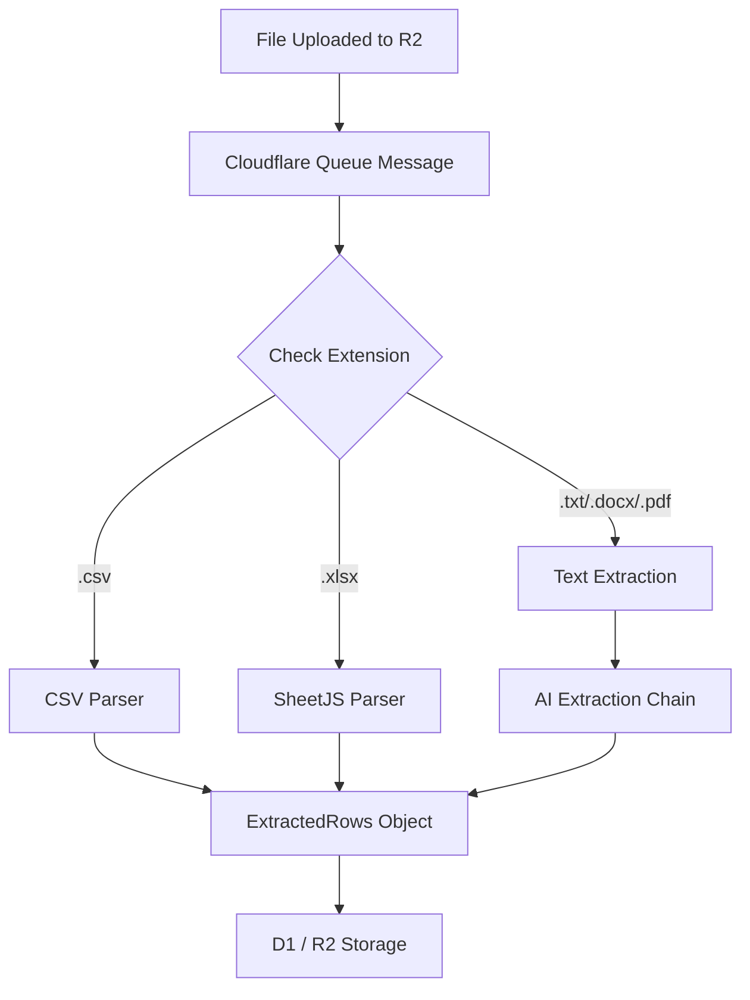
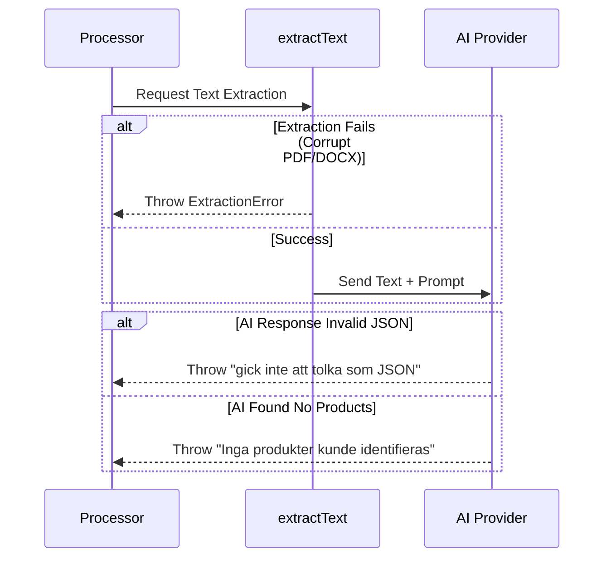

<details>
<summary>Relevant source files</summary>

The following files were used as context for generating this wiki page:

- [processor/src/extractors.ts](processor/src/extractors.ts)
- [processor/package.json](processor/package.json)
- [engine/src/index.ts](engine/src/index.ts)
- [DESIGN.md](DESIGN.md)
- [README.md](README.md)
- [app/public/app.js](app/public/app.js)

</details>

# Document Extraction Engine

The Document Extraction Engine is a core component of the `product-describer-cloudflare` project responsible for transforming unstructured and structured document formats into actionable product data. It operates within the `processor/` worker, serving as a queue consumer that extracts product rows (including title, price, and site information) from uploaded files such as CSV, XLSX, PDF, DOCX, and TXT.

This engine utilizes a combination of direct parsing for structured formats and AI-assisted extraction for unstructured text, ensuring that product information can be harvested regardless of the source file's original layout. Extracted data is then passed to the AI description pipeline to generate Swedish product descriptions.

Sources: [README.md:14-18](README.md#L14-L18), [processor/src/extractors.ts:1-7](processor/src/extractors.ts#L1-L7)

## Architecture and Data Flow

The extraction process begins when a user uploads a file through the Web UI. The `app` worker stores the file in Cloudflare R2 and adds an extraction task to a Cloudflare Queue. The `processor` worker consumes these messages, invoking the `extractRows` function to handle the specific file type.

### Extraction Pipeline Flow
The following diagram illustrates the path from file upload to structured product rows:



The system distinguishes between "structured" formats (CSV/XLSX) which are parsed directly and "unstructured" formats which require a text extraction layer followed by an LLM-based extraction prompt.

Sources: [processor/src/extractors.ts:32-45](processor/src/extractors.ts#L32-L45), [README.md:14-20](README.md#L14-L20), [DESIGN.md:4.1](DESIGN.md:4.1)

## Supported File Formats

The engine supports five primary file extensions, handled by specialized internal parsers or third-party libraries.

| Extension | Extraction Method | Library Used |
| :--- | :--- | :--- |
| `.csv` | Manual parsing (RFC4180-like) | Native TypeScript |
| `.xlsx` | Spreadsheet parsing | `xlsx` (SheetJS) |
| `.txt` | UTF-8 Text Decoding | `TextDecoder` |
| `.docx` | Raw text extraction | `mammoth` |
| `.pdf` | Document text extraction | `unpdf` |

Sources: [processor/src/extractors.ts:16-18](processor/src/extractors.ts#L16-L18), [processor/package.json:15-18](processor/package.json#L15-L18)

### Structured Extraction (CSV/XLSX)
For CSV files, the engine implements a manual `parseCsvLine` function that supports quoted fields (e.g., `"a, b"` as a single field) and escaped quotes. XLSX files are processed using the `xlsx` library, where the first sheet is targeted and empty rows are filtered out.

Sources: [processor/src/extractors.ts:60-108](processor/src/extractors.ts#L60-L108)

### Unstructured Extraction (AI-Assisted)
For `.txt`, `.docx`, and `.pdf` files, the engine first extracts all raw text. Because these formats lack a fixed column structure, the text is sent to a `ProviderChain` (AI service) with a specific extraction prompt.

**Extraction Prompt Requirements:**
- Must return ONLY a valid JSON array.
- Must include fields: `Product` (Required), `Site`, and `Price (SEK)`.
- Input text is capped at 50,000 characters to manage token limits.

```typescript
const EXTRACTION_PROMPT = [
  "Du får ett textdokument. Hitta varje enskild produkt/pryl som nämns i texten.",
  "Svara ALLTIB med endast en giltig JSON-array, utan kodstaket eller extra text,",
  'i exakt detta format:\n[{"Product": "...", "Site": "...", "Price (SEK)": "..."}]',
  "- 'Product' (krävs): produktens namn.",
  "- 'Site' och 'Price (SEK)' (valfria): lämna som tom sträng om okänt.",
  "Hitta om möjligt ALLA produkter i dokumentet, inte bara de första.",
].join("\n");
```

Sources: [processor/src/extractors.ts:21-29](processor/src/extractors.ts#L21-L29), [processor/src/extractors.ts:133-146](processor/src/extractors.ts#L133-L146)

## Error Handling and Validation

The engine employs a specific `ExtractionError` class to handle failures during the parsing or AI extraction phases.

### Sequence of Validation



Sources: [processor/src/extractors.ts:31-58](processor/src/extractors.ts#L31-L58), [processor/src/extractors.ts:145-160](processor/src/extractors.ts#L145-L160)

## Implementation Details

### Data Structures
The primary output of the extraction engine is the `ExtractedRows` interface, which ensures a consistent format for the downstream description generator.

```typescript
export interface ExtractedRows {
  rows: Record<string, string>[]; // Array of product data
  fieldnames: string[];           // Original or normalized headers
}
```

Sources: [processor/src/extractors.ts:34-37](processor/src/extractors.ts#L34-L37)

### Key Functions
- `extractRows(filename, bytes, chain)`: The entry point that routes the file to the correct parser based on suffix. Sources: [processor/src/extractors.ts:39-50](processor/src/extractors.ts#L39-L50)
- `extractText(suffix, bytes)`: Handles the asynchronous loading of `mammoth` and `unpdf` to extract strings from complex document formats. Sources: [processor/src/extractors.ts:110-131](processor/src/extractors.ts#L110-L131)
- `aiExtract(text, chain)`: Manages the communication with LLM providers to turn unstructured text into JSON-formatted product rows. Sources: [processor/src/extractors.ts:133-172](processor/src/extractors.ts#L133-L172)

## Summary
The Document Extraction Engine provides a unified interface for transforming various file uploads into a standardized product list. By combining traditional parsing for CSV/XLSX with AI-powered analysis for PDFs and Word documents, it enables the project to process product catalogs from diverse sources without manual data entry. All extracted data is eventually persisted in Cloudflare D1 as the "Brain and Memory" of the system.

Sources: [DESIGN.md:2](DESIGN.md#L2), [README.md:10-15](README.md#L10-L15)
