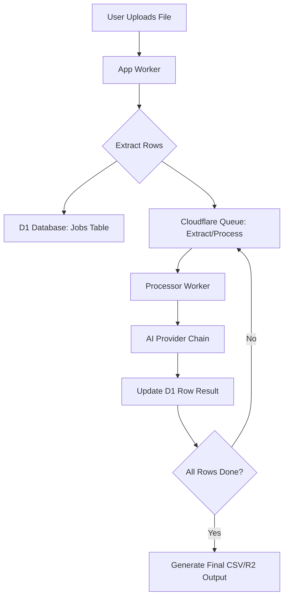
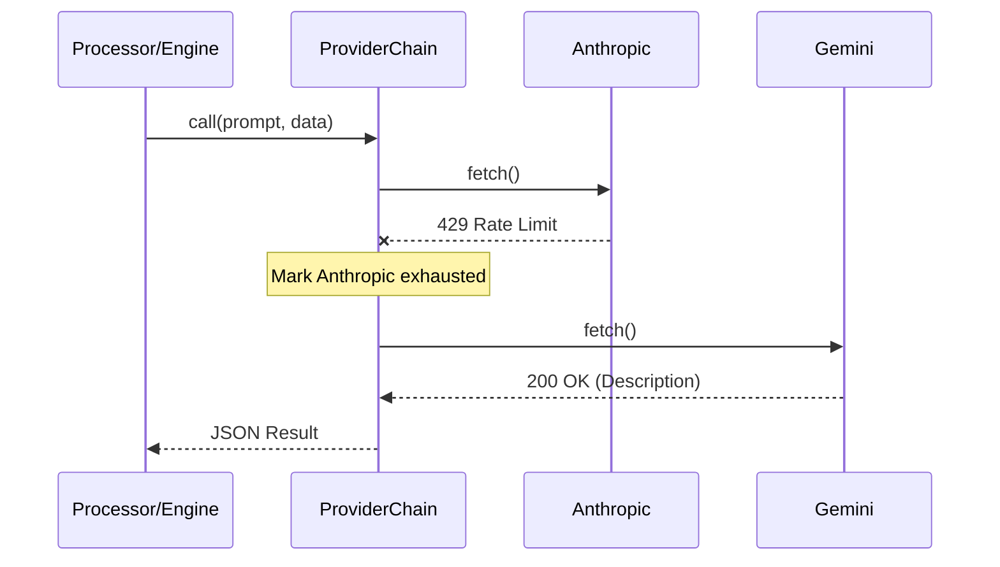

Relevant source files

The following files were used as context for generating this wiki page:

- [README.md](README.md)
- [DESIGN.md](DESIGN.md)
- [engine/src/index.ts](engine/src/index.ts)
- [infra/schema.sql](infra/schema.sql)
- [processor/src/extractors.ts](processor/src/extractors.ts)
- [app/public/app.js](app/public/app.js)
- [shared/providers.ts](shared/providers.ts)

# Row-by-Row AI Generation

Row-by-Row AI Generation is a core architectural feature of the product-describer system designed to handle large-scale product description tasks within the constraints of Cloudflare Workers. Unlike traditional monolithic processing, this system decomposes bulk uploads (CSV, XLSX, PDF, etc.) into individual product rows, each treated as a discrete unit for AI processing. This approach ensures reliability, bypasses Worker execution time limits, and enables granular error handling and progress tracking.

The system operates across three primary Workers: the `app` Worker for user interaction, the `processor` Worker for file extraction and individual row processing via queues, and the `engine` Worker for background catalog enrichment and on-demand generation.

Sources: [README.md:12-16](README.md#L12-L16), [DESIGN.md:28-32](DESIGN.md#L28-L32), [processor/src/extractors.ts:1-6](processor/src/extractors.ts#L1-L6)

## Architecture and Data Flow

The generation process follows a "Pull" and "Queue" model. When a user uploads a file, the system extracts the product data and places it into a Cloudflare Queue. Each message in the queue represents a single product row. The `processor` Worker consumes these messages, invoking AI providers to generate descriptions.

The diagram above illustrates the lifecycle of a row-by-row generation task from upload to completion.
Sources: [README.md:21-23](README.md#L21-L23), [infra/schema.sql:53-73](infra/schema.sql#L53-L73), [app/public/app.js:145-165](app/public/app.js#L145-L165)

## File Extraction and Parsing

Before generation can occur, unstructured or structured files must be converted into a uniform row format. The `extractors.ts` module handles different file formats. Structured files like CSV and XLSX are parsed directly, while unstructured formats (TXT, DOCX, PDF) utilize AI-based extraction to identify product entities and return them as a JSON array.

### Supported Formats and Extraction Logic
| Format | Method | Details |
| :--- | :--- | :--- |
| **CSV** | Text Decoding | Supports quoted fields and standard delimiters. |
| **XLSX** | `xlsx` Library | Reads the first sheet and converts it to JSON objects. |
| **PDF** | `unpdf` + AI | Extracts raw text, then uses AI to find product name, site, and price. |
| **DOCX** | `mammoth` + AI | Extracts raw text and uses AI for entity recognition. |

Sources: [processor/src/extractors.ts:12-25](processor/src/extractors.ts#L12-L25), [processor/src/extractors.ts:50-70](processor/src/extractors.ts#L50-L70)

## Execution Models

The system supports three distinct modes for row-by-row generation depending on the context of the product data.

### 1. Queue-Based Processing (User Uploads)
For bulk file uploads, the `processor` Worker uses Cloudflare Queues. Each row is a queue message. If an AI provider's quota is exhausted, the message is retried with a delay (`queueMsg.retry({delaySeconds})`), preventing the entire job from failing due to temporary rate limits.
Sources: [README.md:14-17](README.md#L14-L17), [processor/src/extractors.ts:117-130](processor/src/extractors.ts#L117-L130)

### 2. Cron-Triggered Background Generation
The `engine` Worker runs a scheduled task every 5 minutes. It identifies products in the D1 database that lack descriptions and processes them in small batches (capped by `DESCRIBE_LIMIT`). This ensures the product catalog is gradually enriched without exceeding free-tier AI API limits.
Sources: [engine/src/index.ts:251-275](engine/src/index.ts#L251-L275), [DESIGN.md:104-115](DESIGN.md#L104-L115)

### 3. On-Demand Generation
Users can trigger generation for a single row within the UI (e.g., "Ansökningsunderlag" or "Katalog"). This is handled via a `POST /describe` endpoint in the `engine` Worker, which attempts to generate a description immediately and caches the result in the `products` table.
Sources: [engine/src/index.ts:327-360](engine/src/index.ts#L327-L360), [app/src/catalog.ts:46-65](app/src/catalog.ts#L46-L65)

## AI Provider Chain and Resilience

To ensure high availability and bypass individual provider quotas, the system implements a `ProviderChain`. This mechanism tries providers in a specific order (Anthropic, OpenAI, Gemini, Azure OpenAI). If a provider returns a rate limit error (429) or billing exhaustion, the system marks that provider as "exhausted" until a calculated reset time and moves to the next one.

The sequence diagram shows how the `ProviderChain` handles failover when a specific AI provider reaches its limit.
Sources: [shared/providers.ts:133-160](shared/providers.ts#L133-L160), [engine/src/index.ts:348-360](engine/src/index.ts#L348-L360), [shared/providers.ts:11-25](shared/providers.ts#L11-L25)

## Database Schema for Tracking

Progress for row-by-row generation is persisted in the D1 `jobs` and `products` tables.

### Job Tracking (D1 `jobs` Table)
| Field | Type | Description |
| :--- | :--- | :--- |
| `status` | TEXT | queued, processing, paused, done, error. |
| `total` | INTEGER | Total number of rows identified in the file. |
| `succeeded` | INTEGER | Number of rows successfully processed by AI. |
| `rows_json` | TEXT | Cached raw rows to prevent re-extraction on retry. |
| `partial_results_json` | TEXT | Results of rows processed so far. |

Sources: [infra/schema.sql:53-73](infra/schema.sql#L53-L73)

### Catalog Persistence (D1 `products` Table)
Once a row is processed, its description is stored in the `products` table.
| Field | Type | Description |
| :--- | :--- | :--- |
| `source_text` | TEXT | The raw text extracted from the product page. |
| `description` | TEXT | The final AI-generated Swedish description. |
| `description_why` | TEXT | AI reasoning for the generated description. |

Sources: [infra/schema.sql:103-118](infra/schema.sql#L103-L118)

## Summary
Row-by-Row AI Generation transforms the system into a resilient, scalable engine for processing product data. By leveraging a combination of D1 for state persistence, Cloudflare Queues for distributed processing, and a multi-provider AI chain, the system maintains high uptime and efficiency even when dealing with large files or restrictive API quotas. This architecture allows for real-time progress updates in the UI and ensures that no work is lost during long-running generation tasks.
