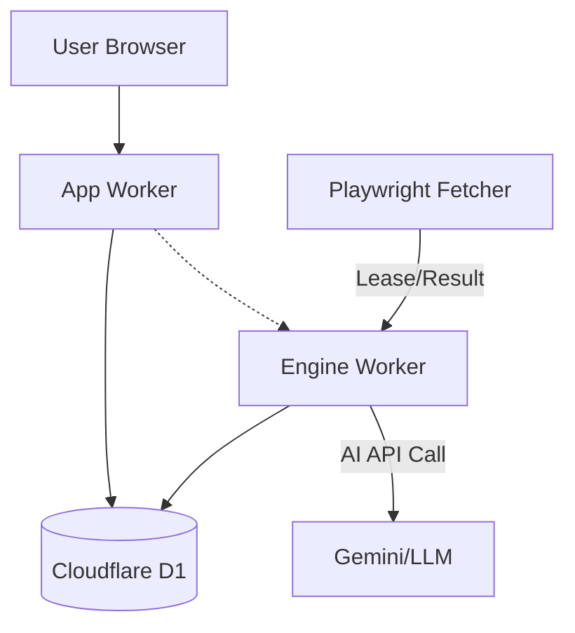
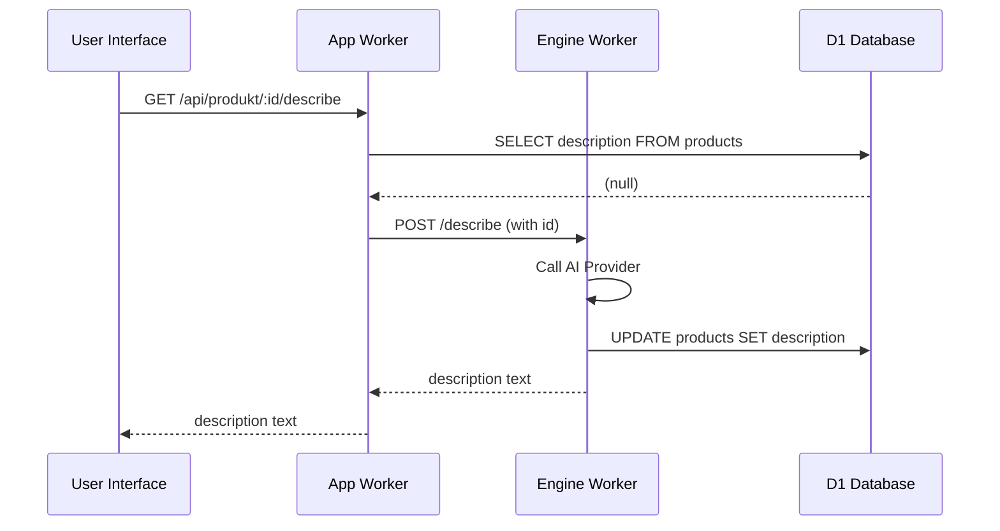

<details>
<summary>Relevant source files</summary>

The following files were used as context for generating this wiki page:

- [PROPOSAL-hopslagen-app.md](PROPOSAL-hopslagen-app.md)
- [app/src/catalog.ts](app/src/catalog.ts)
- [app/src/bistand.ts](app/src/bistand.ts)
- [engine/src/index.ts](engine/src/index.ts)
- [infra/schema.sql](infra/schema.sql)
- [DESIGN.md](DESIGN.md)
- [app/public/app.js](app/public/app.js)
</details>

# Public Catalog & Browsing

The Public Catalog & Browsing system is a core component of the Cloudflare-based Product Describer. It allows users to browse and search a large-scale database of products (approximately 32,000 items) maintained in Cloudflare D1. The system transitions the application from a private tool behind Cloudflare Access to a public-facing platform using account-based authentication and tiered access roles.

Sources: [PROPOSAL-hopslagen-app.md:14-23](PROPOSAL-hopslagen-app.md#L14-L23), [DESIGN.md:5-15](DESIGN.md#L5-L15)

## System Architecture

The catalog architecture follows a "Brain and Muscle" principle. Cloudflare (D1, Workers) serves as the brain and memory, storing all durable data including product details, price history, and AI-generated descriptions. A stateless Playwright-based "fetcher" acts as the muscle, crawling external sites and feeding data back to the Cloudflare environment.

Sources: [DESIGN.md:21-30](DESIGN.md#L21-L30), [engine/src/index.ts:1-12](engine/src/index.ts#L1-L12)

### Component Interaction

The following diagram illustrates how the Catalog & Browsing system interacts with the core database and external crawling components.



This diagram shows the flow of data from the external fetcher into the D1 database, and how users access that data through the App Worker.
Sources: [DESIGN.md:38-55](DESIGN.md#L38-L55), [engine/src/index.ts:15-30](engine/src/index.ts#L15-L30)

## Data Models

The catalog relies on several key tables within the D1 database to store product metadata, categorization, and pricing trends.

### Products and Pricing
| Field | Type | Description |
|-------|------|-------------|
| `id` | INTEGER | Primary Key |
| `url` | TEXT | Unique product URL (Natural Key) |
| `site_id` | INTEGER | Foreign Key to the originating site |
| `title` | TEXT | Product name |
| `current_price` | INTEGER | Last observed price |
| `category` | TEXT | Product category for filtering |
| `description` | TEXT | AI-generated product description |
| `source_text` | TEXT | Raw text extracted from the source page |

Sources: [infra/schema.sql:84-106](infra/schema.sql#L84-L106), [DESIGN.md:105-115](DESIGN.md#L105-L115)

### Price History
The system tracks historical price points to display trends and trigger alerts.
Sources: [infra/schema.sql:115-119](infra/schema.sql#L115-L119), [app/src/catalog.ts:25-30](app/src/catalog.ts#L25-L30)

## Search and Filtering Logic

The catalog provides robust search and filtering capabilities. Users can filter by category or search by product name.

### Catalog Filter Implementation
The filtering logic uses SQL `LIKE` patterns for name searches and direct equality for categories. To ensure compatibility with D1's UPSERT implementation, the filter always includes a `WHERE` clause (defaulting to `WHERE true`).

```typescript
export function catalogFilter(q: string, category: string): { whereSql: string; binds: (string | number)[] } {
  const query = q.trim();
  const cat = category.trim();
  const where: string[] = [];
  const binds: (string | number)[] = [];
  if (query) { where.push("title LIKE ?"); binds.push(`%${query}%`); }
  if (cat) { where.push("category = ?"); binds.push(cat); }
  return { whereSql: ` WHERE ${where.length ? where.join(" AND ") : "true"}`, binds };
}
```

Sources: [app/src/bistand.ts:31-43](app/src/bistand.ts#L31-L43)

### API Endpoints
| Endpoint | Method | Description |
|----------|--------|-------------|
| `/api/catalog` | GET | Returns a paginated list of products based on query `q` and `category`. |
| `/api/categories` | GET | Returns a list of distinct categories and item counts. |
| `/api/produkt/:id` | GET | Returns full details for a specific product including price history. |

Sources: [app/src/bistand.ts:46-60](app/src/bistand.ts#L46-L60), [app/src/catalog.ts:20-33](app/src/catalog.ts#L20-L33), [app/public/app.js:410-425](app/public/app.js#L410-L425)

## AI Description Generation

Descriptions are generated on-demand or via background cron jobs. 

### On-Demand Generation Workflow
1. **Cache Check:** The system first checks if `products.description` is already populated.
2. **Key Tiering:** 
  - If the user has their own API key (e.g., Gemini/Anthropic), it is used.
  - If no key is present, only admins can fall back to the operator's shared Gemini key via the Engine worker.
3. **Engine Proxy:** The request is proxied to the Engine Worker to keep the AI key centralized.
4. **Caching:** The resulting description is saved back to D1 for future users.

Sources: [app/src/catalog.ts:45-75](app/src/catalog.ts#L45-L75), [engine/src/index.ts:420-450](engine/src/index.ts#L420-L450)



This sequence shows the fallback mechanism from the App Worker to the Engine Worker when a description is missing.
Sources: [app/src/catalog.ts:77-95](app/src/catalog.ts#L77-L95), [engine/src/index.ts:415-460](engine/src/index.ts#L415-L460)

## Public vs. Authenticated Access

The system enforces a tiered permission model as it moved out of Cloudflare Access.

*  **Public (Unauthenticated):** Browsing the catalog, searching products, viewing product pages, and reading FAQs.
*  **Account Required:** Saving products to an "Ansökningsunderlag" (application basis), price monitoring, and submitting page suggestions.
*  **Admin Required:** Catalog management, site configuration, and approving user-submitted suggestions.

Sources: [PROPOSAL-hopslagen-app.md:25-33](PROPOSAL-hopslagen-app.md#L25-L33), [app/public/app.js:63-75](app/public/app.js#L63-L75)

## Conclusion
The Public Catalog & Browsing system serves as the primary interface for users to interact with the scraped product data. By leveraging a distributed architecture across Cloudflare Workers and D1, it maintains high performance while managing large datasets and expensive AI operations through clever caching and tiered access.

Sources: [DESIGN.md:155-165](DESIGN.md#L155-L165)
