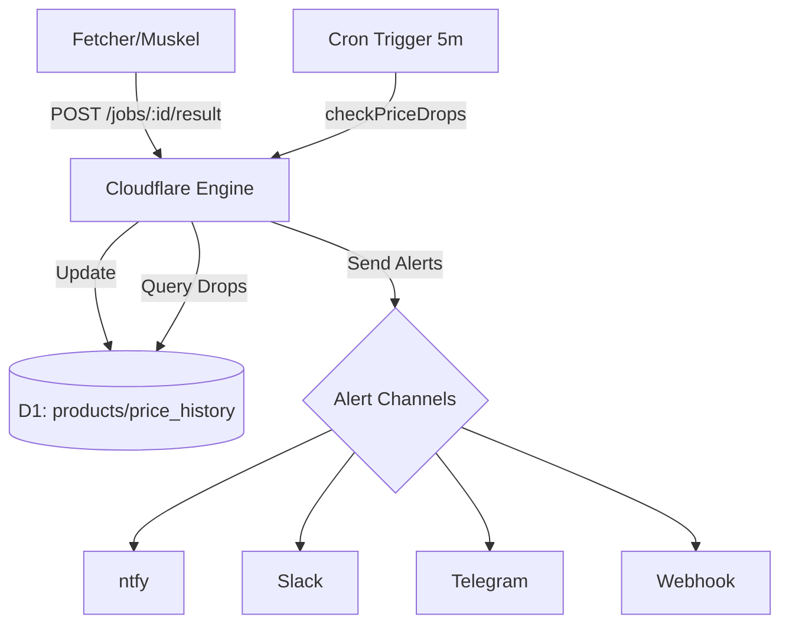
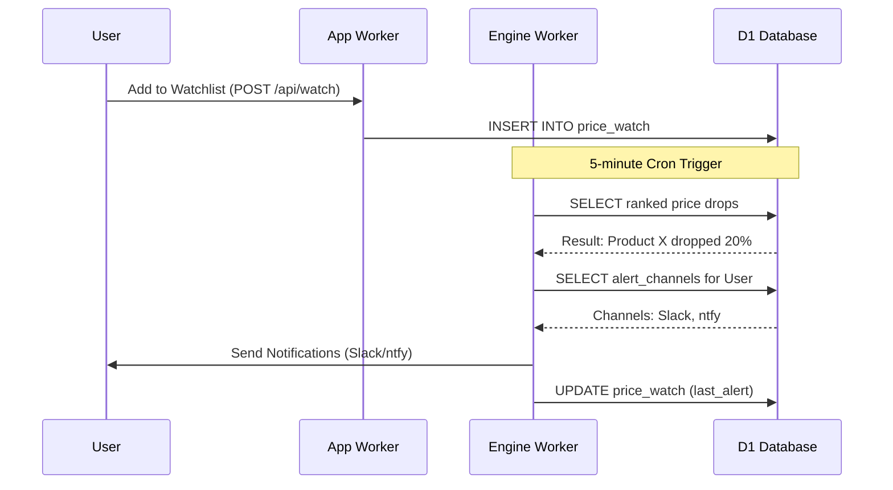

<details>
<summary>Relevant source files</summary>

The following files were used as context for generating this wiki page:

- [engine/src/index.ts](engine/src/index.ts)
- [infra/schema.sql](infra/schema.sql)
- [DESIGN.md](DESIGN.md)
- [PROPOSAL-hopslagen-app.md](PROPOSAL-hopslagen-app.md)
- [app/public/app.js](app/public/app.js)
- [app/public/index.html](app/public/index.html)
</details>

# Price Monitoring & Watchers

The Price Monitoring and Watchers system is a core feature designed to track product price fluctuations and notify users of significant drops. It operates as part of the "Department B" (Public Catalog & Price Monitoring) module, leveraging a unified architecture where Cloudflare D1 serves as the single source of truth for price history and user watchlists.

The system automates the process of identifying price reductions by comparing the latest scraped prices against historical data stored in the database. When a price drop meets specific percentage and currency thresholds, alerts are dispatched through modular notification channels defined by the user.

Sources: [DESIGN.md:38-51](DESIGN.md#L38-L51), [PROPOSAL-hopslagen-app.md:10-14](PROPOSAL-hopslagen-app.md#L10-L14), [PROPOSAL-hopslagen-app.md:52-60](PROPOSAL-hopslagen-app.md#L52-L60)

## Architecture and Data Flow

The architecture follows a pull-based model where a stateless Playwright fetcher (running on an external server) periodically renders product pages and posts results back to the Cloudflare Engine. The Engine then updates the `price_history` table and triggers the monitoring logic.

### System Overview Diagram
This diagram illustrates the flow from price extraction to user notification.



Sources: [DESIGN.md:55-83](DESIGN.md#L55-L83), [engine/src/index.ts:544-550](engine/src/index.ts#L544-L550)

## Monitoring Logic

The monitoring process is encapsulated in the `checkPriceDrops` function within the Engine worker. It is executed every 5 minutes via a Cloudflare Scheduled (Cron) handler.

### Price Drop Detection
The system uses a SQL Common Table Expression (CTE) to identify drops. It ranks the `price_history` for each product currently on at least one user's `price_watch` list, comparing the most recent price (`rn=1`) with the second most recent price (`rn=2`).

A valid alert is triggered only if the drop meets the following criteria (configurable via environment variables):
*  **Minimum Percentage Drop:** Default is 5%.
*  **Minimum Currency Drop:** Default is 100 kr.
*  **Cooldown Period:** Default is 24 hours, preventing duplicate alerts for the same price event.

Sources: [engine/src/index.ts:51-57](engine/src/index.ts#L51-L57), [engine/src/index.ts:468-498](engine/src/index.ts#L468-L498)

### Configuration Parameters

| Parameter | Type | Default | Description |
| :--- | :--- | :--- | :--- |
| `ALERT_MIN_DROP_PCT` | Number | 5 | Percentage threshold for price drops. |
| `ALERT_MIN_DROP_KR` | Number | 100 | Minimum currency (SEK) drop to trigger alert. |
| `ALERT_COOLDOWN_HOURS` | Number | 24 | Hours to wait before alerting on the same product again. |

Sources: [engine/src/index.ts:47-50](engine/src/index.ts#L47-L50), [engine/src/index.ts:470-472](engine/src/index.ts#L470-L472)

## Watchlists and Notifications

Users manage their monitored products through the web interface. Watchlists are stored in the `price_watch` table, linking accounts to specific product IDs.

### Alert Channels
The system supports multiple notification protocols. Each channel is configured per account with a `target` (e.g., URL or token) and a `kind`.

| Channel Kind | Implementation Details |
| :--- | :--- |
| **ntfy** | POST to topic-URL with `Title` and `Click` headers. |
| **Slack** | POST JSON payload to a Webhook URL. |
| **Telegram** | POST to `api.telegram.org` using `bottoken:chatid` format. |
| **Webhook** | POST generic JSON payload `{title, body, url}` to a target URL. |

Sources: [infra/schema.sql:160-167](infra/schema.sql#L160-L167), [engine/src/index.ts:439-465](engine/src/index.ts#L439-L465)

### User Experience Sequence
The following diagram shows the sequence of a user adding a product to their watchlist and receiving an alert.



Sources: [app/public/app.js:640-660](app/public/app.js#L640-L660), [engine/src/index.ts:500-525](engine/src/index.ts#L500-L525)

## Data Schema

The system relies on several tables in the D1 database to track products, historical pricing, and user preferences.

### Table: price_watch
Tracks which users are watching which products.
| Field | Type | Constraints |
| :--- | :--- | :--- |
| `account_id` | TEXT | REFERENCES accounts(id) |
| `product_id` | INTEGER | REFERENCES products(id) |
| `last_alert` | INTEGER | Unix timestamp (ms) |
| `created_at` | INTEGER | NOT NULL |

Sources: [infra/schema.sql:149-158](infra/schema.sql#L149-L158)

### Table: alert_channels
Stores user-defined notification endpoints.
| Field | Type | Description |
| :--- | :--- | :--- |
| `kind` | TEXT | ntfy, slack, telegram, or webhook |
| `target` | TEXT | The destination URL or API token |
| `enabled` | INTEGER | Toggle (1=on, 0=off) |

Sources: [infra/schema.sql:160-167](infra/schema.sql#L160-L167)

## Implementation Details

The core notification dispatch is handled by the `sendAlert` function, which maps specific channel types to their respective HTTP requests.

```typescript
async function sendAlert(kind: string, target: string, title: string, body: string, url: string): Promise<boolean> {
  if (kind === "ntfy") {
    const r = await fetch(target, { method: "POST", headers: { Title: title, Click: url }, body });
    return r.ok;
  }
  if (kind === "slack") {
    const r = await fetch(target, {
      method: "POST",
      headers: { "content-type": "application/json" },
      body: JSON.stringify({ text: `*${title}*\n${body}\n${url}` }),
    });
    return r.ok;
  }
  // ... telegram and webhook implementations
}
```

Sources: [engine/src/index.ts:440-455](engine/src/index.ts#L440-L455)

## Summary
The Price Monitoring & Watchers module provides a robust, low-cost solution for tracking market trends within the Product Describer ecosystem. By utilizing Cloudflare D1 for storage and a recurring Engine Cron for logic execution, it ensures timely notifications to users via modular channels without the overhead of complex message queues or heavy server infrastructure.
