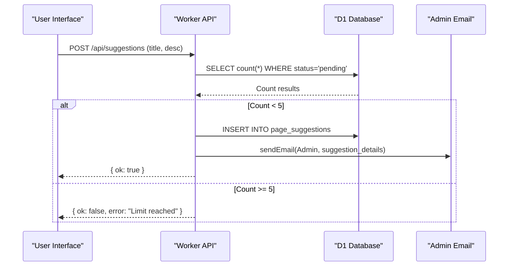
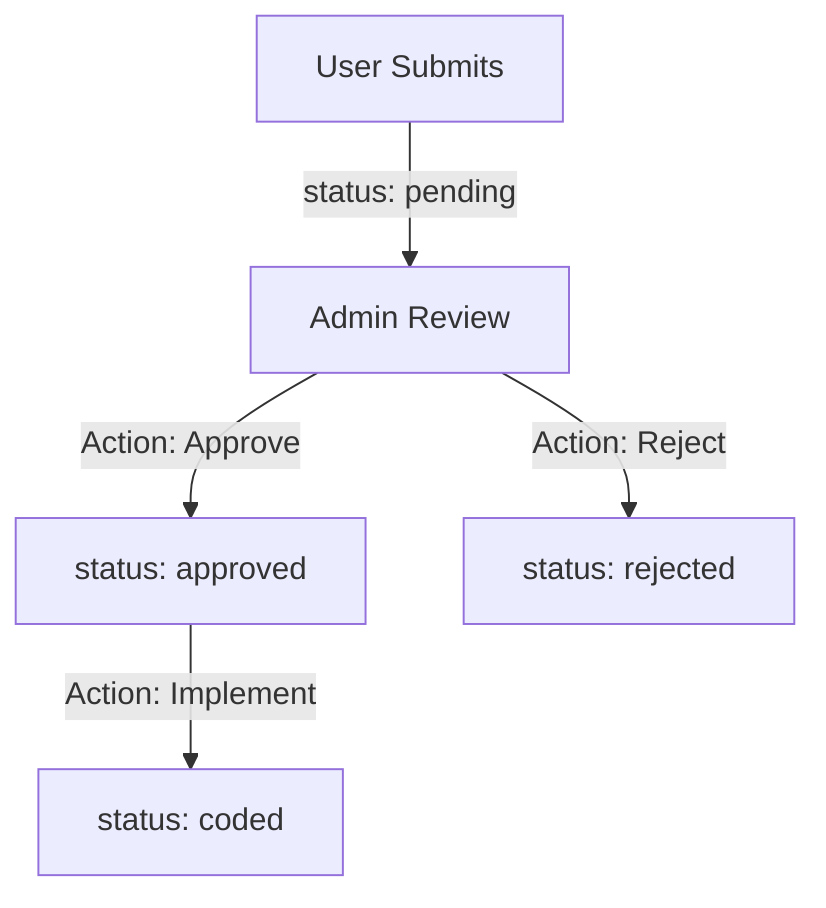

<details>
<summary>Relevant source files</summary>

The following files were used as context for generating this wiki page:

- [app/src/suggestions.ts](app/src/suggestions.ts)
- [PROPOSAL-hopslagen-app.md](PROPOSAL-hopslagen-app.md)
- [infra/schema.sql](infra/schema.sql)
- [app/public/app.js](app/public/app.js)
- [app/public/index.html](app/public/index.html)
- [engine/src/index.ts](engine/src/index.ts)
</details>

# Page Suggestions & Approvals

The Page Suggestions & Approvals system is a feature within the Product Describer project that allows authenticated users to propose new features or pages. This system serves as a feedback loop and "approval gate," ensuring that user-requested functionality is reviewed by an administrator before implementation or deployment. It is designed to prevent spam through submission limits and utilizes email notifications to alert administrators of new entries.

Sources: [app/src/suggestions.ts:1-5](app/src/suggestions.ts#L1-L5), [PROPOSAL-hopslagen-app.md:88-100](PROPOSAL-hopslagen-app.md#L88-L100)

## User Submission Workflow

Users can submit suggestions through the "Föreslå sida" (Suggest Page) department in the application UI. The submission process involves providing a title and a description of the proposed functionality. To prevent system abuse and "inbox flooding," the system enforces a strict limit of 5 pending suggestions per account.

### Submission Logic and Data Flow

When a user submits a suggestion, the backend performs the following steps:
1.  **Validation**: Trims the title and checks if it is empty.
2.  **Rate Limiting**: Queries the D1 database to count existing 'pending' suggestions for the specific `accountId`.
3.  **Persistence**: If valid and under the limit, a new record is inserted into the `page_suggestions` table with a 'pending' status.
4.  **Notification**: A best-effort email is sent to the configured `ADMIN_EMAIL` containing the suggestion details and a unique suggestion ID.

Sources: [app/src/suggestions.ts:18-47](app/src/suggestions.ts#L18-L47), [app/public/app.js:534-547](app/public/app.js#L534-L547)

### Submission Flow Diagram
This diagram illustrates the sequence from a user submitting a suggestion to the administrator receiving a notification.



Sources: [app/src/suggestions.ts:18-50](app/src/suggestions.ts#L18-L50), [app/public/app.js:534-547](app/public/app.js#L534-L547)

## Administrative Review and Approval Gate

The approval gate is a manual process where the administrator evaluates the submitted suggestion. In the administrative view, the administrator can see a list of the 200 most recent suggestions and update their status.

### Status Lifecycle
A suggestion moves through several statuses as defined in the system logic:
*  **pending**: The default state for a newly submitted suggestion.
*  **approved**: The administrator has accepted the suggestion.
*  **rejected**: The administrator has declined the suggestion.
*  **coded**: The suggestion has been implemented in the codebase.

Sources: [app/src/suggestions.ts:60-64](app/src/suggestions.ts#L60-L64), [infra/schema.sql:169-179](infra/schema.sql#L169-L179)

### Administrative Interface
The admin panel provides a scrollable list of suggestions (visible only to users with the `admin` role). This interface allows the administrator to toggle statuses via "PATCH" requests to the API.



Sources: [app/public/app.js:548-578](app/public/app.js#L548-L578), [app/src/suggestions.ts:60-64](app/src/suggestions.ts#L60-L64)

## Technical Implementation

### Data Model
The system relies on the `page_suggestions` table in the D1 database to store all metadata related to user proposals.

| Field | Type | Description |
| :--- | :--- | :--- |
| `id` | TEXT | Primary key (randomly generated ID). |
| `account_id` | TEXT | Reference to the user who created the suggestion. |
| `email` | TEXT | The email address of the suggesting user. |
| `title` | TEXT | Short title of the suggestion (max 200 chars in submission logic). |
| `description` | TEXT | Detailed description (max 4000 chars in submission logic). |
| `status` | TEXT | Current state: pending, approved, rejected, or coded. |
| `created_at` | INTEGER | Unix timestamp of submission. |

Sources: [infra/schema.sql:169-179](infra/schema.sql#L169-L179), [app/src/suggestions.ts:41-43](app/src/suggestions.ts#L41-L43)

### API Endpoints
The following endpoints facilitate the suggestions feature:

| Method | Endpoint | Description | Auth Required |
| :--- | :--- | :--- | :--- |
| `POST` | `/api/suggestions` | Submits a new suggestion. | User |
| `GET` | `/api/suggestions` | Lists the latest 200 suggestions. | Admin |
| `PATCH` | `/api/suggestions/:id` | Updates the status of a suggestion. | Admin |

Sources: [app/public/app.js:534-578](app/public/app.js#L534-L578), [app/src/suggestions.ts:18-65](app/src/suggestions.ts#L18-L65)

### Code Snippet: Setting Suggestion Status
The following function demonstrates the validation and update logic for suggestion statuses.

```typescript
// app/src/suggestions.ts:60-64
export async function setSuggestionStatus(env: Env, id: string, status: string): Promise<void> {
  const allowed = new Set(["pending", "coded", "approved", "rejected"]);
  if (!allowed.has(status)) return;
  await env.DB.prepare("UPDATE page_suggestions SET status = ?1 WHERE id = ?2").bind(status, id).run();
}
```

Sources: [app/src/suggestions.ts:60-64](app/src/suggestions.ts#L60-L64)

## Summary
The Page Suggestions & Approvals system provides a controlled environment for community-driven feature requests. By implementing strict submission limits (5 per user) and requiring manual administrative intervention through a multi-status lifecycle (pending, approved, rejected, coded), the project maintains high standards for feature integration while keeping stakeholders informed via automated email notifications.

Sources: [app/src/suggestions.ts:1-12](app/src/suggestions.ts#L1-L12), [PROPOSAL-hopslagen-app.md:88-100](PROPOSAL-hopslagen-app.md#L88-L100)
