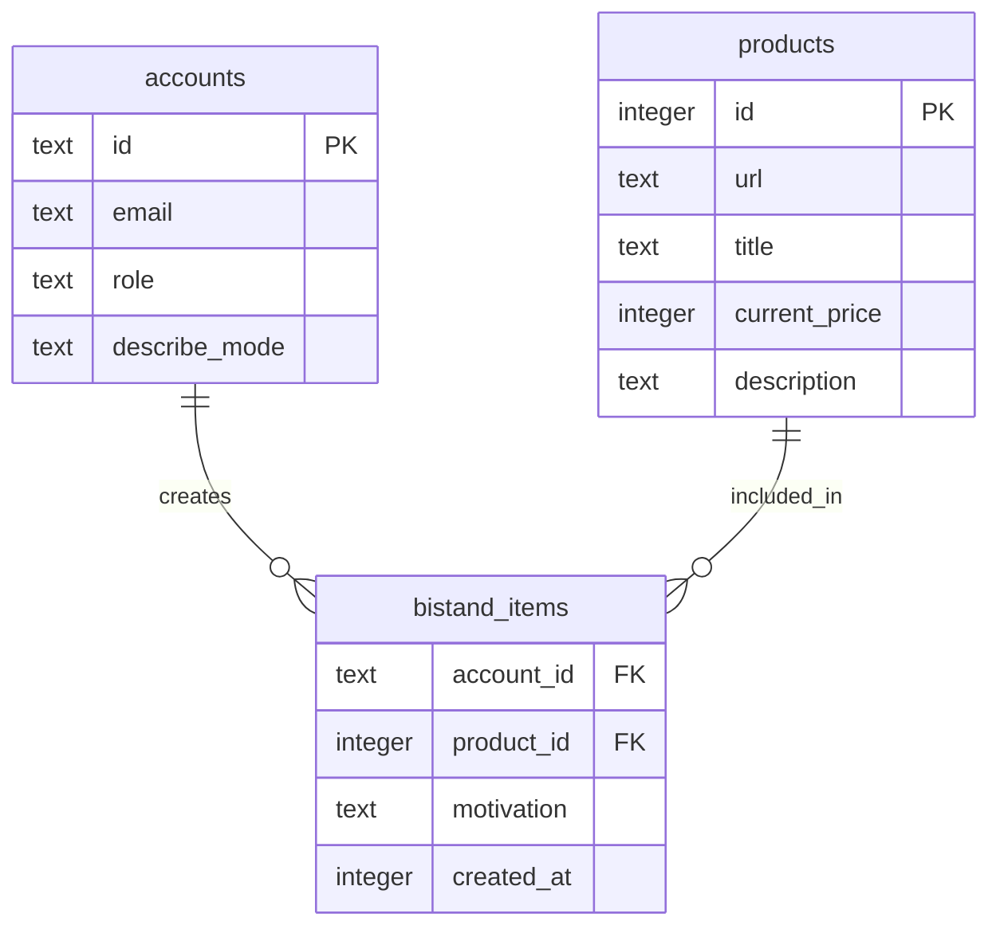
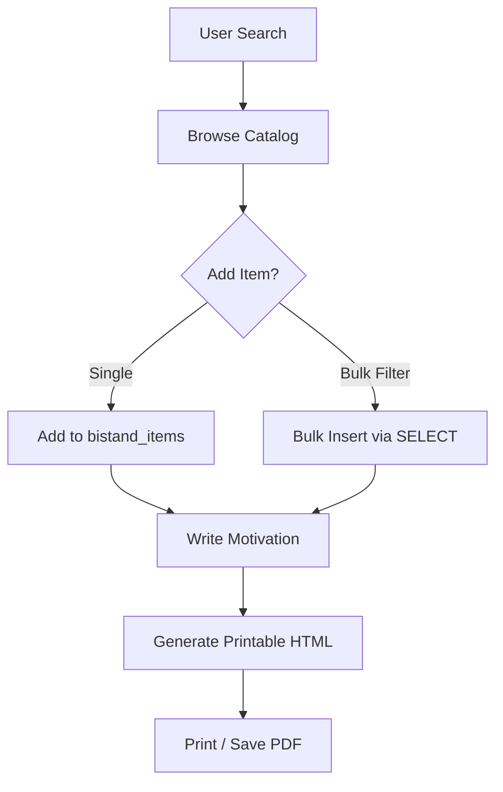

Relevant source files

The following files were used as context for generating this wiki page:

- [app/src/bistand.ts](app/src/bistand.ts)
- [PROPOSAL-hopslagen-app.md](PROPOSAL-hopslagen-app.md)
- [app/public/index.html](app/public/index.html)
- [app/public/app.js](app/public/app.js)
- [infra/schema.sql](infra/schema.sql)
- [app/src/index.ts](app/src/index.ts)
- [engine/src/index.ts](engine/src/index.ts)

# Ansökningsunderlag (Social Services)

The **Ansökningsunderlag** (Application Basis) system is a specialized feature within the Product Describer project designed to assist users in preparing documentation for social services (socialtjänsten). It allows users to browse a managed product catalog, select items relevant to their needs, provide personal justifications (motivations) for each item, and generate a print-ready document or PDF for official submission.

Sources: [app/src/bistand.ts:4-8](app/src/bistand.ts#L4-L8), [app/public/index.html:105-107](app/public/index.html#L105-L107), [PROPOSAL-hopslagen-app.md:27-30](PROPOSAL-hopslagen-app.md#L27-L30)

## System Architecture and Data Flow

The system operates as a module within the unified Cloudflare Workers application. It relies on a D1 SQL database as the source of truth for both the global product catalog and user-specific selections. Users interact with the system through a frontend interface that communicates with the `app` Worker, which in turn performs CRUD operations on the `bistand_items` table.

### Data Relationship Diagram
The following diagram illustrates the relationship between the global product catalog and individual user application files.

Sources: [infra/schema.sql:154-162](infra/schema.sql#L154-L162), [PROPOSAL-hopslagen-app.md:79-80](PROPOSAL-hopslagen-app.md#L79-L80)

### Functional Workflow
Users follow a specific workflow to generate an application:
1.  **Search & Discovery**: Browse products via the catalog using keyword search or category filters.
2.  **Selection**: Add specific items to their personal "Underlag".
3.  **Justification**: Write a custom motivation for each added product.
4.  **Generation**: Render a printable HTML view specifically formatted for submission.

Sources: [app/src/bistand.ts:130-136](app/src/bistand.ts#L130-L136), [app/public/app.js:255-270](app/public/app.js#L255-L270), [app/public/index.html:109-115](app/public/index.html#L109-L115)

## Key Components and Logic

### Catalog Filtering and Selection
The system provides robust filtering to find relevant products. A critical implementation detail in the `catalogFilter` function is the requirement for a `WHERE true` clause even when no filters are active; this ensures that SQLite's `UPSERT` (ON CONFLICT) parser functions correctly during bulk imports.

Sources: [app/src/bistand.ts:25-38](app/src/bistand.ts#L25-L38)

### Bulk Import Capabilities
Users can add multiple products at once to their application basis. The `bulkAddBistand` function utilizes an `INSERT ... SELECT ... ON CONFLICT DO NOTHING` pattern, allowing the addition of all products matching a current search or category filter in a single server-side operation.

Sources: [app/src/bistand.ts:109-120](app/src/bistand.ts#L109-L120), [app/public/app.js:520-530](app/public/app.js#L520-L530)

### Automated Description Generation
The system supports two modes for handling product descriptions:
*  **On-Demand**: Descriptions are shown if they already exist in the catalog.
*  **Auto-Mode**: If enabled (requiring a user's own API key or admin status), the system automatically triggers AI generation for any items in the application that lack descriptions.

Sources: [app/public/app.js:335-350](app/public/app.js#L335-L350), [engine/src/index.ts:327-340](engine/src/index.ts#L327-L340)

## API Endpoints

The `app` Worker exposes several endpoints to manage the application basis:

| Endpoint | Method | Description |
| :--- | :--- | :--- |
| `/api/catalog` | GET | Searches the global product catalog with optional `q` (query), `offset`, and `category` parameters. |
| `/api/bistand` | GET | Retrieves a paginated list of items in the user's application basis. |
| `/api/bistand` | POST | Adds a product to the basis or updates the motivation for an existing one. |
| `/api/bistand/bulk` | POST | Adds all products matching a specific filter to the user's basis. |
| `/api/bistand/:id` | DELETE| Removes a specific product from the user's basis. |
| `/underlag` | GET | Renders the printable HTML document for the user. |

Sources: [app/src/index.ts:111-155](app/src/index.ts#L111-L155), [app/src/bistand.ts:41-45](app/src/bistand.ts#L41-L45)

## Data Structures

### Database Schema: `bistand_items`
This table stores user-specific selections and justifications.

| Field | Type | Constraint | Description |
| :--- | :--- | :--- | :--- |
| `account_id` | TEXT | FK (accounts.id) | The ID of the user creating the basis. |
| `product_id` | INTEGER | FK (products.id) | The ID of the selected product. |
| `motivation` | TEXT | NOT NULL | User's justification for the product. |
| `created_at` | INTEGER | NOT NULL | Unix timestamp of creation. |

Sources: [infra/schema.sql:154-162](infra/schema.sql#L154-L162)

## Document Generation and Rendering

The final document is rendered server-side as a clean HTML page. It includes a custom Print-CSS media query that transitions the UI from a dark-themed web view to a high-contrast, black-and-white document suitable for official social services review.

### Features of the Printable Underlag:
*  **Privacy**: Displays the user's email and the compilation date.
*  **Summary**: Automatically calculates the total cost of all selected products.
*  **Visual Clarity**: Includes product titles, current prices, direct links, AI descriptions, and the user's custom motivation.
*  **Print Optimization**: Hides navigation toolbars and interactive buttons using `@media print`.

Sources: [app/src/bistand.ts:143-160](app/src/bistand.ts#L143-L160), [app/src/bistand.ts:175-200](app/src/bistand.ts#L175-L200)

## Conclusion
The **Ansökningsunderlag** module bridges the gap between raw product data and administrative requirements. By combining a large-scale managed catalog with personalized justification tools and AI-enhanced descriptions, it streamlines the process of creating formal requests for social assistance. Its integration into the Cloudflare Workers architecture ensures that user data remains synchronized across sessions while providing a performant, server-rendered output for end-users.
