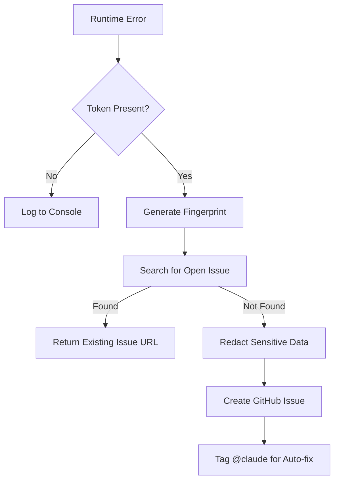

<details>
<summary>Relevant source files</summary>

The following files were used as context for generating this wiki page:

- [shared/github-report.ts](shared/github-report.ts)
- [README.md](README.md)
- [engine/src/index.ts](engine/src/index.ts)
- [guldstandard.md](guldstandard.md)
- [processor/package.json](processor/package.json)
- [engine/package.json](engine/package.json)
</details>

# Automatic Error Reporting

The Automatic Error Reporting system is a specialized diagnostic module designed to capture unexpected runtime errors across the various Cloudflare Workers in the project. It automatically generates GitHub issues for identified bugs, enabling a semi-autonomous "auto-fix" cycle where the repository's CI/CD automation—specifically the `claude.yml` workflow—can attempt to resolve the reported issues.

This system is a TypeScript port of the original Python-based `github_report.py`. It is primarily integrated into the `processor` worker (queue consumer) and the `engine` worker (cron and fetcher endpoints) to provide visibility into operational failures without requiring manual log monitoring.

Sources: [README.md:52-61](README.md#L52-L61), [shared/github-report.ts:1-12](shared/github-report.ts#L1-L12)

## Core Architecture and Data Flow

The reporting logic resides in a shared utility that interacts with the GitHub REST API. When a worker encounters an unhandled exception or a significant operational failure, it invokes the reporting function, which performs data sanitization, deduplication through fingerprinting, and issue creation.

### Error Processing Flow
The following diagram illustrates how an error moves from the runtime environment to a GitHub Issue:



The system ensures that sensitive information like API keys and emails are never leaked into the public issue tracker through a multi-stage redaction process.

Sources: [shared/github-report.ts:44-98](shared/github-report.ts#L44-L98), [README.md:52-61](README.md#L52-L61)

## Implementation Details

### Fingerprinting and Deduplication
To prevent flooding the repository with duplicate issues for the same recurring bug, the system generates a unique fingerprint based on the error name and the first line of the stack trace.

- **Method**: SHA-256 hash of `${err.name}@${firstFrame}`.
- **Outcome**: A 10-character hexadecimal string included in the issue title.
- **Search**: Before creating a new issue, the system queries GitHub for open issues containing that specific fingerprint.

Sources: [shared/github-report.ts:37-42](shared/github-report.ts#L37-L42), [shared/github-report.ts:59-67](shared/github-report.ts#L59-L67)

### Data Redaction and Sanitization
Safety is prioritized by scrubbing sensitive patterns from the error stack and context objects before transmission.

| Target Pattern | Redaction Result | Implementation |
| :--- | :--- | :--- |
| Environment Secrets | `[REDACTED]` | Matches keys containing "KEY", "TOKEN", "SECRET", "PASSWORD", "PASS" |
| API Keys | `[REDACTED]` | Regex for patterns like `sk-`, `ghp_`, `AKIA`, `Bearer` |
| Email Addresses | `[EMAIL REDACTED]` | Standard email regex |
| Home Paths | `/home/[user]` | Regex for `/home/` directories |

Sources: [shared/github-report.ts:14-35](shared/github-report.ts#L14-L35)

## Integration with Workers

The system is integrated at the top-level error handlers of the project's background workers.

### Engine Worker Integration
In the `engine` worker, the reporting logic is wrapped around the `scheduled` cron handler and the `fetch` API handler. It uses the `GITHUB_ERROR_REPORT_TOKEN` secret to authenticate with GitHub.

```typescript
try {
  // ... cron logic ...
} catch (err) {
  console.error("cron misslyckades:", err);
  await reportErrorToGitHub(REPO, "Engine cron misslyckades", err, env);
}
```

Sources: [engine/src/index.ts:25-27](engine/src/index.ts#L25-L27), [engine/src/index.ts:404-407](engine/src/index.ts#L404-L407)

### Component Dependencies
Key dependencies used for error tracking and reporting across the workers:

| Package | Purpose | Used in |
| :--- | :--- | :--- |
| `@sentry/cloudflare` | Distributed tracing and error monitoring | `app`, `processor`, `engine` |
| `shared/github-report.ts` | Custom GitHub Issue reporter | `processor`, `engine` |

Sources: [processor/package.json:14](processor/package.json#L14), [engine/package.json:11](engine/package.json#L11), [README.md:52-61](README.md#L52-L61)

## Automation Synergy

The primary purpose of automatic reporting is to trigger the "auto-fix" mechanism. When an issue is created with the `@claude` tag:
1. The `claude.yml` workflow is triggered by the new issue.
2. The AI assistant analyzes the provided sanitized stack trace and context.
3. The assistant attempts to generate a fix and submit a Pull Request.
4. Once the CI pipeline turns green, the fix can be automatically merged via the `auto-merge.yml` workflow.

Sources: [guldstandard.md:11-13](guldstandard.md#L11-L13), [shared/github-report.ts:80-86](shared/github-report.ts#L80-L86)

## Configuration

Reporting is a "best-effort" service. If the required secret is missing, the system defaults to standard console logging.

| Variable | Type | Description |
| :--- | :--- | :--- |
| `GITHUB_ERROR_REPORT_TOKEN` | Secret | GitHub Fine-grained PAT with issue write access |
| `REPO` | Constant | The target repository (e.g., `blixten85/product-describer-cloudflare`) |

Sources: [shared/github-report.ts:45-50](shared/github-report.ts#L45-L50), [README.md:73-75](README.md#L73-L75)

## Summary
The Automatic Error Reporting system serves as a bridge between production failures and automated remediation. By leveraging cryptographic fingerprinting for deduplication and strict regex-based redaction for security, it provides a safe and efficient way to feed operational telemetry back into the development lifecycle via GitHub Issues.
