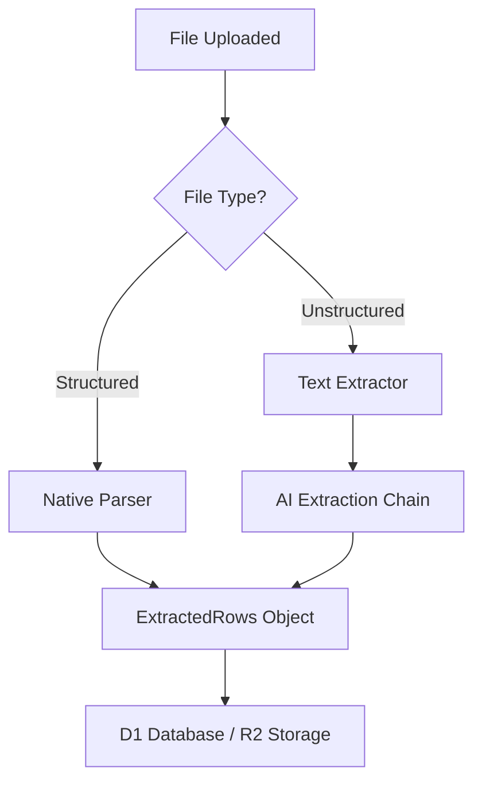
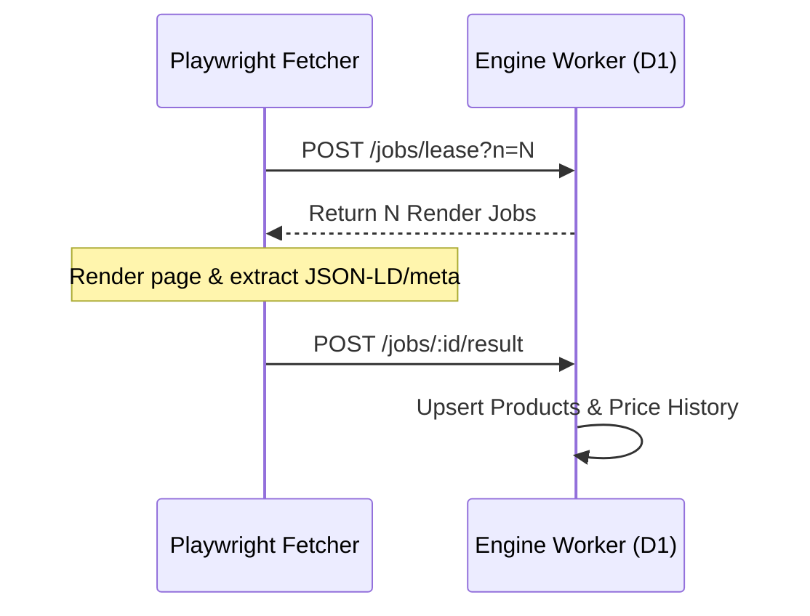

<details>
<summary>Relevant source files</summary>

The following files were used as context for generating this wiki page:

- [processor/src/extractors.ts](processor/src/extractors.ts)
- [DESIGN.md](DESIGN.md)
- [README.md](README.md)
- [engine/src/index.ts](engine/src/index.ts)
- [app/public/app.js](app/public/app.js)
</details>

# Document Extraction Engine

The Document Extraction Engine is a core component of the `product-describer-cloudflare` project, responsible for transforming various unstructured and structured file formats into normalized product data rows. It handles high-level document parsing for file uploads and powers the background catalog discovery system through a combination of local parsing logic and AI-driven extraction. Sources: [processor/src/extractors.ts:1-10](processor/src/extractors.ts#L1-L10), [README.md:12-25](README.md#L12-L25)

The engine operates within a distributed architecture where Cloudflare Workers act as the "brain and memory," while a stateless Playwright-based fetcher serves as the "muscle" for web-based extraction. The system supports multiple input types, including CSV, XLSX, TXT, DOCX, and PDF, with a focus on extracting fields such as product titles, prices, and source text for further enrichment. Sources: [DESIGN.md:15-30](DESIGN.md#L15-L30), [processor/src/extractors.ts:16-18](processor/src/extractors.ts#L16-L18)

## System Architecture

The extraction process is split between the `processor` Worker, which handles uploaded documents, and the `engine` Worker, which manages background crawl jobs. The architecture emphasizes high reliability by utilizing Cloudflare D1 for state management and R2 for storage, replacing legacy on-premise databases. Sources: [DESIGN.md:33-45](DESIGN.md#L33-L45), [README.md:7-15](README.md#L7-L15)

### Extraction Workflow
The following diagram illustrates the flow of a document through the extraction pipeline:



The extraction logic is encapsulated in the `extractRows` function, which routes files based on their extensions. Sources: [processor/src/extractors.ts:44-58](processor/src/extractors.ts#L44-L58)

## Core Extraction Components

### Native Structured Parsers
For formats with inherent structure, the engine uses specialized libraries to ensure high fidelity and low latency without requiring AI intervention. Sources: [processor/src/extractors.ts:1-5](processor/src/extractors.ts#L1-L5)

*  **CSV Parsing:** Implements a custom `parseCsvLine` function that supports quoted fields and handles basic RFC4180-style formatting. Sources: [processor/src/extractors.ts:75-103](processor/src/extractors.ts#L75-L103)
*  **XLSX Parsing:** Utilizes the `xlsx` library to read the first sheet and map rows to a header-defined object. Sources: [processor/src/extractors.ts:105-121](processor/src/extractors.ts#L105-L121)

### AI-Driven Extraction for Unstructured Data
Text-heavy formats (TXT, DOCX, PDF) undergo a two-stage process: raw text extraction followed by AI-assisted structured data identification. Sources: [processor/src/extractors.ts:3-7](processor/src/extractors.ts#L3-L7)

| Component | Library/Method | Functionality |
| :--- | :--- | :--- |
| **PDF Extraction** | `unpdf` | Extracts raw text from multi-page PDF documents. |
| **DOCX Extraction** | `mammoth` | Extracts raw text from Microsoft Word documents. |
| **AI Identification** | `aiExtract` | Uses a `ProviderChain` to identify product entities in text. |

Sources: [processor/src/extractors.ts:123-146](processor/src/extractors.ts#L123-L146)

The `aiExtract` function uses a specific extraction prompt to force the AI to return a strictly formatted JSON array containing `Product`, `Site`, and `Price (SEK)` fields. Sources: [processor/src/extractors.ts:24-33](processor/src/extractors.ts#L24-L33), [processor/src/extractors.ts:148-165](processor/src/extractors.ts#L148-L165)

## Web and Catalog Extraction

In addition to document uploads, the engine facilitates catalog-wide extraction through a "Pull" model. A stateless fetcher leases jobs from the `engine` Worker, renders pages using Playwright, and posts the results back to D1. Sources: [DESIGN.md:55-65](DESIGN.md#L55-L65), [engine/src/index.ts:15-30](engine/src/index.ts#L15-L30)

### Job Lifecycle



The `reportResult` function in the engine handles the ingestion of extracted data, performing complex upserts into the `products` and `price_history` tables. Sources: [engine/src/index.ts:133-150](engine/src/index.ts#L133-L150), [engine/src/index.ts:175-200](engine/src/index.ts#L175-L200)

## Data Structures

The primary output of any extraction process is the `ExtractedRows` interface, which ensures a standard format regardless of the source. Sources: [processor/src/extractors.ts:37-41](processor/src/extractors.ts#L37-L41)

```typescript
export interface ExtractedRows {
  rows: Record<string, string>[];
  fieldnames: string[];
}
```

Sources: [processor/src/extractors.ts:39-40](processor/src/extractors.ts#L39-L40)

### Standard Field Mapping
The engine targets the following standard fields during extraction:
*  **Site:** The source store or website name.
*  **Product:** The descriptive name of the item.
*  **Price (SEK):** The current price in Swedish Krona.
*  **Link:** The URL to the product page (primarily used in web crawls).

Sources: [processor/src/extractors.ts:20](processor/src/extractors.ts#L20), [processor/src/extractors.ts:175-181](processor/src/extractors.ts#L175-L181)

## Error Handling and Recovery

The engine implements several layers of reliability:
1.  **Lease/Ack Pattern:** In background crawls, jobs are leased for a specific duration (`LEASE_MS` of 120,000ms for detail jobs). If the fetcher fails, the lease expires and the job returns to `pending` status. Sources: [engine/src/index.ts:74-76](engine/src/index.ts#L74-L76), [engine/src/index.ts:290-297](engine/src/index.ts#L290-L297)
2.  **Retry Logic:** Failed jobs are retried up to `MAX_ATTEMPTS` (default 5) before being marked as `error`. Sources: [engine/src/index.ts:77](engine/src/index.ts#L77), [engine/src/index.ts:144-152](engine/src/index.ts#L144-L152)
3.  **Validation:** Native parsers include checks for empty files or invalid JSON responses from AI providers, throwing a specialized `ExtractionError`. Sources: [processor/src/extractors.ts:35](processor/src/extractors.ts#L35), [processor/src/extractors.ts:158-164](processor/src/extractors.ts#L158-L164)

The Document Extraction Engine serves as the foundational data ingestion layer, ensuring that whether a user uploads a PDF or the system crawls a web store, the resulting data is uniform and ready for AI-generated enrichment and price tracking. Sources: [DESIGN.md:120-130](DESIGN.md#L120-L130), [README.md:1-10](README.md#L1-L10)
