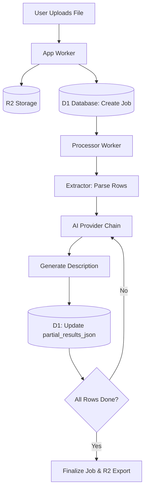
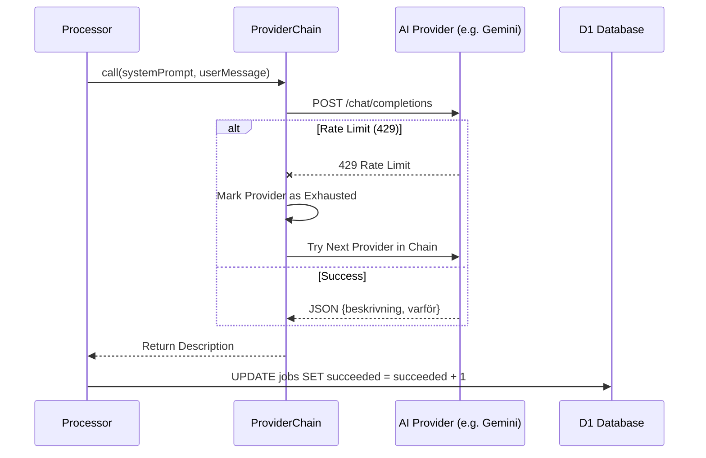

<details>
<summary>Relevant source files</summary>

The following files were used as context for generating this wiki page:

- [processor/src/index.ts](processor/src/index.ts)
- [README.md](README.md)
- [DESIGN.md](DESIGN.md)
- [infra/schema.sql](infra/schema.sql)
- [processor/src/extractors.ts](processor/src/extractors.ts)
- [shared/providers.ts](shared/providers.ts)
</details>

# Row-by-Row AI Generation

Row-by-Row AI Generation is a core architectural pattern in the Product Describer system designed to handle long-running batch processing within the constraints of Cloudflare Workers. Instead of processing an entire product list in a single execution, the system decomposes bulk uploads into individual product rows, processing each row as a discrete message in a queue.

This approach ensures reliability and scalability by allowing the system to handle multi-hour background processes through incremental execution. Each row leverages AI providers to generate descriptions, and the system manages state via a D1 database to track progress, handle provider rate limits, and facilitate job resumption.

Sources: [README.md:12-16](README.md#L12-L16), [DESIGN.md:4.4](DESIGN.md:4.4)

## Architecture and Data Flow

The row-by-row generation process is triggered by a user uploading a file (CSV, XLSX, TXT, DOCX, or PDF). The `processor` worker acts as the consumer of these jobs, moving through stages of extraction and subsequent AI enrichment.

### High-Level Workflow
1.  **Ingestion:** The `app` worker receives a file, stores it in R2, and creates a job entry in D1.
2.  **Extraction:** The `processor` extracts product information (name, site, price) from the file. For unstructured formats like PDF, it uses an AI extraction prompt to identify products.
3.  **Queue Distribution:** Each extracted product is processed as a separate task.
4.  **AI Generation:** The system iterates through rows, calling the `ProviderChain` to generate Swedish descriptions.
5.  **Persistence:** Partial results are stored in the `jobs` table to prevent data loss during pauses or retries.

Sources: [README.md:19-24](README.md#L19-L24), [processor/src/extractors.ts:6-12](processor/src/extractors.ts#L6-L12), [infra/schema.sql:50-59](infra/schema.sql#L50-L59)

### Data Flow Diagram

The following diagram illustrates the flow of data from an initial file upload to the final generation of product descriptions.



Sources: [README.md:19-24](README.md#L19-L24), [infra/schema.sql:47-65](infra/schema.sql#L47-L65)

## Component Breakdown

### The Jobs Table and State Management
State is maintained in the `jobs` table in D1. This table tracks the status of the row-by-row generation, including the number of succeeded rows versus total rows.

| Field | Type | Description |
| :--- | :--- | :--- |
| `status` | TEXT | Current state: `queued`, `processing`, `paused`, `done`, or `error`. |
| `total` | INTEGER | Total number of product rows extracted from the file. |
| `succeeded` | INTEGER | Number of rows successfully processed by the AI. |
| `rows_json` | TEXT | Cached raw rows to avoid re-extraction. |
| `partial_results_json` | TEXT | Results gathered so far to enable resumption. |

Sources: [infra/schema.sql:47-65](infra/schema.sql#L47-L65), [app/public/app.js:144-150](app/public/app.js#L144-L150)

### Extraction Logic
Structured files (CSV/XLSX) are parsed directly using standard logic. Unstructured files (PDF/DOCX/TXT) utilize a specific AI prompt to identify products and return a JSON array for subsequent row-by-row processing.

```typescript
const EXTRACTION_PROMPT = [
  "Du får ett textdokument. Hitta varje enskild produkt/pryl som nämns i texten.",
  "Svara ALLTID med endast en giltig JSON-array, utan kodstaket eller extra text,",
  'i exakt detta format:\n[{"Product": "...", "Site": "...", "Price (SEK)": "..."}]',
].join("\n");
```

Sources: [processor/src/extractors.ts:16-24](processor/src/extractors.ts#L16-L24)

## AI Generation and Provider Handling

The generation step for each row utilizes the `ProviderChain`. This component manages multiple AI providers (Anthropic, OpenAI, Gemini, Azure OpenAI) to ensure high availability and bypass individual rate limits.

### Sequence of Row Processing
The sequence diagram below shows how the `Processor` handles a single row within the batch.



Sources: [shared/providers.ts:153-195](shared/providers.ts#L153-L195), [processor/src/index.ts](processor/src/index.ts)

### Failure and Resume Mechanism
Because Cloudflare Workers are short-lived, long processes may be interrupted. The system uses a `lease/ack` pattern in the `render_jobs` table (for catalog tasks) and message retries for file uploads.
*  **Retries:** If an AI quota is hit, the processor uses `queueMsg.retry({delaySeconds})` to pause execution.
*  **Partial Storage:** By storing `partial_results_json` in D1 after every successful row, the system can resume exactly where it left off if the Worker is terminated.

Sources: [README.md:21-23](README.md#L21-L23), [infra/schema.sql:101-112](infra/schema.sql#L101-L112), [DESIGN.md:3.2](DESIGN.md:3.2)

## Summary
Row-by-Row AI Generation transforms potentially heavy batch operations into a sequence of small, manageable tasks. By combining Cloudflare D1 for state persistence, R2 for file storage, and a robust `ProviderChain` for AI resilience, the system provides a reliable mechanism for generating high-quality Swedish product descriptions at scale without incurring high infrastructure costs.

Sources: [DESIGN.md:2-5](DESIGN.md#L2-L5), [README.md:1-10](README.md#L1-L10)
