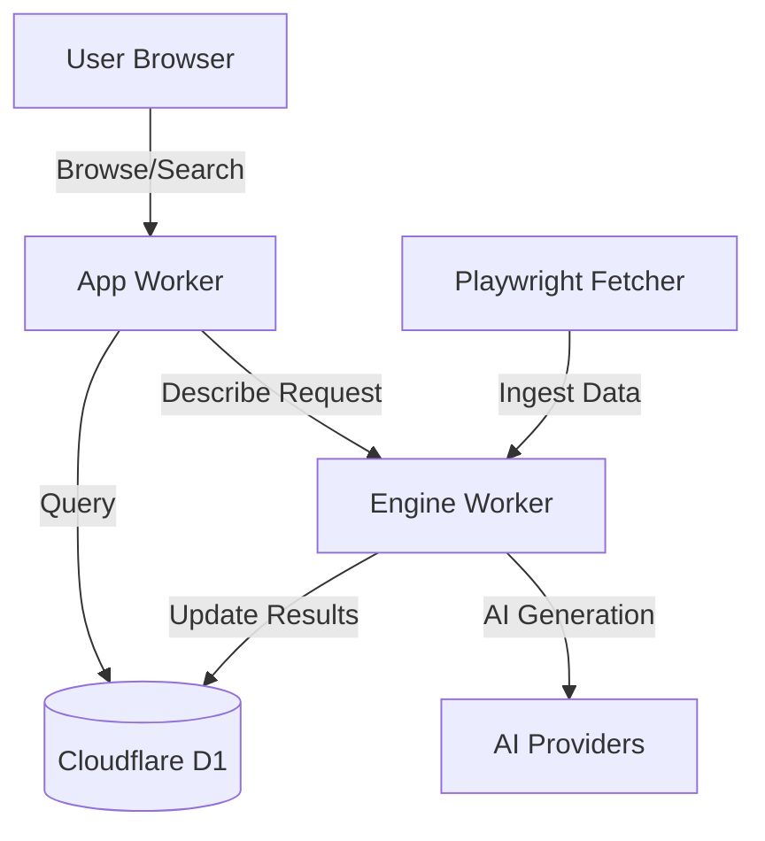
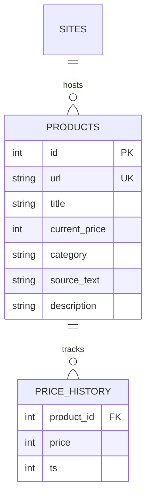
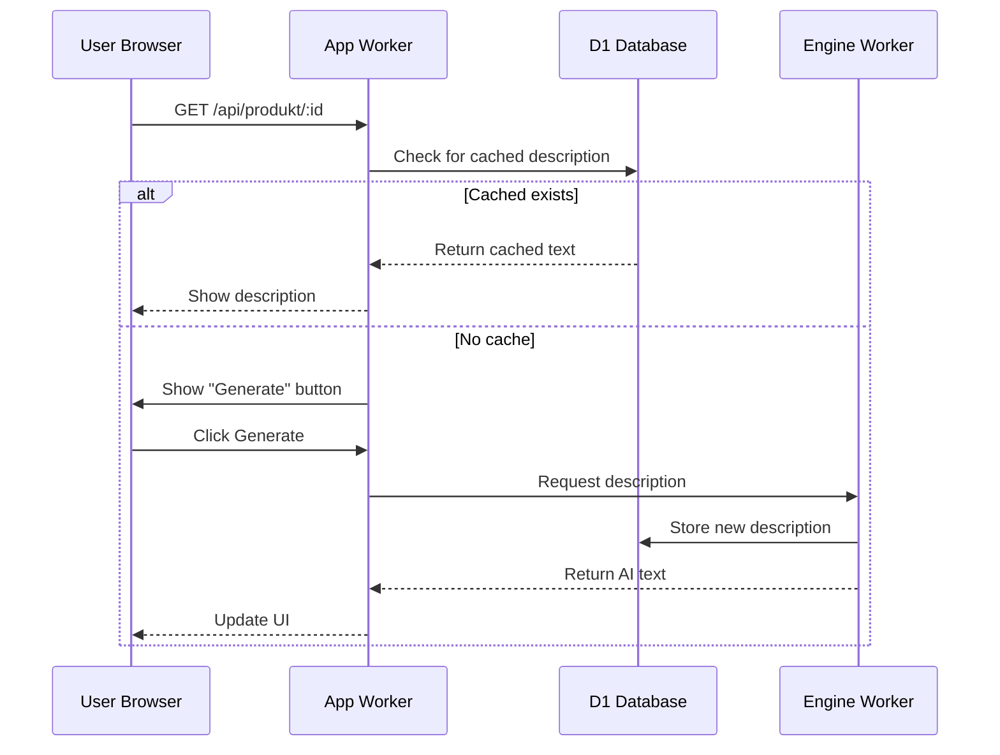

Relevant source files

The following files were used as context for generating this wiki page:

- [PROPOSAL-hopslagen-app.md](PROPOSAL-hopslagen-app.md)
- [app/src/catalog.ts](app/src/catalog.ts)
- [app/src/bistand.ts](app/src/bistand.ts)
- [infra/schema.sql](infra/schema.sql)
- [app/public/app.js](app/public/app.js)
- [DESIGN.md](DESIGN.md)
- [engine/src/index.ts](engine/src/index.ts)

# Public Catalog & Browsing

The Public Catalog & Browsing system is a core module designed to allow users to navigate, search, and view details for approximately 32,000 products stored in a Cloudflare D1 database. This system represents "Department B" of the unified application, providing a public-facing interface that was previously gated behind administrative access. It serves as a centralized repository of product data, including titles, prices, categories, and AI-generated descriptions.

Sources: [PROPOSAL-hopslagen-app.md:14-16](PROPOSAL-hopslagen-app.md#L14-L16), [DESIGN.md:15-18](DESIGN.md#L15-L18), [app/public/app.js:335-340](app/public/app.js#L335-L340)

## Architecture and Data Flow

The catalog architecture relies on Cloudflare Workers for logic and D1 for storage. The data is populated by a stateless Playwright fetcher (the "muscle") that renders product pages and posts results back to an "ingest" endpoint. The `app` Worker handles user requests for browsing and searching, while the `engine` Worker manages the background tasks of updating prices and generating descriptions.

### Component Relationship Diagram
The following diagram illustrates how the public catalog interacts with the broader system architecture.

Sources: [DESIGN.md:21-43](DESIGN.md#L21-L43), [engine/src/index.ts:5-18](engine/src/index.ts#L5-L18)

## Catalog Discovery and Filtering

Users interact with the catalog through search queries and category filters. The system uses SQL-based filtering within D1 to provide paginated results. A specific "bulk" feature allows users to add entire filtered result sets to their personal watchlists or application drafts.

### Search and List Logic
Search functionality is implemented using `LIKE` patterns on product titles, while categories provide a high-level organizational structure. The application uses a consistent `catalogFilter` function to ensure that manual searches and bulk operations target the same data subsets.

| Feature | Implementation | Description |
| :--- | :--- | :--- |
| **Search** | `title LIKE ?` | Case-insensitive search on product names. |
| **Category Filter** | `category = ?` | Filtering by specific product groups. |
| **Pagination** | `LIMIT / OFFSET` | Standard 30-item page size for the web UI. |
| **Bulk Import** | `INSERT ... SELECT` | Server-side transfer of all filtered items to user tables. |

Sources: [app/src/bistand.ts:25-45](app/src/bistand.ts#L25-L45), [app/src/catalog.ts:20-25](app/src/catalog.ts#L20-L25), [app/public/app.js:380-410](app/public/app.js#L380-L410)

## Product Details and Price History

Each product in the catalog has a dedicated detail view. This view aggregates information from the `products` table and historical data from the `price_history` table.

### Data Schema
The catalog data model is centered around the `products` entity.

Sources: [infra/schema.sql:57-94](infra/schema.sql#L57-L94), [app/src/catalog.ts:11-19](app/src/catalog.ts#L11-L19)

### Price Tracking Logic
Prices are tracked over time to support price drop alerts. When the fetcher reports a new price, the system checks if it differs from the most recent entry before creating a new record in `price_history` to avoid redundant data.
Sources: [engine/src/index.ts:233-248](engine/src/index.ts#L233-L248)

## AI-Generated Descriptions

Product descriptions are generated on-demand or via background cron jobs. To manage costs, the system employs a caching strategy: once a description is generated for a product, it is stored in the `products.description` field and served for free to all subsequent users.

### Description Sequence Diagram
This flow shows the priority of description sources when a user views a product.

Sources: [app/src/catalog.ts:50-85](app/src/catalog.ts#L50-L85), [app/public/app.js:460-490](app/public/app.js#L460-L490), [engine/src/index.ts:355-380](engine/src/index.ts#L355-L380)

### Generation Permissions
- **Admin/Operator:** Can use the shared system AI key (Gemini) for background and on-demand generation.
- **Public Users:** Must provide their own API keys (Anthropic, OpenAI, etc.) via the "Describe Tool" settings to generate new descriptions on-demand, though they can view all existing cached descriptions.

Sources: [app/src/catalog.ts:65-72](app/src/catalog.ts#L65-L72), [PROPOSAL-hopslagen-app.md:22-30](PROPOSAL-hopslagen-app.md#L22-L30)

## Summary of API Endpoints

The following endpoints facilitate catalog browsing and interactions.

| Endpoint | Method | Description | Source |
| :--- | :--- | :--- | :--- |
| `/api/catalog` | GET | Lists products with optional search `q` and `category` filters. | [app/src/bistand.ts:46](app/src/bistand.ts#L46) |
| `/api/categories` | GET | Returns distinct categories and counts for filtering. | [app/src/bistand.ts:62](app/src/bistand.ts#L62) |
| `/api/produkt/:id` | GET | Fetches full details for a product, including price history. | [app/src/catalog.ts:28](app/src/catalog.ts#L28) |
| `/api/produkt/:id/describe`| POST | Triggers AI description generation (uses cache if available). | [app/src/catalog.ts:50](app/src/catalog.ts#L50) |

The Public Catalog & Browsing module transforms the application from a private tool into a public utility. By centralizing product data in Cloudflare D1 and utilizing a shared caching mechanism for AI descriptions, the system provides a scalable and cost-effective way for users to discover products and monitor market changes.
