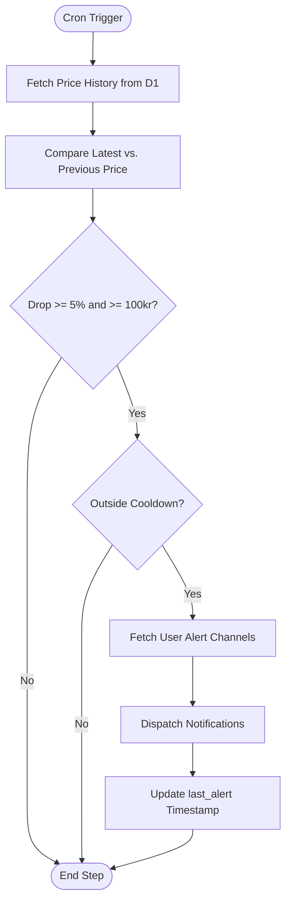
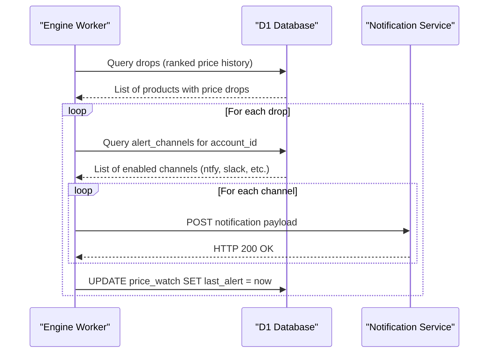

<details>
<summary>Relevant source files</summary>

The following files were used as context for generating this wiki page:

- [engine/src/index.ts](engine/src/index.ts)
- [infra/schema.sql](infra/schema.sql)
- [DESIGN.md](DESIGN.md)
- [PROPOSAL-hopslagen-app.md](PROPOSAL-hopslagen-app.md)
- [app/public/app.js](app/public/app.js)
- [app/public/index.html](app/public/index.html)
</details>

# Price Monitoring & Alerts

The **Price Monitoring & Alerts** system is a core feature of the Product Describer Cloudflare architecture, designed to notify users of significant price drops in tracked products. It operates as part of the centralized "brain" located in Cloudflare Workers, utilizing D1 as a persistent data store for price history and user watchlists.

The system automates the comparison of current prices against historical data points and dispatches notifications through various modular channels. This functionality is integrated into the primary `engine` cron trigger, ensuring regular checks without the need for separate worker instances.

Sources: [PROPOSAL-hopslagen-app.md:12-16](PROPOSAL-hopslagen-app.md#L12-L16), [DESIGN.md:37-43](DESIGN.md#L37-L43), [engine/src/index.ts:503-505](engine/src/index.ts#L503-L505)

## System Architecture & Data Flow

The monitoring logic is a sequential step within the `engine` worker's scheduled handler, which runs every 5 minutes. The process involves identifying products with new price points, comparing them to the immediate previous price, and verifying if the drop meets user-defined or system-default thresholds.

### Logic Flow for Price Checks
The following diagram illustrates how the `checkPriceDrops` function processes data within the Cloudflare environment:



Sources: [engine/src/index.ts:505-515](engine/src/index.ts#L505-L515), [PROPOSAL-hopslagen-app.md:43-47](PROPOSAL-hopslagen-app.md#L43-L47)

## Data Modeling

The system relies on three primary tables in the D1 database to track products, their history, and user preferences.

### Price History and Watchlist Schema
| Table | Field | Type | Description |
| :--- | :--- | :--- | :--- |
| `price_history` | `product_id` | INTEGER | Reference to the product being tracked. |
| `price_history` | `price` | INTEGER | The recorded price at a specific time. |
| `price_history` | `ts` | INTEGER | Unix-ms timestamp of the record. |
| `price_watch` | `account_id` | TEXT | The user monitoring the product. |
| `price_watch` | `product_id` | INTEGER | The product being monitored. |
| `price_watch` | `last_alert` | INTEGER | Timestamp of the last notification sent (cooldown). |

Sources: [infra/schema.sql:87-101](infra/schema.sql#L87-L101), [infra/schema.sql:120-128](infra/schema.sql#L120-L128)

## Alert Thresholds & Cooldown

To prevent notification fatigue, the system enforces specific logic for what constitutes a "valid" price drop. By default, a price drop must satisfy two conditions simultaneously:
1. **Percentage Threshold:** The drop must be at least 5%.
2. **Absolute Threshold:** The drop must be at least 100 kr.

Additionally, an `ALERT_COOLDOWN_HOURS` setting (defaulting to 24 hours) ensures that a user is not alerted multiple times for the same price drop within a short period.

```typescript
const minPct = Number(env.ALERT_MIN_DROP_PCT) || 5;
const minKr = Number(env.ALERT_MIN_DROP_KR) || 100;
const cooldownMs = (Number(env.ALERT_COOLDOWN_HOURS) || 24) * 3_600_000;
```

Sources: [engine/src/index.ts:466-468](engine/src/index.ts#L466-L468), [PROPOSAL-hopslagen-app.md:43-47](PROPOSAL-hopslagen-app.md#L43-L47)

## Notification Channels

The system supports a modular set of alert channels. Each channel is defined by a `kind` and a `target` (address or configuration string).

| Channel Kind | Target Format | Implementation Detail |
| :--- | :--- | :--- |
| `ntfy` | Topic URL | Sent with `Title` and `Click` headers via POST. |
| `slack` | Webhook URL | Sent as a JSON payload with a `text` field. |
| `telegram` | `token:chatid` | Sent via the Telegram Bot API `sendMessage` endpoint. |
| `webhook` | Generic URL | Sent as a JSON payload with `title`, `body`, and `url`. |

Sources: [engine/src/index.ts:430-460](engine/src/index.ts#L430-L460), [infra/schema.sql:130-138](infra/schema.sql#L130-L138), [app/public/index.html:150-155](app/public/index.html#L150-L155)

### Alert Dispatch Sequence
The sequence diagram below shows the interaction between the Engine, the Database, and external Notification Services:



Sources: [engine/src/index.ts:470-501](engine/src/index.ts#L470-L501)

## User Interface & Management

Users manage their alerts through the "Bevakning" (Monitoring) department in the web application. This interface allows users to:
*  **View Watchlist:** See a list of all products currently being monitored and their current prices.
*  **Remove Alerts:** Stop monitoring specific products.
*  **Configure Channels:** Add or delete notification targets like Slack webhooks or Telegram tokens.
*  **Bulk Monitoring:** In the Catalog view, users can bulk-add all filtered products to their watchlist using the "★ Bevaka" action.

Sources: [app/public/index.html:144-162](app/public/index.html#L144-L162), [app/public/app.js:527-542](app/public/app.js#L527-L542), [app/public/app.js:655-675](app/public/app.js#L655-L675)

## Conclusion
The Price Monitoring & Alerts system provides a robust, automated way for users to track value in the product catalog. By integrating the logic into the `engine` worker's cron cycle and leveraging D1 for historical state, the system maintains high technical efficiency with zero additional infrastructure costs.

Sources: [DESIGN.md:92-98](DESIGN.md#L92-L98), [PROPOSAL-hopslagen-app.md:14-16](PROPOSAL-hopslagen-app.md#L14-L16)
