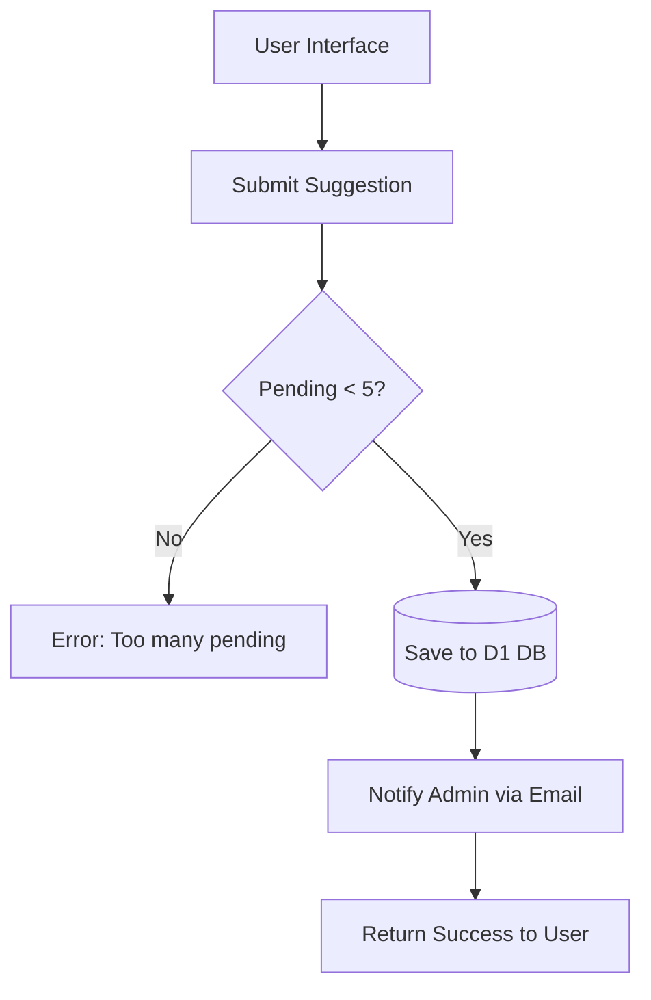
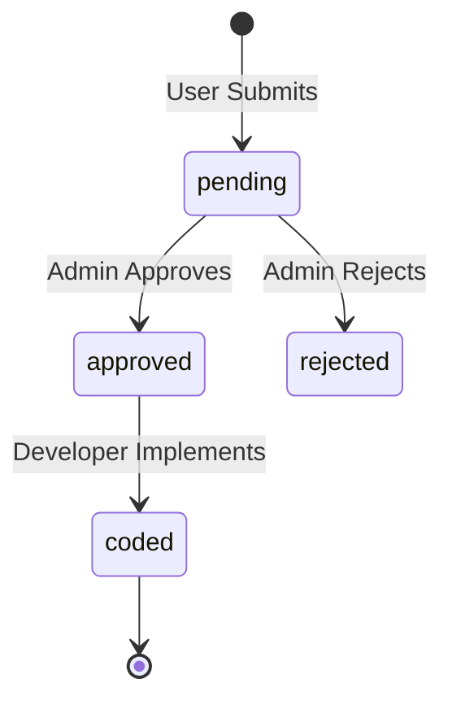
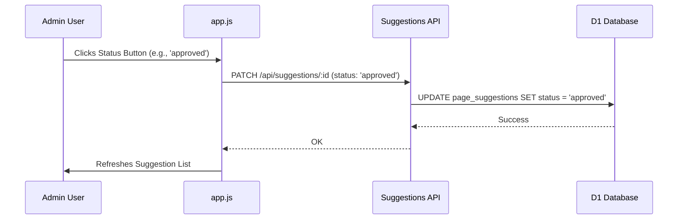

Relevant source files

The following files were used as context for generating this wiki page:

- [app/src/suggestions.ts](app/src/suggestions.ts)
- [PROPOSAL-hopslagen-app.md](PROPOSAL-hopslagen-app.md)
- [infra/schema.sql](infra/schema.sql)
- [app/public/app.js](app/public/app.js)
- [app/public/index.html](app/public/index.html)
- [engine/src/index.ts](engine/src/index.ts)

# Page Suggestions & Approvals

The Page Suggestions & Approvals system allows authenticated users to propose new features or pages for the Product Describer platform. This mechanism acts as a feedback loop between the user base and the administration, ensuring that development is driven by user needs while maintaining a human-in-the-loop "approval gate" for security and architectural integrity.

When a user submits a suggestion, the system stores the request in a D1 database and notifies the administrator via email. The administrator then reviews these submissions through a dedicated admin interface, where they can track the status of proposals—from initial pending status to coding and final implementation.

## Suggestion Submission Workflow

Users interact with the suggestion system through the "Föreslå sida" (Suggest Page) department in the application UI. The backend implements flood protection by limiting the number of pending suggestions per account to prevent inbox flooding.

### Submission Logic and Data Flow

The submission process follows a specific sequence to ensure data persistence and administrator notification:
1.  **Validation**: The system checks for a non-empty title and ensures the user has fewer than 5 pending suggestions.
2.  **Persistence**: The suggestion is saved to the `page_suggestions` table with a status of 'pending'.
3.  **Notification**: An email is sent to the configured `ADMIN_EMAIL` using a "best-effort" approach.

Sources: [app/src/suggestions.ts:21-48](app/src/suggestions.ts#L21-L48), [app/public/index.html:167-175](app/public/index.html#L167-L175), [PROPOSAL-hopslagen-app.md:83-89](PROPOSAL-hopslagen-app.md#L83-L89)

### Key Components

| Component | Description |
| :--- | :--- |
| `submitSuggestion` | Async function handling validation, DB insertion, and admin notification. |
| `page_suggestions` | D1 database table storing suggestion metadata and status. |
| `MAX_PENDING` | Hardcoded limit of 5 pending suggestions per account. |
| `Admin Notification` | Email containing user email, title, description, and suggestion ID. |
Sources: [app/src/suggestions.ts:16-52](app/src/suggestions.ts#L16-L52), [infra/schema.sql:161-170](infra/schema.sql#L161-L170)

## Administrative Review and Approval

The approval process is gated by user roles. Only accounts with the `admin` role can access the "Inkomna förslag" (Incoming Suggestions) card in the administration view.

### Suggestion Lifecycle Statuses
Suggestions transition through several states as they move from idea to implementation:
*  **pending**: The initial state upon submission.
*  **approved**: The administrator has reviewed and accepted the idea.
*  **rejected**: The suggestion will not be implemented.
*  **coded**: The implementation has been written but perhaps not yet fully deployed.

Sources: [app/src/suggestions.ts:68-72](app/src/suggestions.ts#L68-L72), [app/public/app.js:636-646](app/public/app.js#L636-L646)

### Admin Interface Logic
The admin panel retrieves the latest 200 suggestions and displays them with action buttons for status updates. Each status change triggers a `PATCH` request to the backend to update the D1 record.

Sources: [app/public/app.js:622-654](app/public/app.js#L622-L654), [app/src/suggestions.ts:68-72](app/src/suggestions.ts#L68-L72)

## Data Model

The `page_suggestions` table in D1 serves as the central repository for all user feedback.

### Database Schema: `page_suggestions`

| Field | Type | Description |
| :--- | :--- | :--- |
| `id` | TEXT (PK) | Unique identifier (generated via `randomId`). |
| `account_id` | TEXT (FK) | Reference to the user who submitted the suggestion. |
| `email` | TEXT | Email address of the submitter for contact purposes. |
| `title` | TEXT | Short title (max 200 chars). |
| `description` | TEXT | Detailed spec/description (max 4000 chars). |
| `status` | TEXT | Current state (pending, approved, rejected, coded). |
| `created_at` | INTEGER | Unix timestamp of submission. |
Sources: [infra/schema.sql:161-170](infra/schema.sql#L161-L170), [app/src/suggestions.ts:41-43](app/src/suggestions.ts#L41-L43)

## Technical Implementation Details

The feature is implemented across the `app` Worker and the shared database schema.

### Suggestion Retrieval Logic
The `listSuggestions` function retrieves the 200 most recent suggestions, ordered by their creation timestamp in descending order. This ensures admins see the newest feedback first.
Sources: [app/src/suggestions.ts:60-65](app/src/suggestions.ts#L60-L65)

### Security and Role Checks
The suggestion management endpoints are protected. While any logged-in user can submit a suggestion, the viewing and status update functions are restricted to users where `status.role === "admin"`. The UI specifically hides the suggestion list card for non-admin users.
Sources: [app/public/app.js:623-625](app/public/app.js#L623-L625), [PROPOSAL-hopslagen-app.md:33-38](PROPOSAL-hopslagen-app.md#L33-L38)

The Page Suggestions & Approvals system ensures a structured path for platform evolution, providing users with a voice while maintaining strict administrative control over the codebase and feature set. It combines database persistence, automated notifications, and role-based access control to manage the feedback lifecycle effectively.
