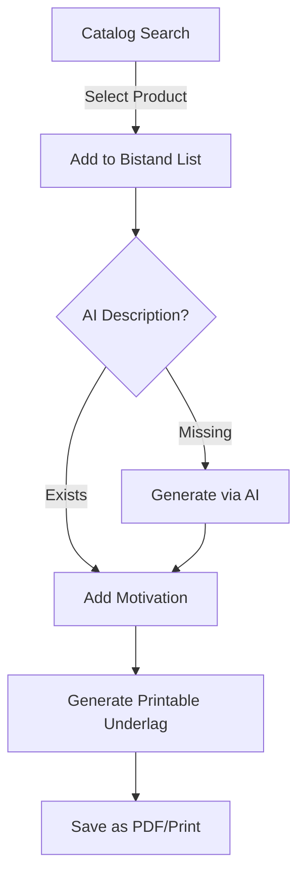
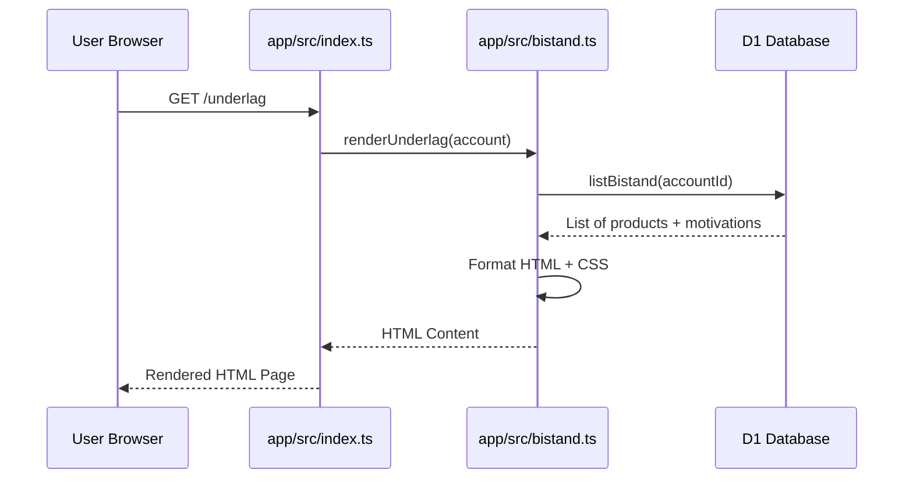

<details>
<summary>Relevant source files</summary>

The following files were used as context for generating this wiki page:

- [app/src/bistand.ts](app/src/bistand.ts)
- [PROPOSAL-hopslagen-app.md](PROPOSAL-hopslagen-app.md)
- [app/public/index.html](app/public/index.html)
- [app/public/app.js](app/public/app.js)
- [infra/schema.sql](infra/schema.sql)
- [app/src/index.ts](app/src/index.ts)
</details>

# Ansökningsunderlag / Bistånd

The **Ansökningsunderlag / Bistånd** (Social Assistance Application Support) feature is a core component of the Product Describer application. Its primary purpose is to help users compile a formal document for social services by selecting products from a managed catalog, adding personal justifications (motivations) for each item, and generating a print-ready PDF or document. Sources: [PROPOSAL-hopslagen-app.md:8-9](PROPOSAL-hopslagen-app.md#L8-L9), [app/src/bistand.ts:2-5](app/src/bistand.ts#L2-L5)

This module bridges the gap between the public product catalog and personal user data. While the product catalog is a shared resource, the application justifications and specific item lists are private to each user account. Users can leverage AI-generated descriptions to enrich their application and provide professional-grade details for the requested items. Sources: [PROPOSAL-hopslagen-app.md:23-25](PROPOSAL-hopslagen-app.md#L23-L25), [app/src/bistand.ts:133-134](app/src/bistand.ts#L133-L134)

## System Architecture and Data Flow

The system follows a typical web application flow where a user searches for products, adds them to a personal list, and then generates a document. The "muscles" of the system involve D1 database queries for filtering and R2/Workers for rendering the final output. Sources: [DESIGN.md:20-22](DESIGN.md#L20-L22), [app/src/bistand.ts:25-30](app/src/bistand.ts#L25-L30)

### Logic Flow for Application Generation

The following diagram illustrates the lifecycle of a bistånd item from discovery to inclusion in the final report.



Sources: [app/public/app.js:203-220](app/public/app.js#L203-L220), [app/src/bistand.ts:133-137](app/src/bistand.ts#L133-L137)

### Component Interaction
1.  **Frontend (App View):** The user interacts with the `dept-underlag` section to search and manage their list. Sources: [app/public/index.html:100-120](app/public/index.html#L100-L120)
2.  **API Layer:** Handlers in `app/src/index.ts` manage requests for adding/removing items and triggering the printable view. Sources: [app/src/index.ts:168-175](app/src/index.ts#L168-L175)
3.  **Database (D1):** The `bistand_items` table stores the relationship between accounts, products, and justifications. Sources: [infra/schema.sql:149-158](infra/schema.sql#L149-L158)

## Data Models

The system relies on a relational structure within the Cloudflare D1 database. The `bistand_items` table is the primary store for user-specific data. Sources: [infra/schema.sql:149-158](infra/schema.sql#L149-L158)

### Database Schema (D1)
| Field | Type | Description |
| :--- | :--- | :--- |
| `account_id` | TEXT | Reference to the unique user account (Foreign Key). |
| `product_id` | INTEGER | Reference to the product in the catalog (Foreign Key). |
| `motivation` | TEXT | User's justification for needing the product. |
| `created_at` | INTEGER | Unix timestamp of when the item was added. |

Sources: [infra/schema.sql:149-158](infra/schema.sql#L149-L158)

### Core Data Interfaces

```typescript
export interface CatalogRow {
  id: number;
  url: string;
  title: string | null;
  current_price: number | null;
  description: string | null;
}

export interface BistandRow extends CatalogRow {
  motivation: string;
}
```

Sources: [app/src/bistand.ts:9-20](app/src/bistand.ts#L9-L20)

## Key Features

### Search and Filtering
The application uses a specific `catalogFilter` function to build dynamic WHERE clauses for SQLite/D1. This ensures that searches by title and category are efficient. A critical implementation detail is the inclusion of `WHERE true` when no filters are present to satisfy SQLite UPSERT parser requirements. Sources: [app/src/bistand.ts:25-42](app/src/bistand.ts#L25-L42)

### Motivation Management
Users can provide a custom text motivation for every item in their list. This is handled via an "upsert" logic (Update or Insert) where the system checks if the product exists before saving. Sources: [app/src/bistand.ts:92-108](app/src/bistand.ts#L92-L108)

### Bulk Import
To improve user experience, the system allows bulk importing products based on current filters. This is executed server-side using an `INSERT ... SELECT ... ON CONFLICT DO NOTHING` statement to avoid multiple round-trips and handle duplicates gracefully. Sources: [app/src/bistand.ts:117-127](app/src/bistand.ts#L117-L127), [app/public/app.js:385-395](app/public/app.js#L385-L395)

### AI Description Integration
Users can choose between `on-demand` or `auto` description modes. In `auto` mode, the frontend iterates through items missing descriptions and triggers the AI engine to generate them. Sources: [app/public/app.js:304-325](app/public/app.js#L304-L325), [app/src/catalog.ts:46-55](app/src/catalog.ts#L46-L55)

## Document Rendering

The printable application is rendered as a server-side HTML document. This document includes a toolbar for printing and back navigation, followed by a formal header and a detailed list of items. Sources: [app/src/bistand.ts:133-140](app/src/bistand.ts#L133-L140)

### Printable Layout Sequence
The sequence diagram below shows how the printable view is generated.



Sources: [app/src/index.ts:74-78](app/src/index.ts#L74-L78), [app/src/bistand.ts:145-155](app/src/bistand.ts#L145-L155)

### Presentation Logic
- **Summary:** The document calculates a total sum and count of all items at the end. Sources: [app/src/bistand.ts:147-148](app/src/bistand.ts#L147-L148)
- **Print CSS:** The document utilizes media queries (`@media print`) to hide UI toolbars and ensure a clean "black text on white paper" look suitable for government submission. Sources: [app/src/bistand.ts:192-205](app/src/bistand.ts#L192-L205)

## Conclusion
The **Ansökningsunderlag** module acts as the personalized productivity layer of the Product Describer. By combining managed catalog data with user-provided justifications and automated AI enrichment, it streamlines the process of creating formal assistance applications. Sources: [app/src/bistand.ts:2-5](app/src/bistand.ts#L2-L5), [PROPOSAL-hopslagen-app.md:20-22](PROPOSAL-hopslagen-app.md#L20-L22)
