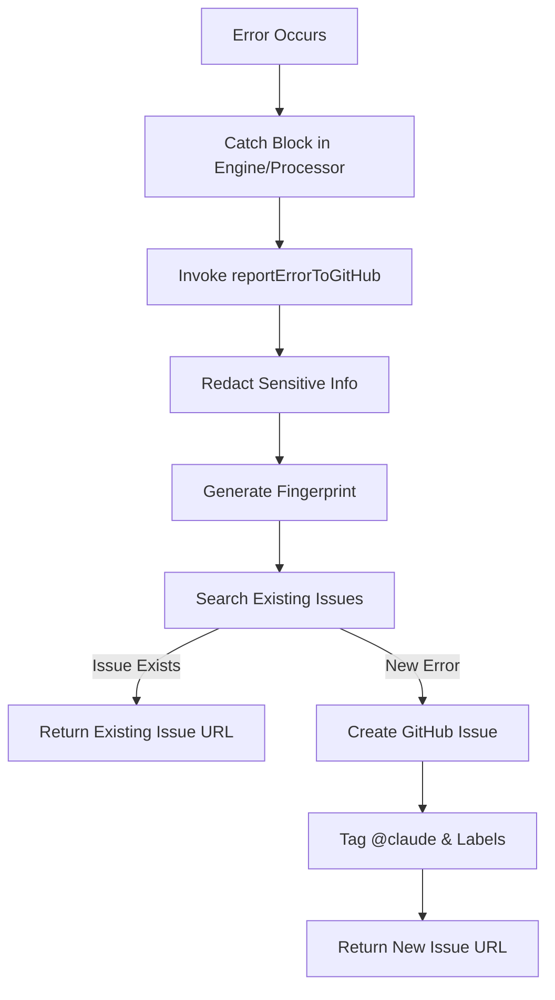
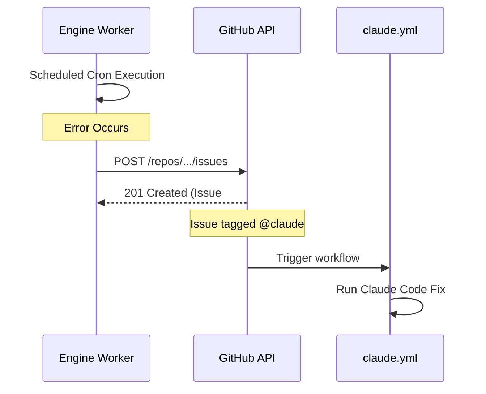

Relevant source files

The following files were used as context for generating this wiki page:

- [shared/github-report.ts](shared/github-report.ts)
- [README.md](README.md)
- [engine/src/index.ts](engine/src/index.ts)
- [guldstandard.md](guldstandard.md)
- [app/package.json](app/package.json)
- [engine/package.json](engine/package.json)
- [processor/package.json](processor/package.json)

# Automatic Error Reporting

The Automatic Error Reporting system in the Product Describer project is designed to capture unexpected runtime errors and report them as GitHub issues. This mechanism ensures that operational failures in headless components—specifically the `engine` (cron and fetcher endpoints) and the `processor` (queue consumer)—are tracked and addressed through automated workflows. Sources: [README.md:72-84](README.md#L72-L84), [shared/github-report.ts:1-5](shared/github-report.ts#L1-L5)

Errors are reported as GitHub issues tagged with `@claude`. This triggers a specific CI/CD automation (`claude.yml`) that attempts to fix the reported bug and merge the fix once the CI suite is green. Sources: [guldstandard.md:12](guldstandard.md#L12), [shared/github-report.ts:74-78](shared/github-report.ts#L74-L78)

## System Architecture

The reporting logic is encapsulated in a shared utility that handles data sanitization, error deduplication (fingerprinting), and interaction with the GitHub API.

### Logic Flow

The following diagram illustrates the lifecycle of an error from detection to GitHub issue creation:

The flow ensures that sensitive data like API keys are never leaked to public issues and prevents issue duplication for the same recurring error. Sources: [shared/github-report.ts:42-105](shared/github-report.ts#L42-L105)

### Key Components and Functions

The system relies on several critical functions within `shared/github-report.ts`:

| Component | Description |
| :--- | :--- |
| `redact()` | Scrubs sensitive information (API keys, emails, home paths) from the error stack and context. |
| `fingerprint()` | Generates a 10-character SHA-256 hash based on the error name and the first frame of the stack trace. |
| `reportErrorToGitHub()` | The main orchestrator that searches for duplicates and performs the POST request to create an issue. |
| `GITHUB_ERROR_REPORT_TOKEN` | A required environment secret. If missing, the system defaults to console logging. |

Sources: [shared/github-report.ts:25-70](shared/github-report.ts#L25-L70), [README.md:80-84](README.md#L80-L84)

## Data Sanitization and Security

A primary requirement of the reporting system is the removal of sensitive data before transmission to GitHub. The system uses regex patterns and environment variable scanning to redact information.

### Redaction Rules
*  **Environment Variables**: Any string value in the environment that is at least 8 characters long and associated with keys containing "KEY", "TOKEN", "SECRET", "PASSWORD", or "PASS" is replaced with `[REDACTED]`.
*  **API Keys**: Common patterns for OpenAI (`sk-`), GitHub (`ghp_`, `gho_`), AWS (`AKIA`), and Bearer tokens are matched and redacted.
*  **Personal Data**: Email addresses are replaced with `[EMAIL REDACTED]`.
*  **System Paths**: Local home directory paths are masked as `/home/[user]`.

Sources: [shared/github-report.ts:14-38](shared/github-report.ts#L14-L38)

## Integration with Project Modules

The reporting system is integrated into the core Workers using a "top-level catch" pattern.

### Engine and Processor Integration
Both the `processor` and `engine` modules utilize Sentry for broad tracking but fall back to the GitHub reporter for unexpected drift errors. In the `engine`, the `scheduled` handler (cron) is wrapped in a try-catch block that invokes the reporter upon failure. Sources: [engine/src/index.ts:510-515](engine/src/index.ts#L510-L515), [README.md:73-75](README.md#L73-L75)

The sequence shows how a cron failure leads directly to an automated fix attempt. Sources: [engine/src/index.ts:503-516](engine/src/index.ts#L503-L516), [guldstandard.md:12-15](guldstandard.md#L12-L15)

## Configuration

The system is configured via environment variables and secrets.

| Secret/Variable | Required | Description |
| :--- | :--- | :--- |
| `GITHUB_ERROR_REPORT_TOKEN` | Yes | Fine-grained PAT with scope for creating issues. |
| `SENTRY_DSN` | No | Optional Sentry integration for parallel error tracking. |

Sources: [README.md:113-116](README.md#L113-L116), [shared/github-report.ts:47-49](shared/github-report.ts#L47-L49)

## Conclusion

Automatic Error Reporting serves as the foundation for the project's "self-healing" capability. By combining robust sanitization with GitHub's search API for deduplication, it provides a safe and efficient way for the application to report its own bugs to the `@claude` automation, minimizing manual maintenance of the Cloudflare Workers environment. Sources: [shared/github-report.ts:1-10](shared/github-report.ts#L1-L10), [guldstandard.md:118-120](guldstandard.md#L118-L120)
