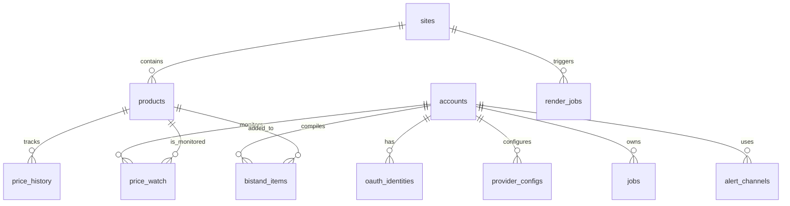
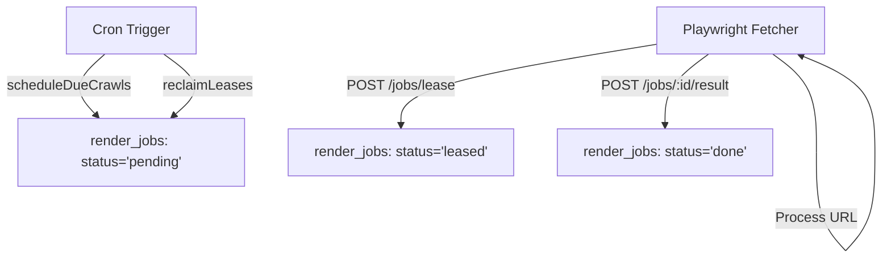
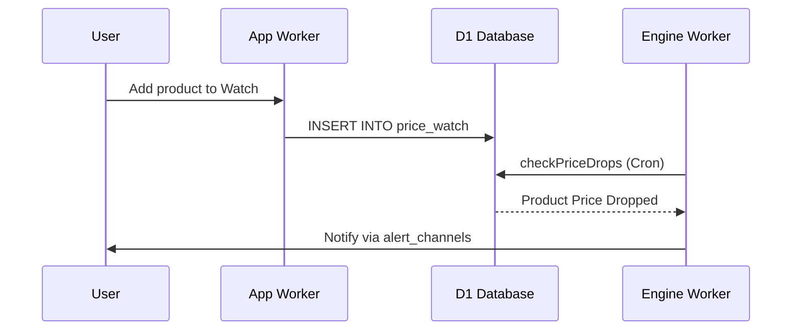

<details>
<summary>Relevant source files</summary>

The following files were used as context for generating this wiki page:

- [infra/schema.sql](infra/schema.sql)
- [DESIGN.md](DESIGN.md)
- [PROPOSAL-hopslagen-app.md](PROPOSAL-hopslagen-app.md)
- [engine/src/index.ts](engine/src/index.ts)
- [app/src/bistand.ts](app/src/bistand.ts)
- [app/src/catalog.ts](app/src/catalog.ts)
</details>

# D1 Database Schema & Models

The D1 Database serves as the centralized "brain and memory" for the unified product-describer architecture. It replaces a previous multi-component setup involving local PostgreSQL and SQLite databases to provide a single source of truth for user accounts, AI configurations, job queues, and the product catalog. By moving all durable data to Cloudflare D1, the system ensures that the server-side components (like the Playwright fetcher) remain stateless and easily replaceable.

Sources: [DESIGN.md:21-28](DESIGN.md#L21-L28), [infra/schema.sql:1-5](infra/schema.sql#L1-L5)

## Core Database Architecture

The database is structured into three primary domains: **User Management & Auth**, **Job Processing**, and **The Catalog Domain**. This structure supports a "pull" model where external workers lease jobs and report results back to D1.

### Entity Relationship Overview

The following diagram illustrates the relationships between the core entities in the D1 schema.



The schema establishes a clear boundary between operator-owned data (Catalog/Sites) and user-owned data (Accounts/Bistand).
Sources: [infra/schema.sql:7-160](infra/schema.sql#L7-L160), [DESIGN.md:58-82](DESIGN.md#L58-L82)

---

## User & Authentication Models

User management utilizes a local `accounts` table supplemented by linked `oauth_identities` for Google and Microsoft authentication. AI provider settings are stored in an encrypted format.

### Accounts & Auth Tables
| Table | Description | Key Fields |
| :--- | :--- | :--- |
| `accounts` | Primary user record. | `id`, `email`, `password_hash`, `role`, `describe_mode` |
| `oauth_identities` | Links external OAuth profiles to local accounts. | `account_id`, `provider`, `provider_user_id` |
| `provider_configs` | Encrypted JSON blobs containing API keys for AI providers. | `account_id`, `provider`, `encrypted_config` |

Sources: [infra/schema.sql:7-40](infra/schema.sql#L7-L40), [PROPOSAL-hopslagen-app.md:89-95](PROPOSAL-hopslagen-app.md#L89-L95)

---

## Job Processing & Queue Replacement

The system implements a lease/ack pattern within D1 to replace Cloudflare Queues, maintaining a zero-cost tier. The `render_jobs` table acts as the task queue for the external Playwright fetcher.

### Render Jobs Flow
The `render_jobs` table handles two types of tasks: `list` (crawling site listings) and `detail` (extracting specific product data).



Citations: The `engine/src/index.ts` file implements this logic through the `leaseJobs` and `reclaimLeases` functions.
Sources: [engine/src/index.ts:117-150](engine/src/index.ts#L117-L150), [engine/src/index.ts:293-300](engine/src/index.ts#L293-L300), [DESIGN.md:43-46](DESIGN.md#L43-L46)

### Job Status Transitions
| Status | Definition |
| :--- | :--- |
| `pending` | Initial state; ready for leasing. |
| `leased` | Currently assigned to a fetcher; protected by `lease_until`. |
| `done` | Task completed successfully. |
| `error` | Failed after `MAX_ATTEMPTS` (default 5). |

Sources: [infra/schema.sql:112-118](infra/schema.sql#L112-L118), [engine/src/index.ts:50-55](engine/src/index.ts#L50-L55)

---

## The Catalog Domain

The Catalog domain stores all extracted product information and historical price data. It is globally shared across users but managed by the operator's engine.

### Data Structures
*  **`sites`**: Configuration for scrapers, including CSS selectors and crawl intervals.
*  **`products`**: Central repository for product metadata, source text, and AI descriptions.
*  **`price_history`**: Time-series data of price changes used for drop alerts.

```sql
CREATE TABLE products (
  id INTEGER PRIMARY KEY,
  url TEXT UNIQUE NOT NULL,
  site_id INTEGER REFERENCES sites(id),
  title TEXT,
  current_price INTEGER,
  source_text TEXT,
  category TEXT,
  description TEXT,
  last_updated INTEGER NOT NULL
);
```

Sources: [infra/schema.sql:84-110](infra/schema.sql#L84-L110), [DESIGN.md:66-77](DESIGN.md#L66-L77)

---

## User Features & Extensions

Additional tables support the "Social Assistance" (Bistand) and "Price Watch" features.

### Bistand & Monitoring
*  **`bistand_items`**: Maps users to products with personal motivations for social service applications.
*  **`price_watch`**: Tracks which users are monitoring which products for price drops.
*  **`alert_channels`**: Stores configuration for notifications (Slack, Telegram, Webhooks).



Sources: [infra/schema.sql:133-160](infra/schema.sql#L133-L160), [app/src/bistand.ts:101-115](app/src/bistand.ts#L101-L115), [engine/src/index.ts:474-515](engine/src/index.ts#L474-L515)

---

## Conclusion
The D1 Database Schema & Models represent a shift toward a serverless-first architecture where the database is the orchestration layer. By utilizing specific indexing for claimable jobs (e.g., `idx_render_jobs_claimable`) and status-based partial indexes (e.g., `idx_products_missing_desc`), the system achieves high performance within Cloudflare's resource limits while maintaining complex relationships between crawling, AI processing, and user-facing features.

Sources: [DESIGN.md:31-40](DESIGN.md#L31-L40), [infra/schema.sql:109-110](infra/schema.sql#L109-L110), [engine/src/index.ts:12-25](engine/src/index.ts#L12-L25)
