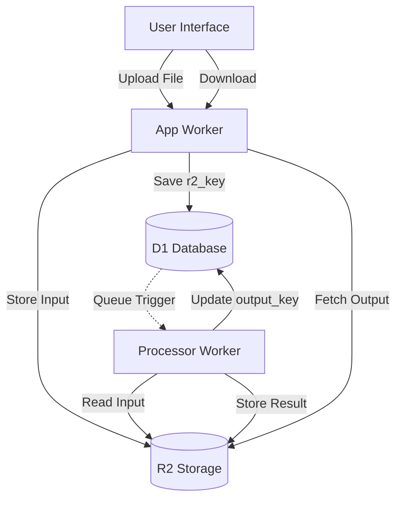

<details>
<summary>Relevant source files</summary>

The following files were used as context for generating this wiki page:

- [README.md](README.md)
- [DESIGN.md](DESIGN.md)
- [infra/schema.sql](infra/schema.sql)
- [app/public/app.js](app/public/app.js)
- [app/public/index.html](app/public/index.html)
</details>

# R2 Storage Integration

Cloudflare R2 storage serves as the durable object storage layer for the Product Describer project. It replaces the local file system used in previous iterations of the software, specifically for handling uploaded product files and the resulting processed data. In the unified architecture, R2 provides a reliable "memory" for the system, ensuring that data persists even if the "muscles" (computational components like the Playwright fetcher) are redeployed or fail.

The integration is primarily utilized by two Workers: the `app` Worker for handling initial file uploads and providing download links to users, and the `processor` Worker for reading input data and storing the AI-generated output. This architecture ensures that the system remains stateless and scales efficiently within the Cloudflare ecosystem.

Sources: [README.md:6-10](README.md#L6-L10), [DESIGN.md:23-28](DESIGN.md#L23-L28)

## Data Persistence Architecture

The project uses R2 to store two primary types of data: raw input files uploaded by users and the final processed results. Metadata about these files, including their R2 object keys, is stored in the D1 SQL database.

### Storage Lifecycle

1.  **Upload:** Users upload files (CSV, XLSX, TXT, DOCX, or PDF) via the web UI. The `app` Worker receives the file and stores it in an R2 bucket.
2.  **Indexing:** The Worker generates a unique `r2_key` and saves a record in the `jobs` table in D1.
3.  **Processing:** The `processor` Worker (Queue consumer) retrieves the file from R2 using the `r2_key`, processes it, and generates results.
4.  **Completion:** The final CSV output is uploaded back to R2, and the `output_key` is updated in the D1 `jobs` table.

Sources: [README.md:12-16](README.md#L12-L16), [infra/schema.sql:50-55](infra/schema.sql#L50-L55), [app/public/app.js:146-165](app/public/app.js#L146-L165)



The diagram shows the flow of data between the user, Cloudflare Workers, R2 storage, and the D1 database.
Sources: [README.md:12-23](README.md#L12-L23), [infra/schema.sql:43-65](infra/schema.sql#L43-L65)

## Database Integration (D1)

R2 is tightly coupled with the D1 database schema to track the state and location of files. The `jobs` table acts as the registry for all R2-backed files.

### The `jobs` Table Schema

| Field | Type | Description |
| :--- | :--- | :--- |
| `id` | TEXT | Primary key for the job. |
| `r2_key` | TEXT | The key/path for the uploaded input file in R2. |
| `output_key` | TEXT | The key/path for the generated result CSV in R2 (set when status is 'done'). |
| `filename` | TEXT | Original name of the uploaded file for UI display. |
| `status` | TEXT | Current state (queued, processing, done, etc.). |

Sources: [infra/schema.sql:43-65](infra/schema.sql#L43-L65)

## Functional Implementation

### File Upload and Retrieval
The user interface allows for uploading files up to 50MB. Supported formats include `.csv`, `.xlsx`, `.txt`, `.docx`, and `.pdf`. Once a job is marked as `done`, the UI provides a "Download" button that points to the R2-hosted output file through an API endpoint.

Sources: [app/public/index.html:77-80](app/public/index.html#L77-L80), [app/public/app.js:183-190](app/public/app.js#L183-L190)

### Code Snippet: UI Job Listing and Download

```javascript
// From app/public/app.js
async function loadJobs() {
  const jobs = await api("/api/jobs");
  const list = document.getElementById("jobs-list");
  list.innerHTML = "";
  for (const job of jobs) {
    const li = document.createElement("li");
    // ... display progress ...
    if (job.status === "done") {
      const a = document.createElement("a");
      a.href = `/api/jobs/${job.id}/download`; // Hits endpoint that serves from R2
      a.textContent = "Ladda ner";
      a.className = "link-btn";
      li.appendChild(a);
    }
    list.appendChild(li);
  }
}
```

Sources: [app/public/app.js:175-195](app/public/app.js#L175-L195)

## Security and Configuration

R2 storage access is managed through Cloudflare's internal bindings within the Worker environment. No public access to the bucket is allowed; all reads and writes must pass through the authenticated Workers.

*  **Secrets:** The project uses `wrangler secret` to manage sensitive keys, although R2 access is generally handled via environment bindings in `wrangler.jsonc`.
*  **Cleaning:** While not explicitly detailed in the provided code, the design mentions that temporary data like `rows_json` and `partial_results_json` in D1 are cleared upon job completion, while the persistent files remain in R2 for user download.

Sources: [SECURITY.md:15-19](SECURITY.md#L15-L19), [infra/schema.sql:57-59](infra/schema.sql#L57-L59), [README.md:104-106](README.md#L104-L106)

## Summary

The R2 Storage Integration is a critical component of the project's "Brain and Memory" architecture. By offloading file storage from the local server to Cloudflare R2, the system achieves durability and statelessness. It handles the full lifecycle of product data from initial ingestion of various document formats to the delivery of AI-enriched CSV exports, all while maintaining a strict link between file objects in R2 and metadata records in D1.
