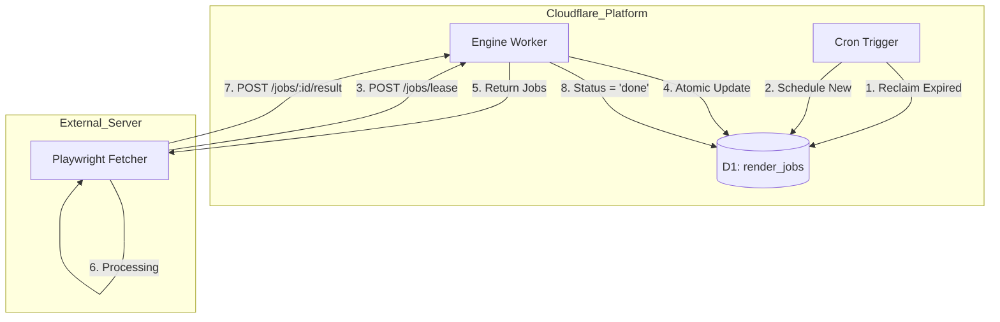
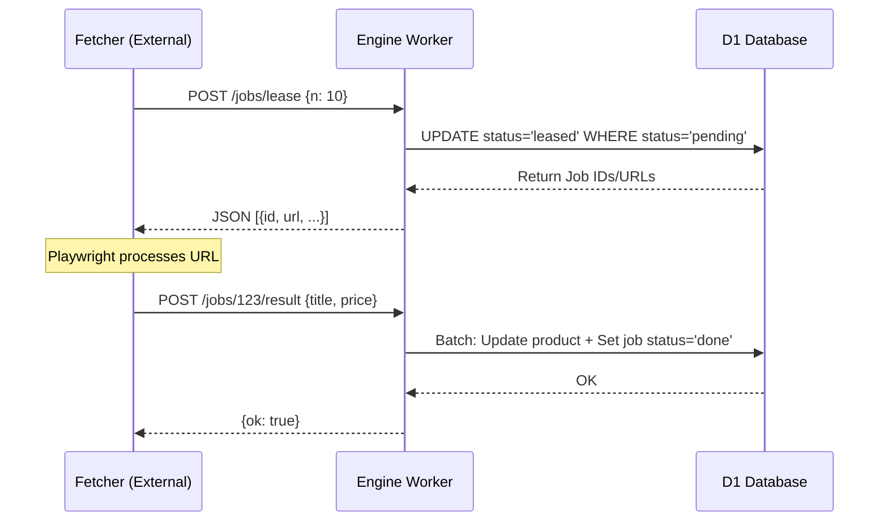

<details>
<summary>Relevant source files</summary>

The following files were used as context for generating this wiki page:

- [DESIGN.md](DESIGN.md)
- [engine/src/index.ts](engine/src/index.ts)
- [infra/schema.sql](infra/schema.sql)
- [README.md](README.md)
- [app/public/app.js](app/public/app.js)
</details>

# D1 Lease & Acknowledgment Pattern

The D1 Lease & Acknowledgment Pattern is a distributed task management system designed to coordinate work between the Cloudflare-based "Brain" (D1 database and Workers) and an external, stateless "Muscle" (server-based Playwright fetcher). This pattern serves as a lightweight alternative to Cloudflare Queues, enabling a pull-based architecture where external workers claim (lease) jobs from a D1 table and acknowledge them upon completion.

This architectural choice allows the system to remain within the Cloudflare Workers Free tier, as Cloudflare Queues require a paid subscription. It ensures durability and high availability by centralizing all state and logic within Cloudflare D1 while treating external servers as replaceable processing units.

Sources: [DESIGN.md:33-40](DESIGN.md#L33-L40), [README.md:104-108](README.md#L104-L108), [engine/src/index.ts:7-12](engine/src/index.ts#L7-L12)

## Architecture Overview

The pattern relies on a centralized D1 table (`render_jobs`) that acts as a job queue. The external fetcher polls this table via an API provided by the `engine` Worker.



*The diagram above illustrates the interaction between the Cron Trigger, the Engine Worker, and the external Fetcher using D1 as the state store.*

Sources: [DESIGN.md:46-65](DESIGN.md#L46-L65), [engine/src/index.ts:515-535](engine/src/index.ts#L515-L535)

## Database Schema

The core of the pattern is the `render_jobs` table in D1. It tracks the lifecycle of every rendering task, from discovery to completion or failure.

| Field | Type | Description |
| :--- | :--- | :--- |
| `id` | INTEGER | Primary Key. |
| `url` | TEXT | The target URL to be processed. |
| `site_id` | INTEGER | Reference to the `sites` configuration table. |
| `type` | TEXT | Job type: `list` (crawling) or `detail` (product extraction). |
| `status` | TEXT | `pending`, `leased`, `done`, or `error`. |
| `attempts` | INTEGER | Counter for retry logic. Incremented on each lease. |
| `lease_until` | INTEGER | Unix-ms timestamp indicating when the lease expires. |
| `last_error` | TEXT | Stores the error message if the job fails. |
| `created_at` | INTEGER | Timestamp of job creation. |

An index `idx_render_jobs_claimable` is defined on `(status, lease_until)` to allow the `engine` to quickly find jobs that are either `pending` or have an expired lease.

Sources: [infra/schema.sql:110-128](infra/schema.sql#L110-L128), [DESIGN.md:92-98](DESIGN.md#L92-L98)

## Core Mechanics

### 1. Job Leasing (Pull Mechanism)
The external fetcher initiates work by requesting `N` jobs. The `engine` Worker performs an atomic `UPDATE ... RETURNING` operation. This operation selects jobs where status is `pending` OR status is `leased` but `lease_until` is in the past. 

*  **Lease Durations**: `detail` jobs have a short lease (approx. 120s), while `list` jobs (crawls) have a longer lease (approx. 900s) as they are more time-consuming.
*  **Prioritization**: `list` jobs are prioritized over `detail` jobs to ensure the discovery of new products is not delayed by a large extraction backlog.

```typescript
// Atomic lease operation
const leased = await env.DB.prepare(
    `UPDATE render_jobs
       SET status = 'leased',
           lease_until = ?1 + CASE type WHEN 'list' THEN ?4 ELSE ?5 END,
           attempts = attempts + 1, updated_at = ?1
     WHERE id IN (
       SELECT id FROM render_jobs
       WHERE status = 'pending' OR (status = 'leased' AND lease_until < ?2)
       ORDER BY CASE type WHEN 'list' THEN 0 ELSE 1 END, id LIMIT ?3
     )
     RETURNING id, url, type, site_id`,
)
```

Sources: [engine/src/index.ts:74-94](engine/src/index.ts#L74-L94), [engine/src/index.ts:46-47](engine/src/index.ts#L46-L47)

### 2. Acknowledgment and Results
When the fetcher completes a job, it sends a `POST /jobs/:id/result` request. The Engine Worker then performs a batch of D1 operations:
1.  **Upsert Product**: Updates or creates a product entry in the `products` table.
2.  **Price History**: Logs a new price point if the price has changed.
3.  **Discovery**: If it was a `list` job, it creates new `detail` jobs for any discovered product URLs.
4.  **Mark Done**: Sets the job status to `done` in the `render_jobs` table.

Sources: [engine/src/index.ts:153-247](engine/src/index.ts#L153-L247)

### 3. Self-Healing and Error Handling
The pattern is inherently self-healing through the Cron Trigger (running every 5 minutes):
*  **Lease Reclaiming**: Any job stuck in `leased` status beyond its `lease_until` timestamp is reset to `pending`. This handles cases where the fetcher crashes or loses connectivity.
*  **Retry Limit**: If a job fails, the fetcher reports an error. The system allows up to `MAX_ATTEMPTS` (5) before marking the job status as `error`.

Sources: [engine/src/index.ts:167-175](engine/src/index.ts#L167-L175), [engine/src/index.ts:400-406](engine/src/index.ts#L400-L406), [DESIGN.md:112-118](DESIGN.md#L112-L118)

## Data Flow Sequence

The following diagram represents the sequence of a single job lifecycle:



*The sequence diagram shows the transactional nature of leasing and acknowledging jobs to ensure no task is lost.*

Sources: [engine/src/index.ts:71-141](engine/src/index.ts#L71-L141), [engine/src/index.ts:153-247](engine/src/index.ts#L153-L247)

## Summary of Key Benefits

*  **Portability**: The fetcher only needs outbound HTTPS and an API key; it requires no incoming routes or Cloudflare tunnels.
*  **Cost Efficiency**: Uses D1 tables to avoid the "Paid" requirement of Cloudflare Queues.
*  **Robustness**: Centralized state in D1 ensures that if the external server (the "Muscle") dies, no data is lost and jobs are simply reclaimed by another instance.

Sources: [DESIGN.md:23-32](DESIGN.md#L23-L32), [DESIGN.md:104-108](DESIGN.md#L104-L108)
