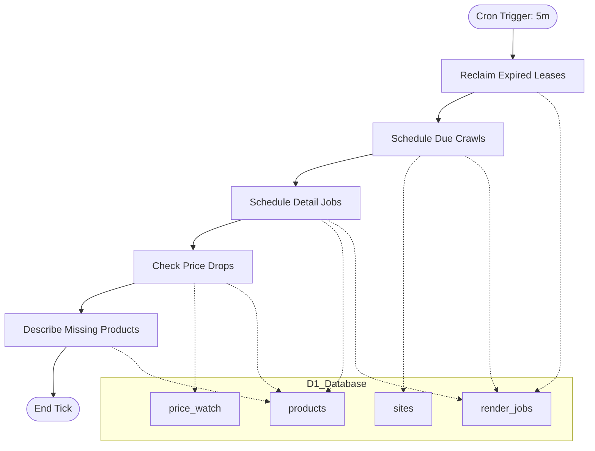
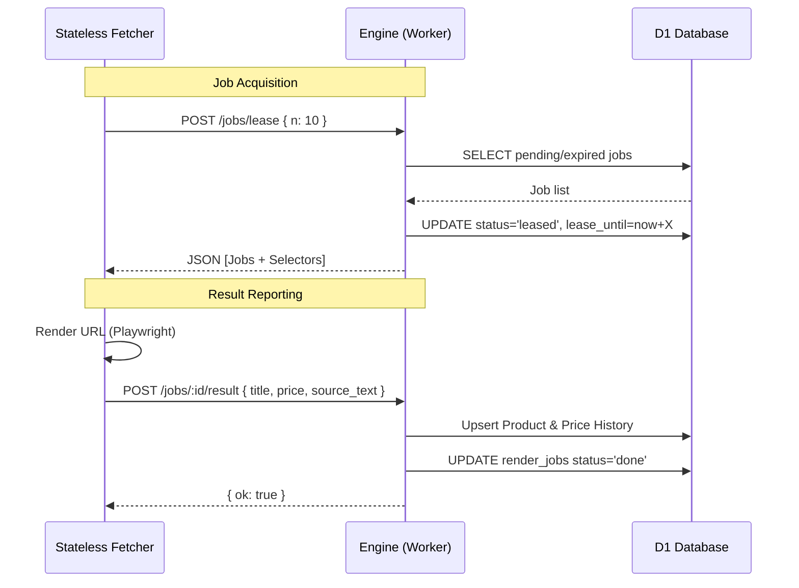

<details>
<summary>Relevant source files</summary>

The following files were used as context for generating this wiki page:

- [engine/src/index.ts](engine/src/index.ts)
- [DESIGN.md](DESIGN.md)
- [infra/schema.sql](infra/schema.sql)
- [README.md](README.md)
- [PROPOSAL-hopslagen-app.md](PROPOSAL-hopslagen-app.md)
</details>

# Engine Cron Scheduler Workflow

The **Engine Cron Scheduler Workflow** serves as the central coordination mechanism for the product describer system. Implemented as a Cloudflare Worker Cron Trigger, it replaces multiple distributed loops with a single, sequential handler that manages the lifecycle of product discovery, data enrichment, and price monitoring. The engine acts as the "brain and memory" of the architecture, maintaining state within a D1 database while offloading heavy browser rendering tasks to external stateless fetchers.

This workflow is designed to remain within the Cloudflare Workers Free Tier limits by capping operations per execution (tick) and utilizing a custom lease/ack pattern in D1 instead of Cloudflare Queues. It ensures high reliability by implementing self-healing mechanisms for expired leases and incremental processing of the product catalog.

Sources: [DESIGN.md:38-51](DESIGN.md#L38-L51), [engine/src/index.ts:1-15](engine/src/index.ts#L1-L15), [README.md:12-25](README.md#L12-L25)

## Architectural Overview

The scheduler operates on a 5-minute interval (`*/5 * * * *`). During each execution, it performs a series of sequential tasks to maintain the product catalog and trigger alerts.



The diagram shows the sequential execution of tasks within a single cron tick and their interactions with D1 database tables.
Sources: [DESIGN.md:104-115](DESIGN.md#L104-L115), [engine/src/index.ts:489-506](engine/src/index.ts#L489-L506)

## Core Execution Steps

### 1. Lease Reclamation (Self-Healing)
The workflow first identifies jobs in the `render_jobs` table that have been marked as `leased` but have exceeded their `lease_until` timestamp. This typically happens if an external fetcher crashes or fails to report a result. The scheduler resets these jobs to `pending`, allowing them to be picked up again.
Sources: [engine/src/index.ts:384-391](engine/src/index.ts#L384-L391), [infra/schema.sql:102-113](infra/schema.sql#L102-L113)

### 2. Crawl and Discovery Scheduling
The engine evaluates the `sites` table to find enabled sites where the `scrape_interval` has elapsed since the `last_crawled` time. For each due site, it creates a `list` type job in the `render_jobs` table. These jobs are later picked up by fetchers to discover new product URLs.
Sources: [engine/src/index.ts:413-435](engine/src/index.ts#L413-L435), [infra/schema.sql:70-80](infra/schema.sql#L70-L80)

### 3. Detail Job Scheduling
The scheduler searches for products that lack `source_text` or `category` data. It creates `detail` type jobs for these products in the `render_jobs` table, subject to a configurable limit (`SCHEDULE_LIMIT`). This ensures the system incrementally gathers detailed information for all discovered products.
Sources: [engine/src/index.ts:395-408](engine/src/index.ts#L395-L408), [infra/schema.sql:84-97](infra/schema.sql#L84-L97)

### 4. Price Drop Monitoring
The engine checks for price changes by comparing the latest entries in `price_history`. If a price drop meets specific thresholds (percentage and absolute value) and the product is not in a cooldown period, the system triggers notifications through configured channels like Slack, Telegram, or Webhooks.
Sources: [engine/src/index.ts:544-596](engine/src/index.ts#L544-L596), [PROPOSAL-hopslagen-app.md:46-52](PROPOSAL-hopslagen-app.md#L46-L52)

### 5. Background AI Enrichment
Products missing descriptions are processed using AI providers (Gemini, Anthropic, etc.). To stay within API rate limits, this is capped by `DESCRIBE_LIMIT`. The scheduler builds a provider chain from environment secrets and updates the `products` table with generated descriptions and rationales.
Sources: [engine/src/index.ts:446-486](engine/src/index.ts#L446-L486), [engine/src/index.ts:500-504](engine/src/index.ts#L500-L504)

## Configuration and Limits

The workflow uses environment variables to control its intensity and stay within resource constraints.

| Variable | Description | Default |
| :--- | :--- | :--- |
| `SCHEDULE_LIMIT` | Max detail jobs created per tick | 200 |
| `DESCRIBE_LIMIT` | Max products described by AI per tick | 10 |
| `DESCRIBE_WORKERS` | Number of parallel AI requests per tick | 2 |
| `ALERT_MIN_DROP_PCT` | Minimum price drop percentage for alerts | 5% |
| `ALERT_MIN_DROP_KR` | Minimum price drop in SEK for alerts | 100 kr |
| `ALERT_COOLDOWN_HOURS` | Hours to wait before re-alerting on the same product | 24h |

Sources: [engine/src/index.ts:41-51](engine/src/index.ts#L41-L51), [engine/src/index.ts:545-547](engine/src/index.ts#L545-L547)

## Data Workflow: Fetcher Interaction

While the Cron Scheduler manages the queue, external fetchers interact with the engine via HTTP endpoints to execute the work.



This diagram illustrates how the engine facilitates the lease/ack pattern for external "muscle" processes.
Sources: [DESIGN.md:53-70](DESIGN.md#L53-L70), [engine/src/index.ts:77-160](engine/src/index.ts#L77-L160)

## Implementation Details

### Sequential Handler Logic
The `scheduled` handler in `engine/src/index.ts` is wrapped with Sentry for error tracking and uses a `try-catch` block to report failures directly to GitHub as issues.

```typescript
// engine/src/index.ts:489-506
async scheduled(_controller: ScheduledController, env: Env): Promise<void> {
  const now = Date.now();
  try {
    const reclaimed = await reclaimLeases(env, now);
    const crawls = await scheduleDueCrawls(env, now);
    const scheduled = await scheduleDetailJobs(env, now, Number(env.SCHEDULE_LIMIT) || 200);
    const alerts = await checkPriceDrops(env, now);
    let described = 0;
    const chain = buildChainFromEnv(env);
    if (chain) {
      described = await describeMissing(env, chain, now, Number(env.DESCRIBE_LIMIT) || 10, Number(env.DESCRIBE_WORKERS) || 2);
    }
    console.log(`cron: reclaimed=${reclaimed} crawls=${crawls} scheduled=${scheduled} alerts=${alerts} described=${described}`);
  } catch (err) {
    console.error("cron misslyckades:", err);
    await reportErrorToGitHub(REPO, "Engine cron misslyckades", err, env);
  }
}
```

Sources: [engine/src/index.ts:489-510](engine/src/index.ts#L489-L510)

### Database Schema for Scheduling
The `render_jobs` table is critical for this workflow, acting as the state machine for all asynchronous tasks.

| Field | Type | Description |
| :--- | :--- | :--- |
| `id` | INTEGER | Primary Key |
| `url` | TEXT | Target URL to process |
| `type` | TEXT | `list` (discovery) or `detail` (extraction) |
| `status` | TEXT | `pending`, `leased`, `done`, or `error` |
| `attempts` | INTEGER | Incremented on every lease to detect dead jobs |
| `lease_until` | INTEGER | Expiration timestamp for current lease |

Sources: [infra/schema.sql:102-113](infra/schema.sql#L102-L113), [engine/src/index.ts:60-75](engine/src/index.ts#L60-L75)

## Summary
The Engine Cron Scheduler Workflow centralizes the system's operational logic into a robust, self-healing loop. By managing job state in D1 and coordinating with stateless fetchers, it provides a cost-effective and scalable way to maintain a large product catalog and provide real-time value through price alerts and AI-generated content.
