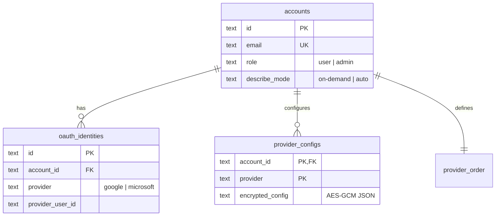
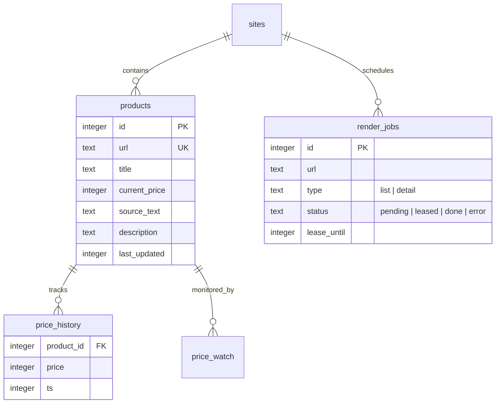
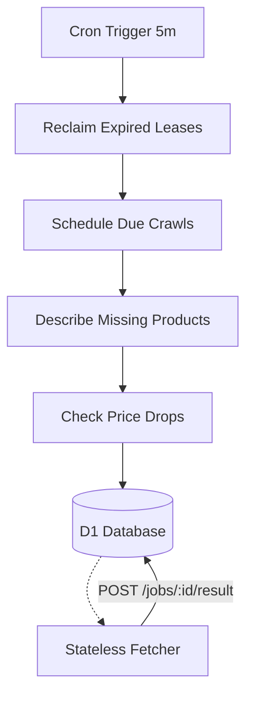

Relevant source files

The following files were used as context for generating this wiki page:

- [infra/schema.sql](infra/schema.sql)
- [engine/src/index.ts](engine/src/index.ts)
- [DESIGN.md](DESIGN.md)
- [app/src/bistand.ts](app/src/bistand.ts)
- [app/src/catalog.ts](app/src/catalog.ts)
- [PROPOSAL-hopslagen-app.md](PROPOSAL-hopslagen-app.md)

# D1 Database Schema & Models

The D1 database serves as the centralized "brain and memory" of the Product Describer system, moving away from a decentralized architecture towards a unified Cloudflare-native storage solution. It consolidates user account management, AI provider configurations, job tracking, and the entire product catalog (previously stored in Postgres) into a single durable source of truth.

The schema is designed to support high-concurrency Cloudflare Workers while maintaining zero running costs by utilizing D1's free tier. It manages both user-specific data (like social assistance applications) and operator-owned global data (like the crawled product catalog and price history).

Sources: [DESIGN.md:21-28](DESIGN.md#L21-L28), [infra/schema.sql:1-5](infra/schema.sql#L1-L5)

## Core User & Authentication Models

The authentication system supports local email/password accounts alongside OAuth identities (Google and Microsoft). A role-based access control (RBAC) system differentiates between standard `user` and `admin` roles, with the latter granting access to operator tools and catalog management.

### Entity Relationship: Authentication & Config

The following diagram illustrates the relationship between accounts, their identities, and their encrypted AI provider configurations.

Sources: [infra/schema.sql:7-38](infra/schema.sql#L7-L38), [PROPOSAL-hopslagen-app.md:23-30](PROPOSAL-hopslagen-app.md#L23-L30)

| Table | Description |
| :--- | :--- |
| `accounts` | Stores primary user records, including roles and description generation preferences. |
| `oauth_identities` | Links external OAuth providers to local accounts to enable social login. |
| `provider_configs` | Stores encrypted JSON blobs containing API keys for providers like Anthropic or OpenAI. |
| `provider_order` | Maintains the failover sequence for AI models per account. |

Sources: [infra/schema.sql:7-45](infra/schema.sql#L7-L45)

## Product Catalog & Crawling Domain

The product catalog is the most complex part of the schema, originally migrated from a standalone Postgres database. It includes configuration for web scrapers (`sites`), the current state of products, and time-series data for price fluctuations.

### Catalog Schema Overview

Sources: [infra/schema.sql:73-128](infra/schema.sql#L73-L128), [DESIGN.md:79-106](DESIGN.md#L79-L106)

### Render Jobs (Queue Replacement)
Because Cloudflare Queues requires a paid plan, the system uses a D1 table (`render_jobs`) to implement a Lease/Ack pattern. Workers "lease" jobs by setting a `lease_until` timestamp, ensuring that if a worker fails, the job eventually becomes "pending" again and can be reclaimed.

Sources: [DESIGN.md:43-47](DESIGN.md#L43-L47), [engine/src/index.ts:114-135](engine/src/index.ts#L114-L135)

## User Features: Applications & Alerts

The system provides specific features for end-users, such as creating "Social Assistance" (Bistånd) application drafts and monitoring price drops for specific products.

### Bistånd Items & Price Watches
- **`bistand_items`**: Maps products to accounts with a custom "motivation" text written by the user.
- **`price_watch`**: Links users to products they want to monitor.
- **`alert_channels`**: Configures where notifications are sent (Slack, Telegram, ntfy, or generic webhooks).

| Field | Type | Constraint | Description |
| :--- | :--- | :--- | :--- |
| `account_id` | TEXT | REFERENCES accounts(id) | The owner of the record. |
| `product_id` | INTEGER | REFERENCES products(id) | The product being acted upon. |
| `motivation` | TEXT | DEFAULT '' | User-written justification for the item. |
| `last_alert` | INTEGER | - | Timestamp of the last notification sent to prevent spam. |

Sources: [infra/schema.sql:130-165](infra/schema.sql#L130-L165), [app/src/bistand.ts:1-15](app/src/bistand.ts#L1-L15)

## Data Flow & Processing Logic

The D1 schema supports a sequential "tick-based" processing flow within the `engine` worker. Every 5 minutes, a cron trigger performs maintenance and schedules new work directly in the database.

Sources: [DESIGN.md:120-134](DESIGN.md#L120-L134), [engine/src/index.ts:405-425](engine/src/index.ts#L405-L425)

### Key Database Operations
1. **Catalog Filtering:** Queries use `LIKE` patterns on titles and category matching, always falling back to `WHERE true` to satisfy SQLite UPSERT requirements.
2. **Lease Selection:** Uses `RETURNING` clauses in `UPDATE` statements to atomatically mark and retrieve available jobs.
3. **Price Tracking:** The `price_history` table is updated only when the fetched price differs from the most recent entry, optimizing storage.

Sources: [app/src/bistand.ts:28-40](app/src/bistand.ts#L28-L40), [engine/src/index.ts:114-125](engine/src/index.ts#L114-L125), [engine/src/index.ts:250-264](engine/src/index.ts#L250-L264)

## Summary
The D1 Database Schema is the foundational element of the Product Describer's Cloudflare migration. By utilizing a Lease/Ack job system and consolidated product/user tables, it enables a serverless architecture that is both robust (self-healing leases) and cost-effective. It effectively manages the lifecycle of a product from initial discovery (list-job) to detailed extraction (detail-job), AI enrichment (description), and ongoing monitoring (price history/alerts).

Sources: [DESIGN.md:144-152](DESIGN.md#L144-L152), [infra/schema.sql:71-78](infra/schema.sql#L71-L78)
