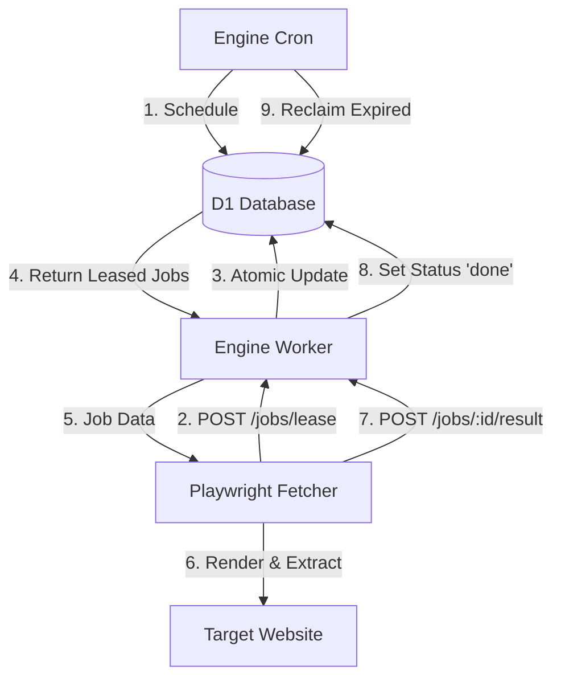

<details>
<summary>Relevant source files</summary>

The following files were used as context for generating this wiki page:

- [engine/src/index.ts](engine/src/index.ts)
- [DESIGN.md](DESIGN.md)
- [infra/schema.sql](infra/schema.sql)
- [README.md](README.md)
- [app/src/index.ts](app/src/index.ts)
- [app/public/app.js](app/public/app.js)
</details>

# Job Lease & Acknowledgment Pattern

The Job Lease & Acknowledgment pattern is a robust distributed task management system implemented to coordinate between the Cloudflare-based "Brain" (Engine) and the server-based "Muscle" (Playwright Fetcher). This pattern replaces standard queueing systems like Cloudflare Queues to maintain a zero-cost architecture while ensuring high reliability and self-healing capabilities for long-running web rendering tasks.

In this architecture, the Cloudflare Engine acts as the central authority and memory, managing a job queue stored in a D1 database table. The Fetcher, a stateless process running externally, polls the Engine to "lease" work, processes the tasks (such as crawling product lists or extracting detail page content), and subsequently "acknowledges" completion by reporting results.

Sources: [DESIGN.md:23-28](DESIGN.md#L23-L28), [DESIGN.md:37-43](DESIGN.md#L37-L43), [engine/src/index.ts:13-18](engine/src/index.ts#L13-L18)

## Architecture and Components

The pattern relies on three primary components interacting through a set of authenticated HTTP endpoints and a persistent database state.

### Core Components
*  **D1 `render_jobs` Table:** Acts as the durable task queue. It tracks job metadata, status (pending, leased, done, error), and lease expiration timestamps.
*  **Engine (Cloudflare Worker):** Exposes endpoints for leasing and reporting, and runs a Cron trigger to reclaim expired leases and schedule new tasks.
*  **Fetcher (External Server):** A stateless Playwright-based consumer that performs the actual rendering and extraction work.

### Data Flow Diagram
The following diagram illustrates the lifecycle of a task from scheduling to completion.



This diagram shows the circular relationship between the Engine scheduling jobs and the Fetcher consuming them.
Sources: [DESIGN.md:46-60](DESIGN.md#L46-L60), [engine/src/index.ts:85-115](engine/src/index.ts#L85-L115)

## Job Lifecycle and Statuses

Jobs progress through four distinct states within the `render_jobs` table. The transitions are designed to be atomic to prevent multiple fetchers from processing the same task simultaneously.

| Status | Description |
| :--- | :--- |
| `pending` | Task is ready to be picked up by a fetcher. |
| `leased` | Task is currently being processed. It has an associated `lease_until` timestamp. |
| `done` | Task successfully completed and results processed. |
| `error` | Task failed repeatedly (up to `MAX_ATTEMPTS`) and requires manual intervention or rescheduling. |

Sources: [infra/schema.sql:127-135](infra/schema.sql#L127-L135), [engine/src/index.ts:79-81](engine/src/index.ts#L79-L81)

### Atomic Leasing Logic
When a fetcher requests jobs via `POST /jobs/lease`, the Engine executes an atomic `UPDATE ... RETURNING` statement. This ensures that:
1.  Only `pending` jobs or `leased` jobs with an expired `lease_until` are selected.
2.  Selected jobs are immediately marked as `leased`.
3.  The `lease_until` is set based on job type: `detail` jobs (short lease) vs `list` jobs (long lease).

Sources: [engine/src/index.ts:88-105](engine/src/index.ts#L88-L105), [engine/src/index.ts:77-78](engine/src/index.ts#L77-L78)

## Results and Acknowledgment

Acknowledgment occurs when the fetcher calls `POST /jobs/:id/result`. This endpoint handles both success and failure scenarios.

### Success Processing
Upon successful completion, the Engine performs a batch update:
*  Upserts product information into the `products` table.
*  Records price history in the `price_history` table.
*  For `list` jobs, it discovers new URLs and creates new `detail` jobs for them.
*  Marks the original job as `done`.

### Failure and Retries
If the fetcher reports an error, the Engine increments the `attempts` counter. If `attempts` is less than `MAX_ATTEMPTS` (default 5), the status is reverted to `pending` for another fetcher to try. Otherwise, the job is moved to `error` status.

Sources: [engine/src/index.ts:145-155](engine/src/index.ts#L145-L155), [engine/src/index.ts:160-235](engine/src/index.ts#L160-L235), [engine/src/index.ts:79](engine/src/index.ts#L79)

## Self-Healing and Cron Tasks

The Engine uses a single Cron trigger (every 5 minutes) to maintain system health. This "scheduled" handler performs two critical maintenance tasks for the Lease/Ack pattern:

### Lease Reclamation
The `reclaimLeases` function identifies jobs stuck in the `leased` state beyond their `lease_until` time (e.g., if a fetcher process crashed). These are reset to `pending`.

```typescript
// engine/src/index.ts:281-287
async function reclaimLeases(env: Env, now: number): Promise<number> {
  const r = await env.DB.prepare(
    "UPDATE render_jobs SET status='pending', updated_at=?1 WHERE status='leased' AND lease_until < ?1",
  )
    .bind(now)
    .run();
  return r.meta.changes ?? 0;
}
```

### Job Scheduling
The Cron trigger also populates the queue by:
1.  **Crawls:** Scheduling `list` jobs for sites whose `scrape_interval` has passed.
2.  **Detail Enrichment:** Scheduling `detail` jobs for products missing `source_text`.

Sources: [engine/src/index.ts:279-335](engine/src/index.ts#L279-L335), [DESIGN.md:112-124](DESIGN.md#L112-L124)

## Data Structures

The `render_jobs` table is the backbone of the pattern, as defined in the database schema.

| Field | Type | Description |
| :--- | :--- | :--- |
| `id` | INTEGER | Primary Key. |
| `url` | TEXT | Target URL for the Playwright fetcher. |
| `type` | TEXT | Either `list` (crawling) or `detail` (extraction). |
| `status` | TEXT | Current state: `pending`, `leased`, `done`, `error`. |
| `attempts` | INTEGER | Counter for retry logic. |
| `lease_until` | INTEGER | Unix timestamp (ms) when the lease expires. |
| `last_error` | TEXT | Stores the error message from the last failed attempt. |

Sources: [infra/schema.sql:125-136](infra/schema.sql#L125-L136), [engine/src/index.ts:81-83](engine/src/index.ts#L81-L83)

## Summary

The Job Lease & Acknowledgment Pattern provides a resilient, stateless task management system tailored for the constraints of Cloudflare Workers and D1. By centralizing logic in the Engine's Cron and atomic DB operations, the system guarantees task completion even if individual fetchers fail. This pull-based approach simplifies network configuration, as the server-side fetcher requires only outgoing HTTPS access to the Engine API.

Sources: [DESIGN.md:23-35](DESIGN.md#L23-L35), [README.md:9-16](README.md#L9-L16)
