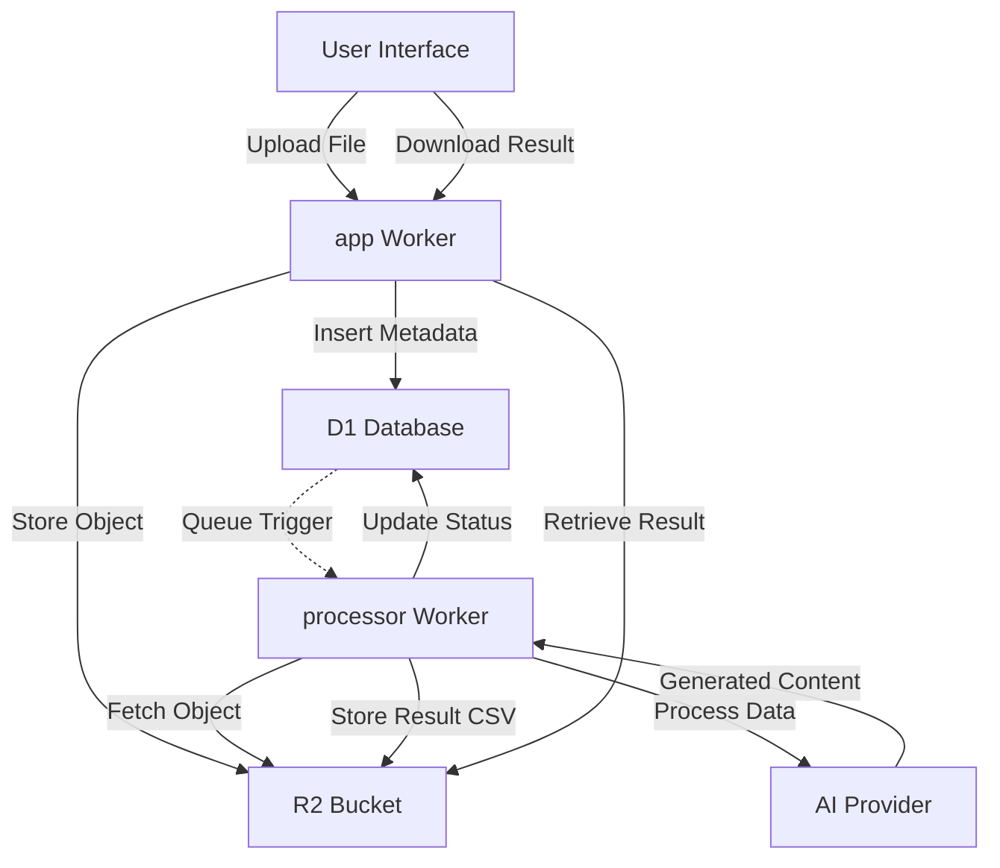
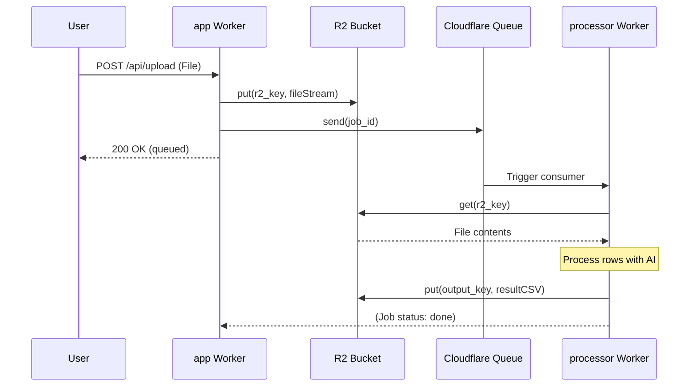

<details>
<summary>Relevant source files</summary>

The following files were used as context for generating this wiki page:

- [DESIGN.md](DESIGN.md)
- [README.md](README.md)
- [infra/schema.sql](infra/schema.sql)
- [processor/package.json](processor/package.json)
- [app/public/app.js](app/public/app.js)
</details>

# R2 File Storage Integration

The R2 File Storage Integration is a core component of the `product-describer-cloudflare` project, replacing traditional local file system storage with Cloudflare R2 object storage. Its primary purpose is to handle the durable storage of uploaded user files (CSV, Excel, PDF, etc.) and the subsequent generation and retrieval of AI-processed result files. This migration to R2 is part of a broader "Cloudflare = Brain + Memory" architecture designed to make the system stateless and resilient to local hardware failures.

Sources: [DESIGN.md:21-24](DESIGN.md#L21-L24), [README.md:6-7](README.md#L6-L7)

## Architecture and Data Flow

The R2 integration serves as the "memory" for file-based processing jobs. When a user uploads a file through the web interface, it is stored in an R2 bucket. A reference to this file is then stored in the D1 database within the `jobs` table. The `processor` Worker later retrieves the file from R2 to extract product data for AI processing.



The diagram shows the lifecycle of a file from initial upload to AI processing and final result retrieval, emphasizing R2's role as the central storage hub.
Sources: [DESIGN.md:21-24](DESIGN.md#L21-L24), [README.md:16-19](README.md#L16-L19), [infra/schema.sql:56-61](infra/schema.sql#L56-L61)

## Database Integration (D1 Schema)

The D1 database maintains the state and mapping for all objects stored in R2. The `jobs` table specifically tracks the keys required to access objects within the R2 bucket.

| Field | Type | Description |
| :--- | :--- | :--- |
| `r2_key` | TEXT | The unique identifier/path for the uploaded input file in the R2 bucket. |
| `output_key` | TEXT | The identifier for the generated CSV result file, populated upon job completion. |
| `filename` | TEXT | The original name of the uploaded file for display in the UI. |

Sources: [infra/schema.sql:56-61](infra/schema.sql#L56-L61)

```sql
-- infra/schema.sql:51-68
CREATE TABLE jobs (
  id TEXT PRIMARY KEY,
  account_id TEXT NOT NULL REFERENCES accounts(id),
  status TEXT NOT NULL, 
  filename TEXT NOT NULL,
  r2_key TEXT NOT NULL, -- uploaded input file in R2
  output_key TEXT,      -- generated CSV in R2, set when status='done'
  -- ... other fields
  updated_at INTEGER NOT NULL
);
```

## Supported File Formats

The integration supports various document types that are uploaded to R2 and subsequently processed. The `processor` Worker utilizes specific libraries to handle these formats after retrieving them from storage.

*  **Spreadsheets:** CSV, Excel (`.xlsx`) via the `xlsx` library.
*  **Documents:** Word (`.docx`) via `mammoth` and Text (`.txt`).
*  **Portable Formats:** PDF via `unpdf`.

Sources: [processor/package.json:14-16](processor/package.json#L14-L16), [README.md:17-18](README.md#L17-L18), [app/public/app.js:141-143](app/public/app.js#L141-L143)

## Lifecycle of an R2 Object

### 1. Upload and Ingestion
The `app` Worker receives a `FormData` post containing a file (max 50MB). It generates a unique `r2_key` and streams the file to the configured R2 bucket. Simultaneously, it creates a entry in the D1 `jobs` table with a status of `queued`.

Sources: [app/public/app.js:141-146](app/public/app.js#L141-L146), [infra/schema.sql:51-68](infra/schema.sql#L51-L68)

### 2. Processing and Retrieval
The `processor` Worker (a queue consumer) uses the `r2_key` from the job metadata to fetch the object from R2. It extracts rows and performs row-by-row AI description generation.

Sources: [README.md:17-19](README.md#L17-L19), [DESIGN.md:38-41](DESIGN.md#L38-L41)

### 3. Result Storage and Download
Once processing is finished, the `processor` Worker generates a final output (typically a CSV) and saves it back to R2, updating the job's `output_key` in D1 and setting the status to `done`. Users can then download this file via an API endpoint in the `app` Worker.

Sources: [app/public/app.js:168-173](app/public/app.js#L168-L173), [README.md:88-91](README.md#L88-L91)

## Technical Implementation Details

The integration is built to work within Cloudflare Worker limits. Because Workers cannot run long-running background processes, file processing is split into discrete tasks using Cloudflare Queues, with R2 providing the shared persistent storage between the `app` and `processor` Workers.



The sequence shows how R2 acts as the data hand-off point between the upload Worker and the processing Worker.
Sources: [README.md:16-24](README.md#L16-L24), [DESIGN.md:21-25](DESIGN.md#L21-L25)

## Conclusion
The R2 File Storage Integration provides a scalable and serverless alternative to local disk storage. By decoupling file storage from the execution environment, the project ensures that user data and processing results remain available even if individual Worker instances or external "muscle" servers (like the Playwright fetcher) are restarted or relocated.

Sources: [DESIGN.md:21-25](DESIGN.md#L21-L25), [README.md:6-10](README.md#L6-L10)
