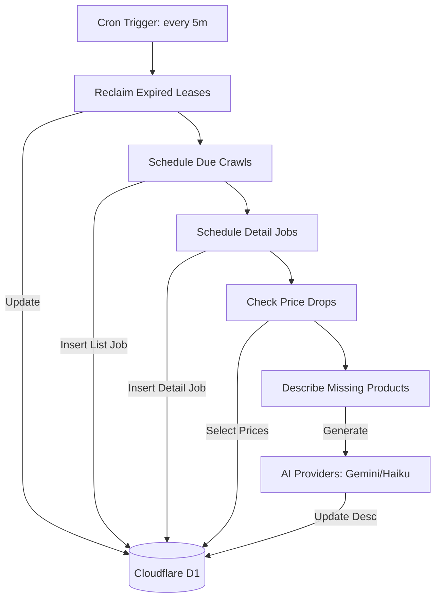
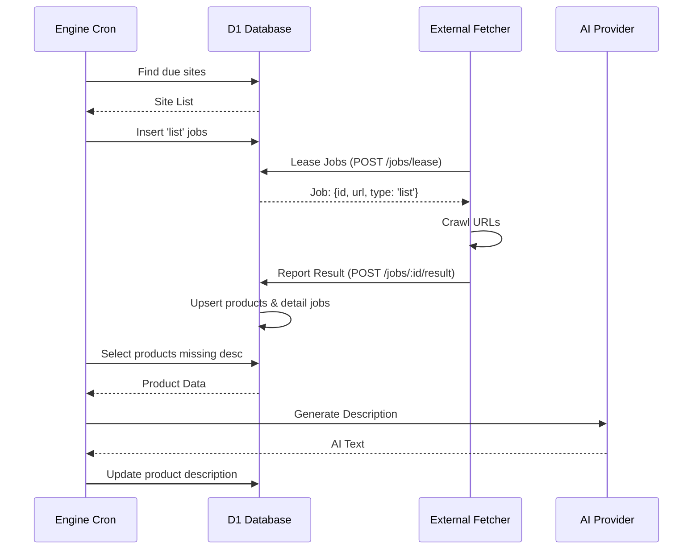

Relevant source files

The following files were used as context for generating this wiki page:

- [engine/src/index.ts](engine/src/index.ts)
- [DESIGN.md](DESIGN.md)
- [infra/schema.sql](infra/schema.sql)
- [README.md](README.md)
- [PROPOSAL-hopslagen-app.md](PROPOSAL-hopslagen-app.md)

# Engine Cron Scheduler Workflow

The Engine Cron Scheduler Workflow serves as the central orchestration logic for the product-describer system. Operating as a Cloudflare Worker Cron Trigger, it executes every 5 minutes to manage the lifecycle of web scraping, product discovery, AI-driven content generation, and price monitoring. By moving logic from an unreliable external server to Cloudflare, the workflow ensures that the system's "brain and memory" reside in a durable environment, utilizing Cloudflare D1 as the single source of truth.

The workflow follows a "pull" model where the Cloudflare Engine schedules tasks into a `render_jobs` table, which are then leased by stateless external "muscles" (Playwright fetchers). This architecture eliminates the need for inbound tunnels or complex queue systems, maintaining compatibility with Cloudflare's free tier.

Sources: [DESIGN.md:14-23](DESIGN.md#L14-L23), [README.md:18-24](README.md#L18-L24), [engine/src/index.ts:1-15](engine/src/index.ts#L1-L15)

## Architecture Overview

The workflow is encapsulated within a single `scheduled()` handler in the Engine Worker. It processes several distinct tasks sequentially within each execution "tick." To remain within Worker execution limits, the workflow employs "capping," where the number of operations per tick is strictly limited.

### Component Interaction Diagram

The following diagram illustrates how the Cron Workflow interacts with D1 storage and external AI providers to manage the product lifecycle.

Sources: [DESIGN.md:96-107](DESIGN.md#L96-L107), [engine/src/index.ts:511-531](engine/src/index.ts#L511-L531)

## Workflow Sequential Steps

The `scheduled` handler in `engine/src/index.ts` executes the following steps in order:

### 1. Lease Reclamation
The system implements a self-healing "lease/ack" pattern. Jobs marked as `leased` that have exceeded their `lease_until` timestamp are reset to `pending`. This ensures that if a fetcher process dies mid-job, the task is eventually returned to the queue.

*  **Logic:** `UPDATE render_jobs SET status='pending' WHERE status='leased' AND lease_until < now`
*  **Source:** [engine/src/index.ts:333-339](engine/src/index.ts#L333-L339)

### 2. Crawl Scheduling (List Jobs)
The workflow identifies sites in the `sites` table where the `scrape_interval` has elapsed. For each due site, it creates a `list` type job in the `render_jobs` table.

*  **Logic:** Checks `last_crawled + scrape_interval < now`. It also updates `last_crawled` immediately to prevent duplicate scheduling in the next tick before the job is claimed.
*  **Source:** [engine/src/index.ts:358-385](engine/src/index.ts#L358-L385)

### 3. Detail Job Discovery
Products that lack `source_text` or `category` but do not have active jobs are scheduled for a `detail` render job. This process is capped by `SCHEDULE_LIMIT` (default 200).

*  **Logic:** `INSERT INTO render_jobs ... SELECT p.url FROM products p WHERE p.source_text IS NULL`
*  **Source:** [engine/src/index.ts:343-354](engine/src/index.ts#L343-L354)

### 4. Price Monitoring and Alerts
The workflow analyzes the `price_history` for watched products. If a price drop exceeds configured thresholds (e.g., 5% and 100 SEK) and is outside the cooldown period, the workflow triggers notifications to configured channels (ntfy, Slack, Telegram, or Webhooks).

*  **Logic:** Uses a Common Table Expression (CTE) to compare the latest price against the previous entry in `price_history`.
*  **Source:** [engine/src/index.ts:456-506](engine/src/index.ts#L456-L506), [PROPOSAL-hopslagen-app.md:54-58](PROPOSAL-hopslagen-app.md#L54-L58)

### 5. AI Description Generation
The workflow identifies products missing descriptions and uses configured AI providers (Anthropic, OpenAI, Gemini, etc.) to generate content. This is a background process that complements on-demand requests.

*  **Capping:** Controlled by `DESCRIBE_LIMIT` (default 10) and `DESCRIBE_WORKERS` (default 2) to manage API quotas.
*  **Source:** [engine/src/index.ts:395-442](engine/src/index.ts#L395-L442)

## Data Structures and Configuration

The workflow relies on specific D1 table structures to track job state and product metadata.

### Core Database Tables (D1)
| Table | Purpose | Key Fields |
| :--- | :--- | :--- |
| `render_jobs` | Task queue for fetchers | `id`, `url`, `type` (list/detail), `status`, `lease_until` |
| `sites` | Scraper configurations | `base_url`, `scrape_interval`, `last_crawled`, `detail_selector` |
| `products` | Product catalog | `url`, `source_text`, `description`, `current_price` |
| `price_history` | Historical price tracking | `product_id`, `price`, `ts` |
| `price_watch` | User alerts | `account_id`, `product_id`, `last_alert` |

Sources: [infra/schema.sql:84-135](infra/schema.sql#L84-L135), [DESIGN.md:68-84](DESIGN.md#L68-L84)

### Workflow Environment Variables
| Variable | Description | Default |
| :--- | :--- | :--- |
| `SCHEDULE_LIMIT` | Max detail jobs to create per tick | 200 |
| `DESCRIBE_LIMIT` | Max products to describe per tick | 10 |
| `DESCRIBE_WORKERS` | Parallel AI generation requests | 2 |
| `ALERT_MIN_DROP_PCT`| Min price drop percentage for alert | 5 |
| `ALERT_MIN_DROP_KR` | Min price drop in currency for alert | 100 |

Sources: [engine/src/index.ts:46-55](engine/src/index.ts#L46-L55)

## State Management Flow

The following sequence diagram shows how the Cron workflow transitions a product from discovery to description.

Sources: [DESIGN.md:37-56](DESIGN.md#L37-L56), [engine/src/index.ts:74-138](engine/src/index.ts#L74-L138)

## Error Handling and Reporting

The workflow includes a robust error handling mechanism. If a sequential step fails, the error is caught and reported to GitHub as an issue via the `reportErrorToGitHub` utility. This utility sanitizes sensitive data (secrets, keys, emails) before reporting.

For individual jobs handled by fetchers, the `attempts` counter is incremented during each lease. If a job fails more than `MAX_ATTEMPTS` (5), its status is changed to `error` and it is removed from the active queue until manual intervention.

Sources: [engine/src/index.ts:531-534](engine/src/index.ts#L531-L534), [engine/src/index.ts:167-175](engine/src/index.ts#L167-L175), [README.md:44-51](README.md#L44-L51)

## Conclusion
The Engine Cron Scheduler Workflow centralizes the management of the product catalog. By utilizing a capped, sequential execution model within Cloudflare Workers, it maintains system state, triggers background AI tasks, and manages external scraping resources while remaining within the constraints of Cloudflare's serverless environment.
