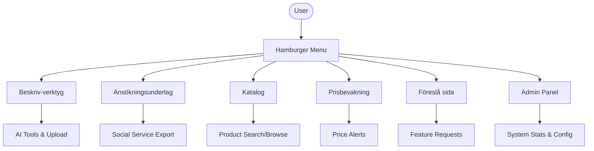
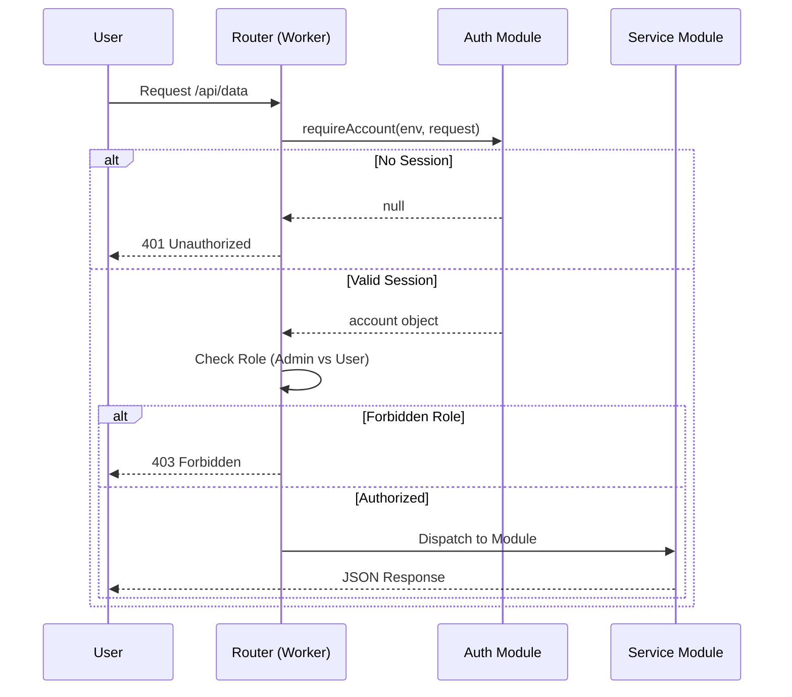
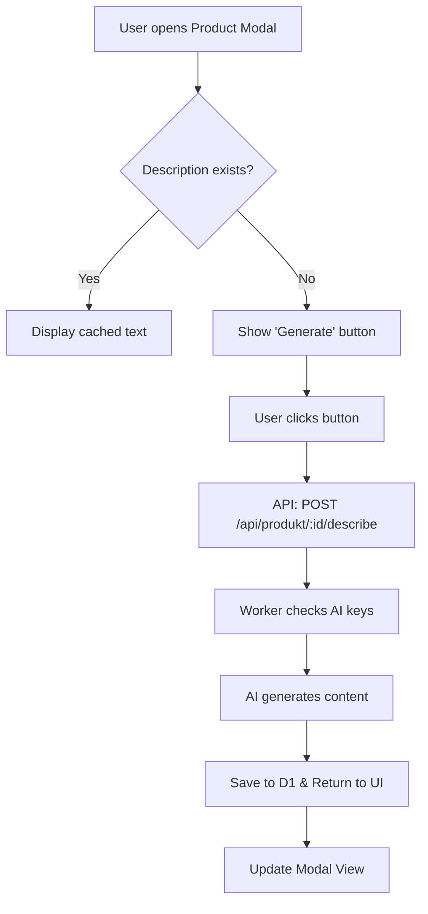

Relevant source files

The following files were used as context for generating this wiki page:

- [app/public/index.html](app/public/index.html)
- [app/public/app.js](app/public/app.js)
- [app/public/style.css](app/public/style.css)
- [PROPOSAL-hopslagen-app.md](PROPOSAL-hopslagen-app.md)
- [app/src/index.ts](app/src/index.ts)
- [DESIGN.md](DESIGN.md)

# Main UI & App Routing

The Main UI and App Routing system provides a unified interface for the Product Describer platform, integrating AI-driven product description tools, social service application support, and a public product catalog. The architecture follows a Single Page Application (SPA) pattern on the frontend, supported by a Cloudflare Workers backend that handles authentication, data persistence via D1, and modular service routing.

The system is designed to be "public-facing" while maintaining strict access controls for administrative functions. It utilizes a "department-based" navigation structure, where users switch between different functional modules (e.g., Tools, Catalog, Monitoring) within a single worker environment.

Sources: [PROPOSAL-hopslagen-app.md:7-14](PROPOSAL-hopslagen-app.md#L7-L14), [DESIGN.md:52-59](DESIGN.md#L52-L59)

## Frontend Architecture

The frontend is implemented as a lightweight SPA using vanilla JavaScript and CSS. The UI is split into two primary states: an unauthenticated `auth-view` and an authenticated `app-view`. Navigation is managed through a "department drawer" (hamburger menu) that toggles visibility between different functional sections without page reloads.

### Department Navigation
The UI is divided into several "Departments," which are triggered by the `showDept(name)` function. This function hides all sections with the `.dept` class and shows the one matching the requested ID.

Sources: [app/public/index.html:47-57](app/public/index.html#L47-L57), [app/public/app.js:464-473](app/public/app.js#L464-L473)

### UI Components and Styling
The application uses a dark-themed, card-based layout. Key UI components include:
*  **Modals:** A product details modal used for viewing history and generating on-demand descriptions.
*  **Status Badges:** Used to indicate AI configuration status or job progress.
*  **Responsive Drawers:** The navigation menu slides out on mobile or opens as a drawer.

Sources: [app/public/style.css:1-30](app/public/style.css#L1-L30), [app/public/index.html:246-253](app/public/index.html#L246-L253)

## Application Routing (Backend)

The backend routing logic is centralized in `app/src/index.ts`. It acts as a gateway that validates sessions, checks user roles, and dispatches requests to specialized modules.

### Route Categories
Routes are categorized by their authentication requirements and user roles:

| Route Path | Method | Access Level | Description |
|:---|:---|:---|:---|
| `/signup` | POST | Public | Account creation (Rate-limited) |
| `/login` | POST | Public | User authentication |
| `/api/oauth/*` | GET | Public | OAuth flow with Google/Microsoft |
| `/underlag` | GET | User | Server-rendered HTML for printing |
| `/api/catalog` | GET | User | Search product D1 database |
| `/api/admin/*` | ALL | Admin | Statistics, exports, and site config |
| `/api/upload` | POST | Admin | CSV/PDF upload for AI processing |

Sources: [app/src/index.ts:55-120](app/src/index.ts#L55-L120), [PROPOSAL-hopslagen-app.md:52-62](PROPOSAL-hopslagen-app.md#L52-L62)

### Routing Logic Flow
The router implements a "waterfall" validation process before fulfilling requests.

Sources: [app/src/index.ts:70-85](app/src/index.ts#L70-L85)

## Authentication & Session Management

The system transitioned from Cloudflare Access to an internal account-based model to support public users while protecting administrative tools.

### Authentication Methods
1.  **Email/Password:** Standard login handled via `handleLogin` with rate limiting.
2.  **OAuth 2.0:** Support for Microsoft and Google providers. The flow uses a state nonce stored in an `oauth_state` cookie to prevent CSRF.
3.  **Session Cookies:** Authenticated users receive a `session` cookie with `HttpOnly`, `Secure`, and `SameSite=Lax` attributes, valid for 30 days.

Sources: [app/src/index.ts:167-195](app/src/index.ts#L167-L195), [PROPOSAL-hopslagen-app.md:23-33](PROPOSAL-hopslagen-app.md#L23-L33)

### Role-Based Access Control (RBAC)
User accounts are assigned roles, primarily `user` and `admin`.
*  **Users:** Can browse the catalog, save items to their social service "underlag," and configure price watches.
*  **Admins:** Access the "Beskriv-verktyg" (uploading files for bulk AI processing), system statistics, and site crawling configurations.

Sources: [app/src/index.ts:87-95](app/src/index.ts#L87-L95), [app/public/app.js:54-68](app/public/app.js#L54-L68)

## Data Flow: Product Catalog & On-Demand UI

The UI interacts with a synchronized product catalog stored in D1. While bulk processing happens in the background via queues, the UI handles on-demand interactions.

### On-Demand Description Flow
When a user views a product that lacks an AI description, the UI provides a "Generate description" button. This triggers a specific sequence to leverage the worker's AI provider chain.

Sources: [app/public/app.js:379-405](app/public/app.js#L379-L405), [app/src/index.ts:125-130](app/src/index.ts#L125-L130)

### Admin Catalog Management
Administrators use the `/api/admin/sites` route to manage how the system crawls external sites. They can update CSS selectors used for extraction via an interactive table in the Admin department.

Sources: [app/public/index.html:179-190](app/public/index.html#L179-L190), [app/public/app.js:655-680](app/public/app.js#L655-L680)

## Summary
The Main UI & App Routing system centralizes multiple distinct tools—AI description, social service assistance, and price monitoring—into a single, role-aware SPA. By leveraging Cloudflare Workers, the system achieves sub-second routing and secure session management without the overhead of a traditional server, while D1 provides a unified source of truth for the shared product catalog and private user data.
