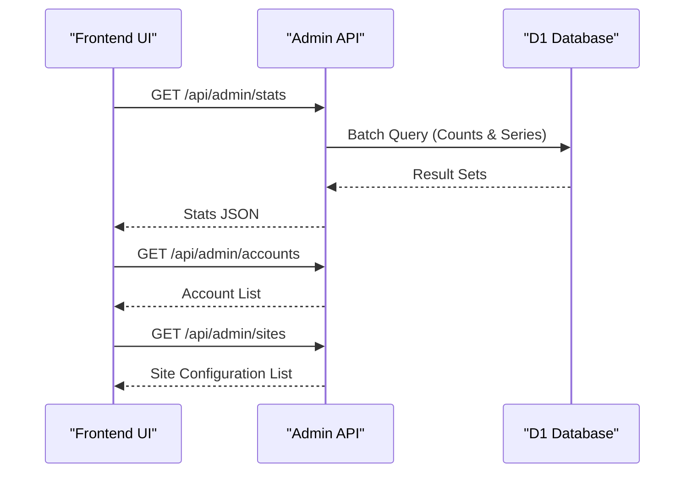
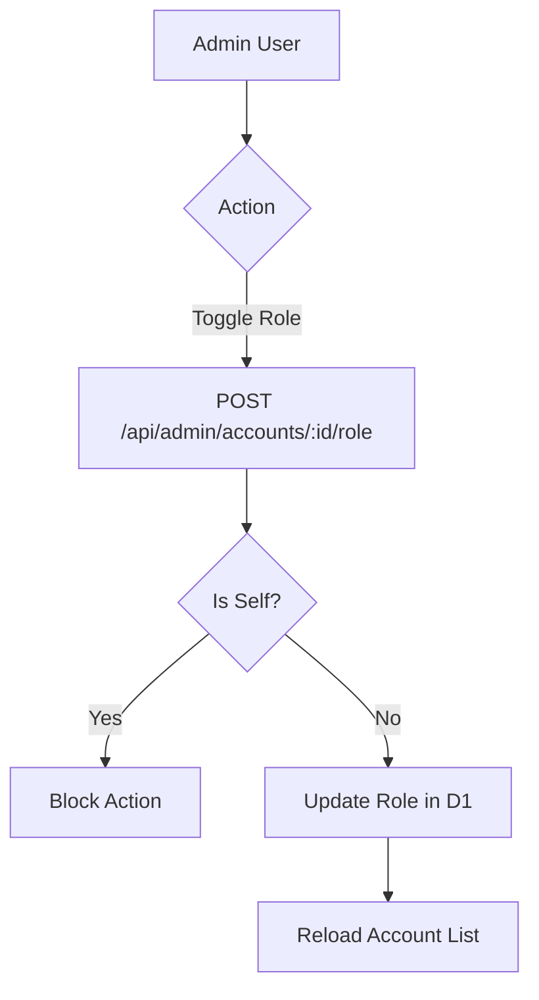
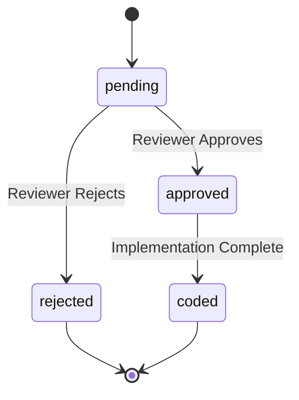

Relevant source files

The following files were used as context for generating this wiki page:

- [app/public/app.js](app/public/app.js)
- [app/src/admin.ts](app/public/app.js)
- [app/public/index.html](app/public/index.html)
- [infra/schema.sql](infra/schema.sql)
- [app/public/style.css](app/public/style.css)
- [DESIGN.md](DESIGN.md)

# Admin Dashboard UI

The Admin Dashboard UI serves as the centralized management interface for the Product Describer system. It provides administrators with high-level operational oversight, including system statistics, user account management, site scraping configuration, and data export capabilities. Access to this dashboard is restricted to users with the `admin` role, and the interface visibility is dynamically adjusted based on the authenticated user's permissions.

Sources: [app/public/app.js:52-54](app/public/app.js#L52-L54), [app/src/admin.ts:7-9](app/src/admin.ts#L7-L9), [app/public/index.html:200-244](app/public/index.html#L200-L244)

## Dashboard Architecture and Data Flow

The dashboard follows a client-server architecture where the frontend (JavaScript) interacts with specialized admin API endpoints protected by role-based access control. The backend retrieves aggregated data from the D1 database through batch queries to provide a comprehensive view of system health.

### Admin Data Initialization
When an administrator selects the "Admin" department from the navigation drawer, the `loadAdmin()` function is triggered. This function orchestrates several parallel data fetching tasks to populate the different sections of the dashboard.

The diagram shows the sequence of API calls triggered when the Admin section is loaded, showing how the UI populates statistics, accounts, and site configurations.
Sources: [app/public/app.js:342-348](app/public/app.js#L342-L348), [app/src/admin.ts:31-70](app/src/admin.ts#L31-L70)

## System Statistics and Visualization

The statistics section provides real-time and historical data through numerical grids and SVG-based bar charts.

### Operational Metrics
Key metrics are displayed in a `stat-grid` containing `stat-box` elements. These include:
*  **Account Growth**: Total accounts and new accounts in the last 30 days.
*  **Product Catalog**: Total products, products with AI descriptions, and products with extracted source text.
*  **System Activity**: Total price points logged, active price watches, alert channels, and application support documents.

### Time-Series Visualization
Historical data is rendered using the `barChart` function, which generates lightweight SVG bars to visualize trends over time (14-30 days).

| Chart Target | Data Source | Duration |
| :--- | :--- | :--- |
| New Accounts | `accounts_30d` | 30 Days |
| AI Descriptions | `descriptions_30d` | 30 Days |
| Price Points | `price_points_14d` | 14 Days |

Sources: [app/public/app.js:555-570](app/public/app.js#L555-L570), [app/public/app.js:585-610](app/public/app.js#L585-L610), [app/src/admin.ts:65-69](app/src/admin.ts#L65-L69)

## User Account Management

The account management section allows administrators to oversee all registered users and modify their permissions.

### Management Features
*  **Account Listing**: Displays email, role, creation date, and activity counts (jobs, watches, support items).
*  **Role Promotion/Demotion**: Admins can toggle user roles between `user` and `admin`. The system includes a safety check in `setAccountRole` to prevent administrators from accidentally removing their own admin privileges.

The flowchart describes the logic for updating user roles, including the self-demotion protection mechanism.
Sources: [app/src/admin.ts:88-102](app/src/admin.ts#L88-L102), [app/public/app.js:690-715](app/public/app.js#L690-L715)

## Site Scraping Configuration

Administrators can manage the "muscle" of the system—the scrapers—by configuring how the system interacts with external product sites.

### Site Parameters
The dashboard allows inline editing of site-specific scraping behaviors:
*  **Detail Selector**: A CSS selector used to specifically target product description text when standard heuristics (JSON-LD, OpenGraph) fail.
*  **Stealth Mode**: A toggle for advanced scraping techniques.
*  **Enable/Disable**: Ability to pause crawling for specific domains.
*  **Scrape Interval**: Configurable frequency for price and data updates (minimum 300 seconds).

Sources: [app/src/admin.ts:162-192](app/src/admin.ts#L162-L192), [app/public/app.js:639-688](app/public/app.js#L639-L688)

## Data Export Engine

The export functionality allows for bulk data retrieval in either CSV or JSON formats. Due to the potential size of the product catalog (~32k products), the backend implements a keyset-based chunking strategy to avoid Cloudflare D1 response size limits.

| Export Type | Fields Included | File Formats |
| :--- | :--- | :--- |
| **Products** | id, url, title, price, category, has_description, timestamps | CSV, JSON |
| **Accounts** | id, email, role, created_at, activity counts | CSV, JSON |

Sources: [app/src/admin.ts:133-159](app/src/admin.ts#L133-L159), [app/public/index.html:236-242](app/public/index.html#L236-L242)

## Page Suggestion Moderation

User-submitted feature suggestions are moderated through the dashboard. Administrators can review suggestions and transition them through multiple states.

### Suggestion Status Workflow

The state diagram illustrates the lifecycle of a page suggestion as managed by the administrator.
Sources: [app/public/app.js:527-550](app/public/app.js#L527-L550), [infra/schema.sql:151-160](infra/schema.sql#L151-L160)

## Conclusion
The Admin Dashboard UI serves as the operational brain of the Product Describer, providing the tools necessary to manage a growing product catalog and user base. By integrating D1-backed statistics, role-based user management, and fine-grained scraper configuration, it ensures the administrator has complete control over the system's performance and data integrity.
