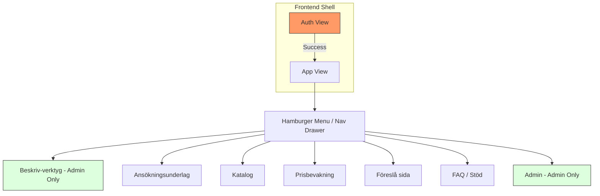
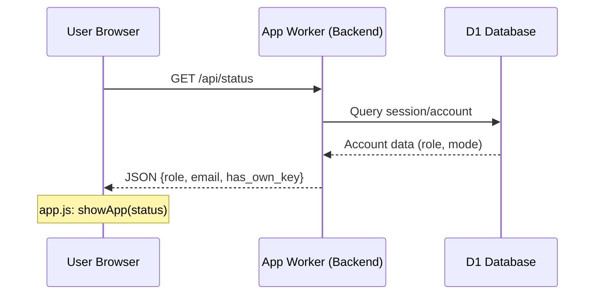
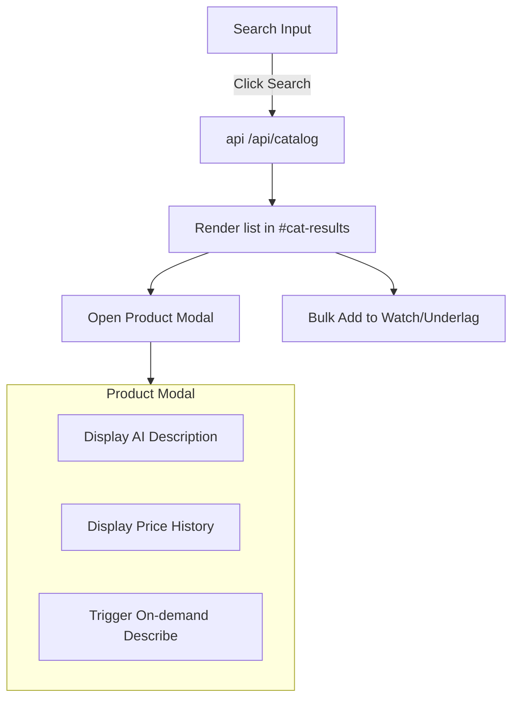

Relevant source files

The following files were used as context for generating this wiki page:

- [app/public/index.html](app/public/index.html)
- [app/public/app.js](app/public/app.js)
- [app/src/index.ts](app/src/index.ts)
- [PROPOSAL-hopslagen-app.md](PROPOSAL-hopslagen-app.md)
- [DESIGN.md](DESIGN.md)
- [README.md](README.md)

# Main UI & Routing

The Product Describer interface is a Single Page Application (SPA) designed to consolidate multiple functional areas—product description generation, catalog browsing, price monitoring, and application documentation—into a single unified Worker-based application. It employs a "Two Departments" architecture: one focused on social service assistance (Application Documents) and another on public utility (Catalog and Price Monitoring).

The UI is built with a standard HTML/CSS/JS stack, leveraging a Cloudflare Worker as a backend API and router. Access control is managed through a role-based system (`user` vs `admin`), which determines the visibility of specific management tools and administrative panels.

Sources: [PROPOSAL-hopslagen-app.md:1-18](PROPOSAL-hopslagen-app.md#L1-L18), [README.md:10-20](README.md#L10-L20)

## Frontend Architecture

The frontend uses a state-driven Single Page Application model where visibility of different "departments" is toggled based on user interaction with a hamburger menu or current authentication status.

### Component Structure
The UI is divided into two primary views:
*  **Auth View:** Handles user registration, login (email/password), and OAuth via Google or Microsoft.
*  **App View:** The main functional container visible after authentication, containing the navigation drawer and department sections.

Sources: [app/public/index.html:12-104](app/public/index.html#L12-L104), [app/public/app.js:68-85](app/public/app.js#L68-L85)

### Department Routing Logic
Department switching is handled by the `showDept(name)` function in `app.js`. This function hides all sections with the `.dept` class and shows only the target section ID. It also triggers data-loading functions specific to that department (e.g., `loadWatches()` for price monitoring).

Sources: [app/public/app.js:316-324](app/public/app.js#L316-L324)

## Authentication & Authorization

The system transitioned from Cloudflare Access to an application-managed account model supporting multiple login methods and roles.

### Auth Flow
Authentication is verified via a session cookie. The frontend `init` function calls `/api/status` to determine if a session is active and retrieves the user's role.

Sources: [app/public/app.js:68-75](app/public/app.js#L68-L75), [app/src/index.ts:241-255](app/src/index.ts#L241-L255), [PROPOSAL-hopslagen-app.md:21-30](PROPOSAL-hopslagen-app.md#L21-L30)

### User Roles
| Role | Access Permissions |
| :--- | :--- |
| **User** | Access to Catalog, Underlag (Documents), Price Monitoring, and Page Suggestions. |
| **Admin** | Full access including "Beskriv-verktyg" (AI config/upload), Admin Statistics, Site Configuration, and User Management. |

Sources: [app/src/index.ts:63-70](app/src/index.ts#L63-L70), [app/public/app.js:77-85](app/public/app.js#L77-L85)

## API Routing & Endpoints

The `app/src/index.ts` file acts as the primary router for all API requests. It handles static routing, OAuth callbacks, and protected API endpoints.

### Key API Routes
| Method | Path | Description | Access |
| :--- | :--- | :--- | :--- |
| `POST` | `/signup` / `/login` | Account management | Public |
| `GET` | `/api/status` | Current session info | Session |
| `POST` | `/api/upload` | File upload for AI processing | Admin |
| `GET` | `/api/catalog` | Search product catalog | User |
| `POST` | `/api/produkt/:id/describe` | Trigger on-demand AI description | User/Admin |
| `POST` | `/api/watch` | Add product to price monitoring | User |

Sources: [app/src/index.ts:50-160](app/src/index.ts#L50-L160)

## Department Details

### Catalog & Search
The catalog interface allows users to browse products and filter by category. It implements "Bulk Import" functionality allowing users to add multiple products to their "Underlag" or "Watchlist" simultaneously.

Sources: [app/public/app.js:364-420](app/public/app.js#L364-L420), [app/public/index.html:125-155](app/public/index.html#L125-L155)

### AI Description Management (Beskriv-verktyg)
This admin-only section manages AI provider configurations and file uploads. Providers supported include Anthropic, OpenAI, Gemini, and Azure OpenAI.

*  **Provider Config:** AES-GCM encrypted API keys stored in D1.
*  **Uploads:** Files (CSV, XLSX, PDF, etc.) are uploaded to R2, and a job is queued for the `processor` worker.

Sources: [app/src/index.ts:326-353](app/src/index.ts#L326-L353), [README.md:14-25](README.md#L14-L25), [DESIGN.md:28-35](DESIGN.md#L28-L35)

### Price Monitoring (Bevakning)
Users can configure alerts for price drops. The system supports multiple alert channels:
*  `ntfy` (Topic-URL)
*  `Slack` (Webhook)
*  `Telegram` (Bot token + Chat ID)
*  `Webhook` (Generic POST)

Sources: [app/public/index.html:158-180](app/public/index.html#L158-L180), [app/public/app.js:512-545](app/public/app.js#L512-L545)

## Conclusion
The Main UI & Routing system provides a centralized hub for both end-users and administrators. By utilizing Single Page Application logic on the frontend and a consolidated Worker on the backend, the project achieves a high degree of portability and low maintenance overhead while maintaining strict security via role-based access control.
