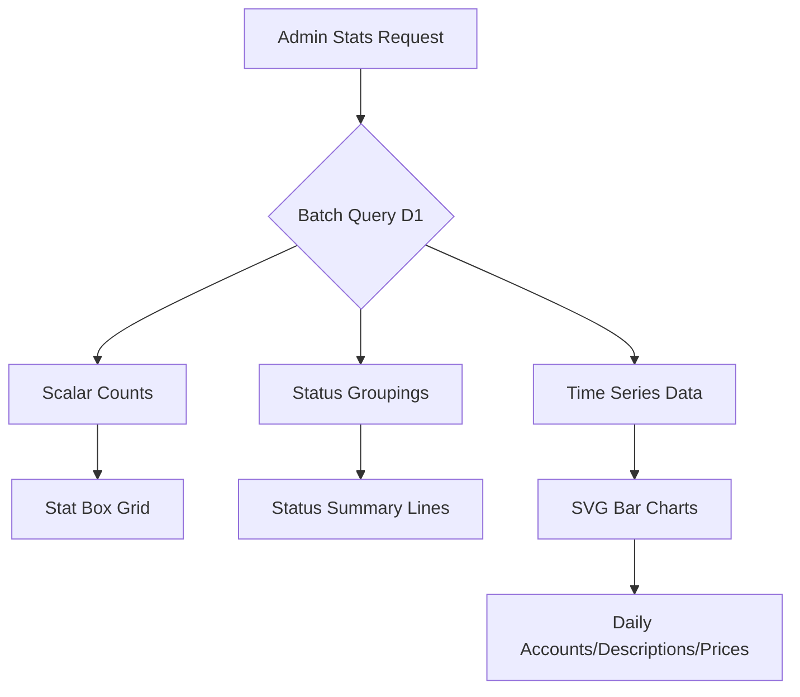
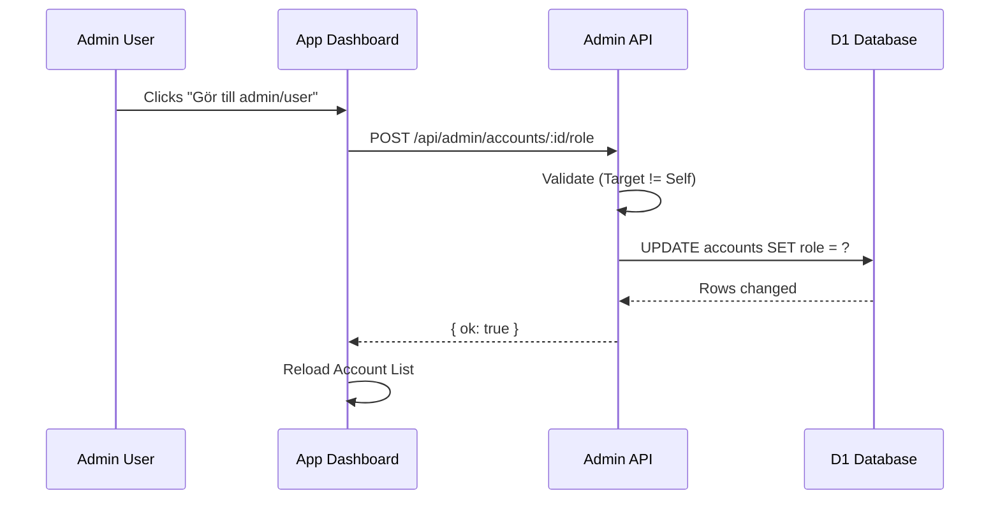
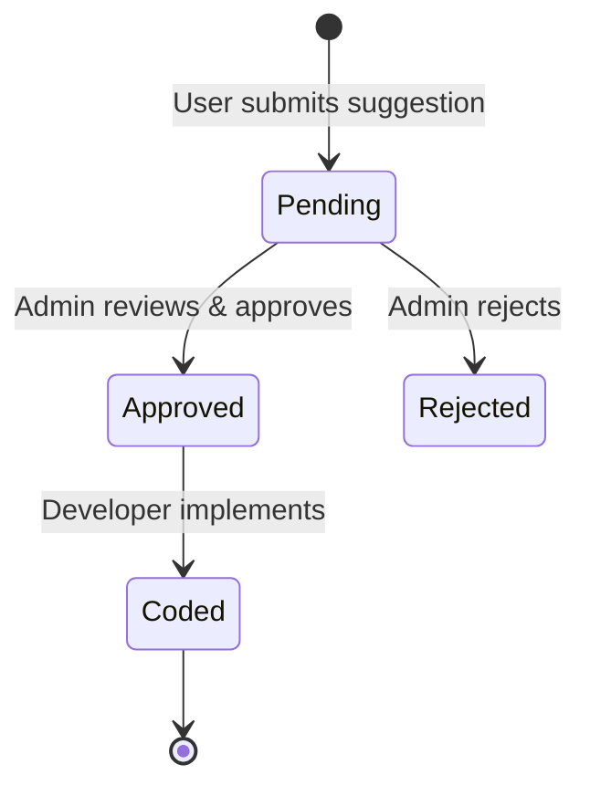

Relevant source files

The following files were used as context for generating this wiki page:

- [app/public/app.js](app/public/app.js)
- [app/src/admin.ts](app/src/admin.ts)
- [app/public/index.html](app/public/index.html)
- [infra/schema.sql](infra/schema.sql)
- [engine/src/index.ts](engine/src/index.ts)
- [DESIGN.md](DESIGN.md)

# Admin Dashboard UI

The Admin Dashboard UI is a specialized management interface within the Product Describer application, restricted to users with the `admin` role. It provides high-level oversight of system health, user activity, and product catalog management. The dashboard is designed to facilitate operator-level tasks such as monitoring processing queues, managing site scraping configurations, and reviewing user-submitted suggestions.

Architecturally, the dashboard consumes data from the `/api/admin/*` endpoints, which interact with the Cloudflare D1 database. The UI is integrated into the main single-page application (SPA), with visibility toggled based on the authenticated user's role determined during the initial app status check. Sources: [app/public/app.js:46-56](app/public/app.js#L46-L56), [app/src/admin.ts:1-5](app/src/admin.ts#L1-L5), [infra/schema.sql:8](infra/schema.sql#L8)

## System Statistics and Visualization

The dashboard includes a comprehensive statistics section that visualizes system performance and growth over time. This includes counts of accounts, products, price points, and active scraping sites.

### Data Aggregation Logic
The backend aggregates data using batch SQL queries to minimize latency. Key metrics include:
*  **Accounts**: Total count, admin count, and new accounts in the last 30 days.
*  **Products**: Total products, count of products with AI descriptions, and count of products with extracted source text.
*  **Operational Metrics**: Counts for various job types (processing jobs, render jobs, and page suggestions) grouped by status.
*  **Time Series**: Daily counts for descriptions generated, accounts created (30-day window), and price points logged (14-day window).

Sources: [app/src/admin.ts:25-65](app/src/admin.ts#L25-L65), [app/public/app.js:519-531](app/public/app.js#L519-L531)

### Visual Components
Data is presented through a combination of "Stat Boxes" for scalar values and SVG-based bar charts for time-series data. The bar charts automatically fill missing days with zero values to ensure a consistent timeline.

The diagram shows the flow from the initial request to the rendering of various statistical UI components. Sources: [app/public/app.js:538-564](app/public/app.js#L538-L564), [app/src/admin.ts:32-60](app/src/admin.ts#L32-L60)

## User and Role Management

Admins have the authority to manage user accounts and modify permissions. The interface displays the 500 most recent accounts in a sortable table.

| Field | Description | Source |
| :--- | :--- | :--- |
| **Email** | User's unique identifier | [app/src/admin.ts:93](app/src/admin.ts#L93) |
| **Role** | Current permission level (`user` or `admin`) | [infra/schema.sql:8](infra/schema.sql#L8) |
| **Created At** | ISO date of account creation | [app/public/app.js:636](app/public/app.js#L636) |
| **Activity Counters** | Counts for Jobs, Watches, and Underlag (Bistand) items | [app/src/admin.ts:94-96](app/src/admin.ts#L94-L96) |

### Role Modification
Role changes are performed via the `POST /api/admin/accounts/:id/role` endpoint. The system includes a safety check to prevent admins from removing their own admin status, which could lead to lockout.

This sequence illustrates the secure role-changing process. Sources: [app/public/app.js:641-654](app/public/app.js#L641-L654), [app/src/admin.ts:103-114](app/src/admin.ts#L103-L114)

## Site Scraping Configuration

A critical component of the dashboard is the management of the "Muskel" (muscle) layer—the sites being crawled for product data. Admins can adjust scraping parameters per site without modifying the underlying code.

### Site Management Fields
*  **Enabled Toggle**: Activates or deactivates crawling for a specific site.
*  **Use Stealth**: Toggles the use of stealth mode in the Playwright fetcher to bypass basic bot detection.
*  **Detail Selector**: A CSS selector used as the primary source for product text extraction. If empty, the system defaults to heuristic extraction (JSON-LD, OpenGraph, or Meta tags).
*  **Scrape Interval**: Configures the frequency of crawls (minimum 300 seconds).

Sources: [app/src/admin.ts:184-187](app/src/admin.ts#L184-L187), [app/public/app.js:584-605](app/public/app.js#L584-L605), [DESIGN.md:4.1](DESIGN.md:4.1)

## Data Export and Suggestions

The dashboard provides tools for auditing and community management through data exports and a suggestion review system.

### Export Capabilities
Admins can download system data in CSV or JSON formats. To avoid memory issues with the ~32k product catalog, exports are processed in chunks and exclude large text blobs like `source_text` or `description`, including only boolean flags for their existence.

| Export Type | Fields Included | Source |
| :--- | :--- | :--- |
| **Products** | id, url, title, price, category, has_description, first_seen, last_updated | [app/src/admin.ts:145](app/src/admin.ts#L145) |
| **Accounts** | id, email, role, created_at, job/watch/bistand counts | [app/src/admin.ts:162](app/src/admin.ts#L162) |

### Suggestion Management
Users can propose new sites or features via the "Föreslå sida" section. These appear in the admin dashboard for review. Admins can update the status of these suggestions to `approved`, `rejected`, or `coded`. Sources: [app/public/app.js:487-515](app/public/app.js#L487-L515), [infra/schema.sql:135-144](infra/schema.sql#L135-L144)

The state diagram shows the lifecycle of a user-submitted feature suggestion within the admin workflow. Sources: [infra/schema.sql:142](infra/schema.sql#L142), [app/public/app.js:504-510](app/public/app.js#L504-L510)

The Admin Dashboard UI serves as the central control plane for the Product Describer project, ensuring that the transition to a Cloudflare-centric "Brain + Memory" architecture remains observable and manageable for the operator. Sources: [DESIGN.md:2](DESIGN.md#L2), [app/src/admin.ts:1-5](app/src/admin.ts#L1-L5)
