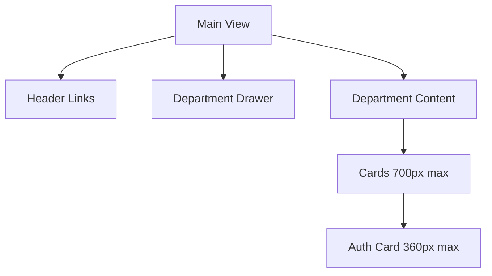
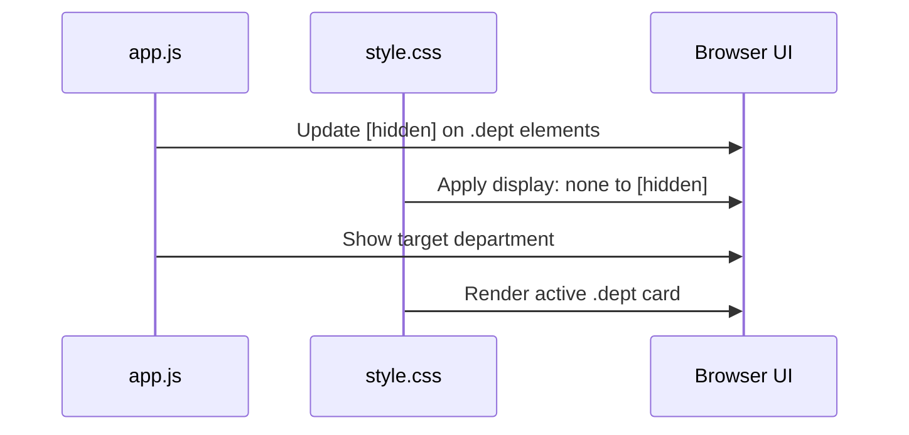
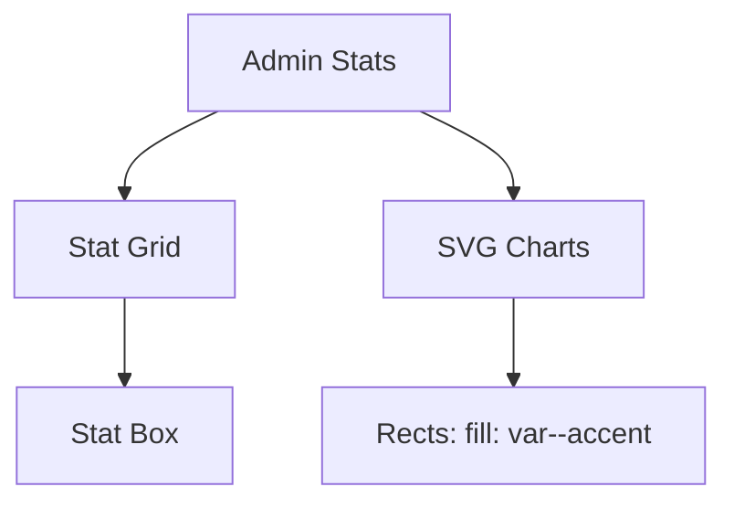

<details>
<summary>Relevant source files</summary>

The following files were used as context for generating this wiki page:

- [app/public/style.css](app/public/style.css)
- [app/public/index.html](app/public/index.html)
- [app/src/bistand.ts](app/src/bistand.ts)
- [app/public/app.js](app/public/app.js)
- [PROPOSAL-hopslagen-app.md](PROPOSAL-hopslagen-app.md)
</details>

# CSS & Styling Architecture

The styling architecture of the Product Describer project follows a "single-page application" (SPA) visual pattern where different "departments" or views are toggled within a unified interface. The system utilizes a dark-themed aesthetic driven by CSS variables and standardizes on a card-based layout for various modules such as the product catalog, description tools, and administration panels.

This architecture supports two distinct visual contexts: a dynamic dark-themed web interface for active users and a specialized print-ready light-themed layout for generating physical documentation.

Sources: [app/public/index.html:2-3](app/public/index.html#L2-L3), [app/public/style.css:3-13](app/public/style.css#L3-L13), [app/src/bistand.ts:167-172](app/src/bistand.ts#L167-L172), [PROPOSAL-hopslagen-app.md:12-16](PROPOSAL-hopslagen-app.md#L12-L16)

## Visual Foundation and Design System

The core visual identity is defined using CSS variables in the `:root` pseudo-class, which establishes a dark theme as the default for the application. The system uses a system-ui font stack and focuses on a card-based layout to group related functionality.

### Core Color Palette and Variables
| Variable | Value | Description |
| :--- | :--- | :--- |
| `--bg` | `#0c0e14` | Primary application background |
| `--card-bg` | `#13161f` | Background for interactive card elements |
| `--text` | `#e4e2dc` | Primary text color (off-white) |
| `--accent` | `#f0a500` | Golden accent color used for buttons and links |
| `--error` | `#ef4444` | Red color for error states and messages |
| `--ok` | `#4ade80` | Green color for success indicators |
| `--hint` | `#6b7280` | Muted gray for secondary information |

Sources: [app/public/style.css:3-13](app/public/style.css#L3-L13)

### Component Layout
The application organizes content into centered containers with a `max-width` of 700px, creating a focused reading and interaction area.



The design prioritizes mobile-responsive inputs and buttons, where interactive elements like `input`, `select`, and `button` are set to `width: 100%` by default within their containers.

Sources: [app/public/style.css:20-26](app/public/style.css#L20-L26), [app/public/style.css:35-42](app/public/style.css#L35-L42)

## Dynamic View Management

The styling architecture works in tandem with JavaScript to manage visibility of different application sections.

### The "Department" Pattern
The application is divided into "departments" (e.g., `dept-verktyg`, `dept-katalog`, `dept-admin`). Styling is used to hide these sections by default using the `[hidden]` attribute.



Specific overrides are necessary to ensure that ID-based selectors do not conflict with the `hidden` logic for critical components like the product modal and navigation drawer.

Sources: [app/public/app.js:519-524](app/public/app.js#L519-L524), [app/public/style.css:127-133](app/public/style.css#L127-L133)

## Specialized Print Styling

A critical feature of the system is the generation of printable documentation for social services. This requires a dedicated styling strategy that overrides the application's dark theme.

### The bistand.ts Print Engine
The `renderUnderlag` function in the backend logic injects a specific `<style>` block for the printable page. This CSS uses a `@media print` query to transform the dark UI into a high-contrast black-and-white document.

| Property | Screen Mode (Default) | Print Mode (@media print) |
| :--- | :--- | :--- |
| **Background** | `#0c0e14` (Dark) | `#fff` (White) |
| **Text Color** | `#e4e2dc` (Light) | `#111` (Black) |
| **Toolbar** | Visible | `display: none` |
| **Borders** | `rgba(255,255,255,0.1)` | `#ccc` (Gray) |
| **Font** | Serif (Georgia/Times) | Serif |

Sources: [app/src/bistand.ts:182-206](app/src/bistand.ts#L182-L206)

### Document Layout Logic
The print CSS ensures that individual product "items" are not split across pages by using `page-break-inside: avoid;`.

```javascript
/* Item styling for printable documentation */
.item { 
  border: 1px solid rgba(255,255,255,0.1); 
  border-radius: 6px; 
  padding: 1rem 1.25rem; 
  margin-bottom: 1rem; 
  background: #13161f; 
  page-break-inside: avoid; 
}
```

Sources: [app/src/bistand.ts:188-188](app/src/bistand.ts#L188)

## Administrative and Data Visualizations

The styling architecture includes specific provisions for administrative dashboards, including grid layouts and SVG-based charts.

### Statistics and Charts
The admin panel uses a `stat-grid` with `grid-template-columns: repeat(auto-fill, minmax(130px, 1fr))` for high-level metrics. Data visualizations are rendered as SVGs where bar colors are tied to the design system's accent variable.



Sources: [app/public/style.css:170-179](app/public/style.css#L170-L179), [app/public/style.css:186-186](app/public/style.css#L186)

### Data Tables
Tables within the admin view use horizontal scrolling (`overflow-x: auto`) for responsiveness and have strict formatting for headers and monospace font for technical selectors.

Sources: [app/public/style.css:192-205](app/public/style.css#L192-L205)

## Conclusion
The styling architecture of Product Describer is a CSS-variable driven system that balances a modern dark-themed SPA experience with high-fidelity, print-optimized document generation. By utilizing a shared design system across its department-based layout, it maintains visual consistency while providing specialized views for different user roles and output requirements.
