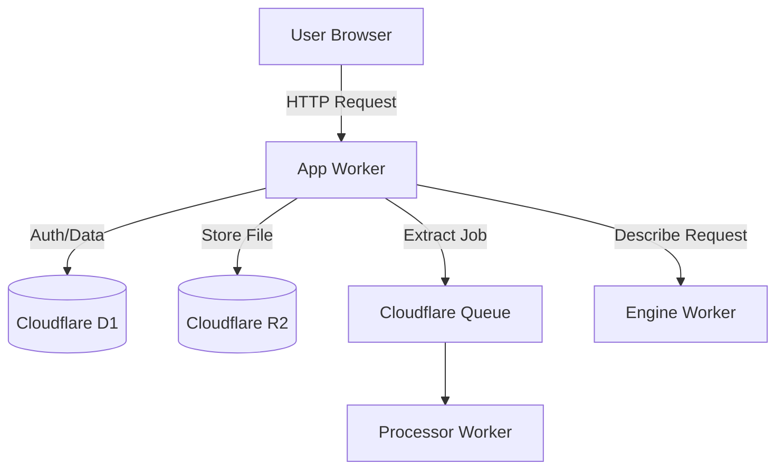
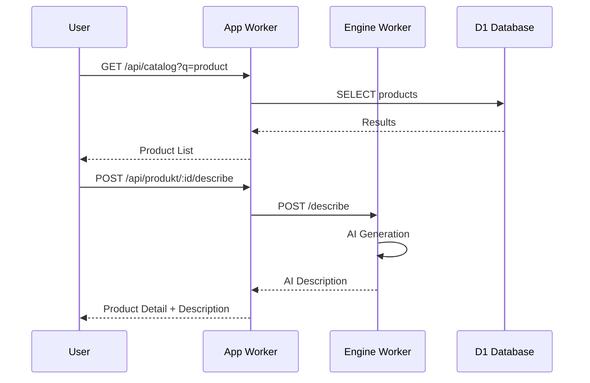
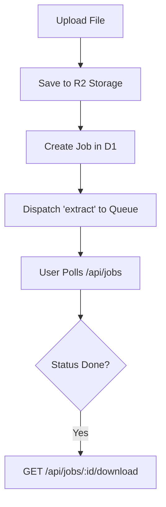

<details>
<summary>Relevant source files</summary>

The following files were used as context for generating this wiki page:

- [app/src/index.ts](app/src/index.ts)
- [README.md](README.md)
- [DESIGN.md](DESIGN.md)
- [PROPOSAL-hopslagen-app.md](PROPOSAL-hopslagen-app.md)
- [app/public/app.js](app/public/app.js)
</details>

# App Worker API

The **App Worker API** serves as the primary interface for the Product Describer web application. It handles authentication, user session management, AI provider configurations, file uploads, and catalog interactions. Built as a Cloudflare Worker, it orchestrates data flow between the frontend, D1 database, R2 storage, and specialized background workers.

Sources: [README.md:12-14](README.md#L12-L14), [app/src/index.ts:5-18](app/src/index.ts#L5-L18)

## Architecture Overview

The App Worker acts as a gatekeeper and orchestrator. While it manages the UI and API endpoints, it delegates heavy processing tasks—such as file extraction and AI generation—to the `processor` worker via Cloudflare Queues. It relies on Cloudflare D1 for structured data (accounts, jobs, products) and R2 for unstructured data (uploaded files and results).



The App Worker coordinates user sessions and storage, offloading processing to the Queue.
Sources: [README.md:12-25](README.md#L12-L25), [DESIGN.md:39-55](DESIGN.md#L39-L55), [app/src/index.ts:241-248](app/src/index.ts#L241-L248)

## Authentication and Session Management

The API implements a multi-layered authentication system. It supports traditional Email/Password credentials alongside OAuth providers (Google and Microsoft). For local security within the Cloudflare ecosystem, it uses encrypted cookies to maintain sessions and role-based access control (RBAC) to differentiate between standard `user` and `admin` roles.

### Authentication Endpoints

| Method | Endpoint | Description |
| :--- | :--- | :--- |
| POST | `/signup` | Registers a new user with rate limiting. |
| POST | `/login` | Validates credentials and issues a session cookie. |
| POST | `/logout` | Invalidates the current session and clears cookies. |
| GET | `/api/oauth/:provider` | Initiates OAuth flow for Google or Microsoft. |
| GET | `/api/status` | Returns current user role, email, and config status. |

Sources: [app/src/index.ts:58-62](app/src/index.ts#L58-L62), [PROPOSAL-hopslagen-app.md:18-29](PROPOSAL-hopslagen-app.md#L18-L29), [app/public/app.js:14-46](app/public/app.js#L14-L46)

### Rate Limiting and Security
To prevent abuse, the API enforces rate limits on sensitive endpoints:
- **Signup**: Limited to 5 attempts per hour per IP.
- **Login**: Limited to 10 attempts per 10 minutes per IP.

Sources: [app/src/index.ts:193-195](app/src/index.ts#L193-L195), [app/src/index.ts:206-208](app/src/index.ts#L206-L208)

## Product Catalog and "Bistånd" Support

The API provides endpoints to browse the unified product catalog and manage personal "Bistånds-underlag" (social assistance documentation). Users can search for products, view price history, and add items to a list with custom motivations.



The App Worker proxies description requests to the Engine worker and fetches catalog data from D1.
Sources: [app/src/index.ts:130-143](app/src/index.ts#L130-L143), [engine/src/index.ts:468-522](engine/src/index.ts#L468-L522), [PROPOSAL-hopslagen-app.md:43-52](PROPOSAL-hopslagen-app.md#L43-L52)

### Catalog Endpoints

| Method | Endpoint | Parameters | Description |
| :--- | :--- | :--- | :--- |
| GET | `/api/catalog` | `q`, `offset`, `category` | Search and filter the product catalog. |
| GET | `/api/categories` | - | Retrieve a list of all product categories. |
| GET | `/api/produkt/:id` | `id` | Get detailed product info and price history. |
| POST | `/api/bistand` | `product_id`, `motivation` | Add item to assistance documentation. |
| GET | `/underlag` | - | Renders printable HTML documentation. |

Sources: [app/src/index.ts:122-126](app/src/index.ts#L122-L126), [app/src/index.ts:175-182](app/src/index.ts#L175-L182), [app/public/app.js:235-255](app/public/app.js#L235-L255)

## Admin and Configuration API

Administrative users have access to system-wide metrics, AI provider configurations, and catalog management. The API manages credentials for Anthropic, OpenAI, Gemini, and Azure OpenAI, storing them encrypted using a shared `PROVIDER_CONFIG_KEY`.

### AI Provider Management
The API supports dynamic configuration of AI models. Admins can set API keys and specific parameters for different providers.

```typescript
// Example: Setting a provider key (from app/src/index.ts:285-296)
const provider = data.provider as ProviderName;
const apiKey = data.api_key ?? "";
const extra: Record<string, string> = {};
for (const field of EXTRA_FIELDS[provider] ?? []) {
  extra[field.name] = (data[field.name] ?? "").trim();
}
await setProviderConfig(env, accountId, provider, { api_key: apiKey, ...extra });
```

### Administrative Endpoints

| Method | Endpoint | Access | Description |
| :--- | :--- | :--- | :--- |
| GET | `/api/admin/stats` | Admin | System metrics (accounts, jobs, products). |
| GET | `/api/admin/sites` | Admin | Manage scraper sites and CSS selectors. |
| POST | `/api/admin/accounts/:id/role`| Admin | Change user roles (user <-> admin). |
| GET | `/api/admin/export/products` | Admin | Export catalog as CSV or JSON. |

Sources: [app/src/index.ts:91-115](app/src/index.ts#L91-L115), [app/public/app.js:520-562](app/public/app.js#L520-L562), [DESIGN.md:92-108](DESIGN.md#L92-L108)

## File Upload and Job Tracking

The API manages the lifecycle of bulk product description jobs. It handles file uploads up to 50MB, supporting formats like CSV, XLSX, PDF, and DOCX.



The upload process involves R2 storage, D1 metadata creation, and Queue dispatching.
Sources: [README.md:31-38](README.md#L31-L38), [app/src/index.ts:317-340](app/src/index.ts#L317-L340), [app/public/app.js:154-173](app/public/app.js#L154-L173)

### Job Statuses
Jobs transition through various states visible via the `/api/jobs` endpoint:
- **queued**: Waiting for processor.
- **processing**: Currently extracting or describing.
- **paused**: Waiting for AI provider quota/retry.
- **done**: Output file ready in R2.
- **error**: Processing failed (error message available).

Sources: [app/public/app.js:179-185](app/public/app.js#L179-L185), [README.md:18-21](README.md#L18-L21)

## Conclusion

The App Worker API provides the central logic for the Product Describer system, balancing user interaction with complex background workflows. By utilizing Cloudflare's serverless infrastructure (D1, R2, and Queues), it maintains high availability and performance while managing secure multi-provider AI integrations and comprehensive product catalog features.

Sources: [README.md:1-25](README.md#L1-L25), [DESIGN.md:10-23](DESIGN.md#L10-L23)
