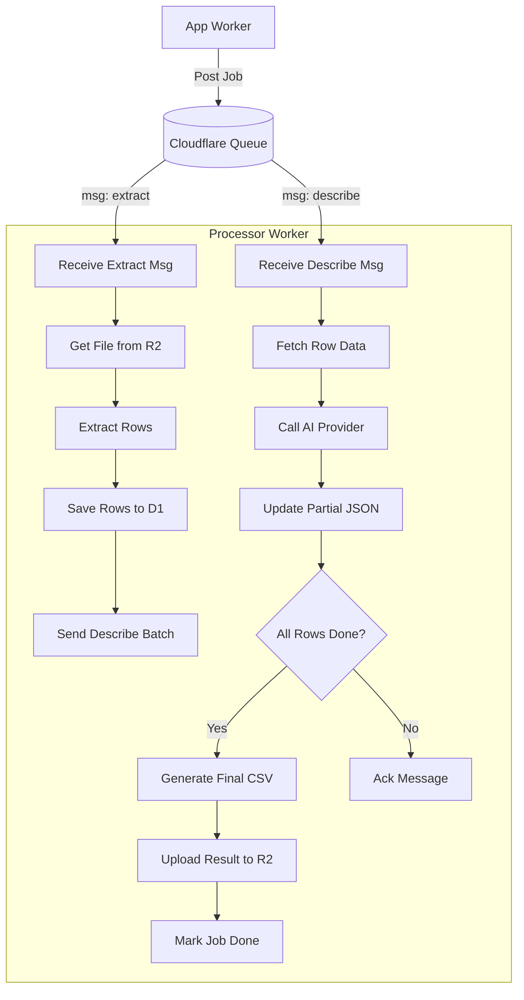
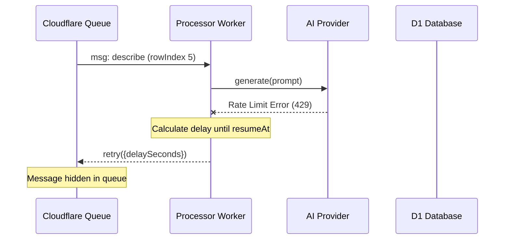

<details>
<summary>Relevant source files</summary>

The following files were used as context for generating this wiki page:

- [processor/src/index.ts](processor/src/index.ts)
- [README.md](README.md)
- [DESIGN.md](DESIGN.md)
- [processor/package.json](processor/package.json)
- [app/public/app.js](app/public/app.js)
- [app/src/bistand.ts](app/src/bistand.ts)
</details>

# Processor Worker (Queue Consumer)

The Processor Worker is a Cloudflare Workers consumer responsible for handling background tasks related to product file processing. It primarily manages two stages of data handling: extracting raw product rows from uploaded files (CSV, XLSX, TXT, DOCX, or PDF) and generating AI-based product descriptions for each extracted row. Unlike traditional background threads, this worker utilizes Cloudflare Queues to handle potentially long-running processes by breaking them into individual message-based tasks.

Sources: [README.md:9-13](README.md#L9-L13), [processor/src/index.ts:1-12](processor/src/index.ts#L1-L12)

This architecture ensures high availability and scalability, allowing the system to process large batches of products without hitting execution time limits. It works in conjunction with the [App Worker](#app-worker) which handles file uploads and UI interactions, and the [Engine Worker](#engine-worker) which manages the central product catalog and price monitoring.

Sources: [DESIGN.md:46-60](DESIGN.md#L46-L60), [processor/src/index.ts:14-18](processor/src/index.ts#L14-L18)

## Core Architecture and Data Flow

The Processor Worker operates as a consumer of a Cloudflare Queue (`JOB_QUEUE`). It handles two distinct message types: `extract` and `describe`. The extraction phase converts a multi-row file into a structured JSON representation, while the description phase processes each row individually to leverage parallel execution.

### Task Processing Logic

1.  **Extraction Stage**: When a message of type `extract` is received, the worker retrieves the file from R2 storage, parses its contents, and updates the D1 database with the total row count and the raw data.
2.  **Description Stage**: Upon successful extraction, the worker enqueues multiple `describe` messages—one for every row in the file. Each `describe` task calls an AI provider to generate a Swedish product description.
3.  **Completion**: As individual rows are completed, they are stored as partial results. Once the number of partial results matches the total row count, a final CSV is generated and uploaded back to R2.

Sources: [processor/src/index.ts:50-65](processor/src/index.ts#L50-L65), [processor/src/index.ts:153-165](processor/src/index.ts#L153-L165)

### Processing Flow Diagram

The following diagram illustrates the lifecycle of a processing job from file upload to final output generation.



Sources: [processor/src/index.ts:50-70](processor/src/index.ts#L50-L70), [processor/src/index.ts:153-165](processor/src/index.ts#L153-L165), [README.md:12-13](README.md#L12-L13)

## Key Components and Interfaces

The worker relies on several environment bindings and specific data structures to manage the state of jobs across multiple invocations.

### Environment Bindings
| Binding | Type | Description |
| :--- | :--- | :--- |
| `DB` | D1Database | Stores job status, row data, and partial results. |
| `UPLOADS` | R2Bucket | Stores original uploaded files and generated results. |
| `JOB_QUEUE` | Queue | Used for message passing between extraction and description phases. |
| `PROVIDER_CONFIG_KEY` | Secret | Symmetric key used to decrypt AI provider credentials. |

Sources: [processor/src/index.ts:21-25](processor/src/index.ts#L21-L25), [README.md:32-35](README.md#L32-L35)

### Job Message Schema
The worker distinguishes between two types of messages in the queue:

```typescript
type JobMessage = 
  | { type: "extract"; jobId: string } 
  | { type: "describe"; jobId: string; rowIndex: number };
```

Sources: [processor/src/index.ts:27-27](processor/src/index.ts#L27)

### Job Database Schema
The `jobs` table in D1 tracks the progress of each upload.
| Field | Type | Description |
| :--- | :--- | :--- |
| `id` | TEXT | Primary identifier for the job. |
| `status` | TEXT | current state (`queued`, `processing`, `paused`, `done`, `error`). |
| `rows_json` | TEXT | Stringified JSON containing all extracted product rows. |
| `partial_results_json` | TEXT | JSON object mapping `rowIndex` to AI descriptions. |
| `total` | INTEGER | Total number of rows to be processed. |
| `succeeded` | INTEGER | Number of rows successfully described by AI. |

Sources: [processor/src/index.ts:29-40](processor/src/index.ts#L29-L40), [app/public/app.js:145-151](app/public/app.js#L145-L151)

## Error Handling and Retries

The Processor Worker implements a robust retry mechanism, specifically for AI provider rate limits. 

### Provider Quota Management
If an AI provider returns a quota error, the worker throws an `AllProvidersExhausted` error. The queue consumer catches this and uses `msg.retry()` with a `delaySeconds` calculated from the provider's `resumeAt` timestamp. This effectively pauses processing for that specific job until the quota is replenished.

Sources: [processor/src/index.ts:114-118](processor/src/index.ts#L114-L118), [processor/src/index.ts:192-195](processor/src/index.ts#L192-L195)

### Automatic Reporting
Unexpected errors (not related to AI quotas) are caught in the top-level queue handler. These errors are reported to a GitHub repository as issues using the `reportErrorToGitHub` utility, provided the `GITHUB_ERROR_REPORT_TOKEN` is configured.

Sources: [processor/src/index.ts:63-71](processor/src/index.ts#L63-L71), [README.md:21-30](README.md#L21-L30)



Sources: [processor/src/index.ts:192-196](processor/src/index.ts#L192-L196), [README.md:12-13](README.md#L12-L13)

## Job Completion and Output

Final output generation occurs within the `maybeFinishJob` function. This function is called after every successful `describe` task but only executes the finalization logic if it determines the current row is the last one pending.

### CSV Generation
The worker escapes content for CSV compatibility using the `csvEscape` helper, which handles quotes and line breaks. The generated file includes all original fields from the extraction plus two new columns: **Beskrivning** (Description) and **Varför** (Rationale).

Sources: [processor/src/index.ts:221-237](processor/src/index.ts#L221-L237), [processor/src/index.ts:250-253](processor/src/index.ts#L250-L253)

### Atomic Updates
To prevent race conditions during parallel processing of the same job, the worker uses the SQLite `json_set` function within a D1 statement. This ensures that adding a result for one row does not overwrite results simultaneously being added for other rows.

Sources: [processor/src/index.ts:203-207](processor/src/index.ts#L203-L207)

```typescript
// Example of atomic update in D1
await env.DB.prepare(
  "UPDATE jobs SET partial_results_json = json_set(COALESCE(partial_results_json, '{}'), '$.\"' || ? || '\"', json(?)), updated_at = ? WHERE id = ?",
)
.bind(String(rowIndex), JSON.stringify(result), Date.now(), jobId)
.run();
```

Sources: [processor/src/index.ts:203-207](processor/src/index.ts#L203-L207)

The Processor Worker provides a scalable and resilient backend for product enrichment by leveraging Cloudflare's serverless infrastructure and queueing systems to manage complex data extraction and AI workflows.
