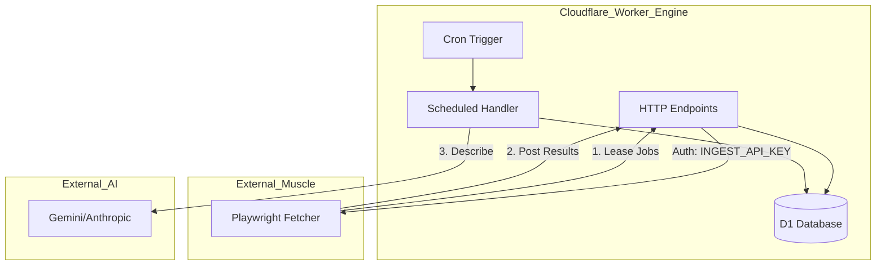
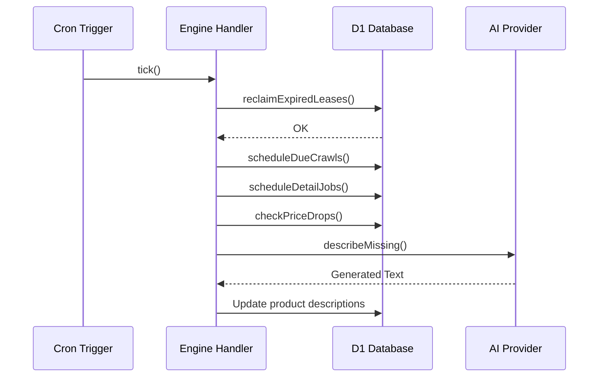

<details>
<summary>Relevant source files</summary>

The following files were used as context for generating this wiki page:

- [engine/src/index.ts](engine/src/index.ts)
- [README.md](README.md)
- [DESIGN.md](DESIGN.md)
- [infra/schema.sql](infra/schema.sql)
- [app/src/catalog.ts](app/src/catalog.ts)
</details>

# Engine Worker (Catalog Engine)

The Engine Worker serves as the "brain" of the product-describer system, acting as the central hub for the product catalog, price monitoring, and job scheduling. It is implemented as a Cloudflare Worker that manages a D1 database as the single source of truth for the entire ecosystem. Its primary purpose is to orchestrate crawling activities (via a stateless external fetcher), manage product enrichment using AI, and handle price-drop alerts.

Sources: [engine/src/index.ts:1-26](engine/src/index.ts#L1-L26), [DESIGN.md:21-25](DESIGN.md#L21-L25), [README.md:14-16](README.md#L14-L16)

The system follows a "Brain and Muscle" architecture where the Engine (Brain) owns all durable data and logic, while external servers act as stateless "muscles" (Playwright fetchers) that perform the actual web rendering and data extraction on behalf of the Engine.

Sources: [DESIGN.md:27-31](DESIGN.md#L27-L31)

## Core Architecture & Data Flow

The Engine Worker operates through two primary interfaces: HTTP endpoints for external communication and a `scheduled()` handler driven by a Cloudflare Cron Trigger.

### System Flow Overview
The following diagram illustrates the relationship between the Engine Worker, the D1 database, and the external Playwright fetcher.



The Engine provides jobs to the fetcher, stores the extracted results, and then uses AI to generate descriptions.
Sources: [DESIGN.md:43-58](DESIGN.md#L43-L58), [engine/src/index.ts:10-24](engine/src/index.ts#L10-L24)

## Data Management (D1 Database)

The Engine replaces legacy PostgreSQL and SQLite instances with a Cloudflare D1 database. This database tracks sites, products, price history, and the job queue.

### Key Database Tables

| Table | Description |
| :--- | :--- |
| `sites` | Configuration for crawlable stores (selectors, intervals, stealth settings). |
| `products` | Product metadata (title, price, source text, AI descriptions). |
| `price_history` | Historical price points used for trend analysis and alerts. |
| `render_jobs` | A D1-backed queue replacing Cloudflare Queues for job lease/ack. |
| `price_watch` | User-defined product monitors for price drop notifications. |

Sources: [infra/schema.sql:63-140](infra/schema.sql#L63-L140), [DESIGN.md:71-105](DESIGN.md#L71-L105)

### Job Lease/Ack Pattern
Instead of using Cloudflare Queues (to maintain a zero-cost profile), the Engine implements a lease/ack pattern within D1. The fetcher "leases" a job by setting a `lease_until` timestamp. If the fetcher fails, the Engine's cron handler reclaims the job after the timeout expires.

Sources: [engine/src/index.ts:51-118](engine/src/index.ts#L51-L118), [DESIGN.md:107-112](DESIGN.md#L107-L112)

## API Endpoints

The Engine exposes several internal API routes protected by an `INGEST_API_KEY`.

| Endpoint | Method | Purpose |
| :--- | :--- | :--- |
| `/jobs/lease` | `POST` | Assigns pending crawl or detail jobs to a fetcher. |
| `/jobs/:id/result` | `POST` | Receives extracted product data or site links from a fetcher. |
| `/ingest` | `POST` | Bulk upsert of product data (used for migrations or list-results). |
| `/describe` | `POST` | On-demand generation and caching of product descriptions. |
| `/health` | `GET` | Service status check. |

Sources: [engine/src/index.ts:16-24](engine/src/index.ts#L16-L24), [engine/src/index.ts:417-435](engine/src/index.ts#L417-L435)

## Scheduled Tasks (Cron)

A single Cron Trigger (running every 5 minutes) drives the sequential automation of the catalog.



The sequential execution ensures that the worker stays within CPU and time limits by capping the number of operations per tick.
Sources: [engine/src/index.ts:391-413](engine/src/index.ts#L391-L413), [DESIGN. [DESIGN.md:114-126](DESIGN. [DESIGN.md#L114-L126)

### Automated Description Generation
The `describeMissing` function gradually populates the catalog with AI descriptions. It prioritizes products that have `source_text` available but lack a `description`. To manage costs, the number of products described per tick is limited by the `DESCRIBE_LIMIT` environment variable.

Sources: [engine/src/index.ts:303-349](engine/src/index.ts#L303-L349)

## Price Monitoring & Alerts

The Engine monitors price changes by comparing the newest price point in `price_history` with the previous one.

### Alert Logic
1.  **Threshold Check:** Alerts trigger only if the drop meets both a percentage (default 5%) and absolute (default 100 kr) threshold.
2.  **Cooldown:** An `alert_cooldown` (default 24h) prevents spamming multiple alerts for the same price change.
3.  **Dispatch:** Notifications are sent via configured channels (ntfy, Slack, Telegram, or Webhook).

Sources: [engine/src/index.ts:43-52](engine/src/index.ts#L43-L52), [engine/src/index.ts:446-492](engine/src/index.ts#L446-L492), [app/src/catalog.ts:25-30](app/src/catalog.ts#L25-L30)

```typescript
// Alert Threshold Configuration
const minPct = Number(env.ALERT_MIN_DROP_PCT) || 5;
const minKr = Number(env.ALERT_MIN_DROP_KR) || 100;
const cooldownMs = (Number(env.ALERT_COOLDOWN_HOURS) || 24) * 3_600_000;
```

Sources: [engine/src/index.ts:447-449](engine/src/index.ts#L447-L449)

## Summary
The Engine Worker (Catalog Engine) centralizes the management of a high-volume product catalog by combining D1 persistence, a custom lease/ack job queue, and integrated AI enrichment. By moving the "brain" to Cloudflare and using a stateless pull-based model for scraping, the system achieves high reliability and near-zero running costs.
