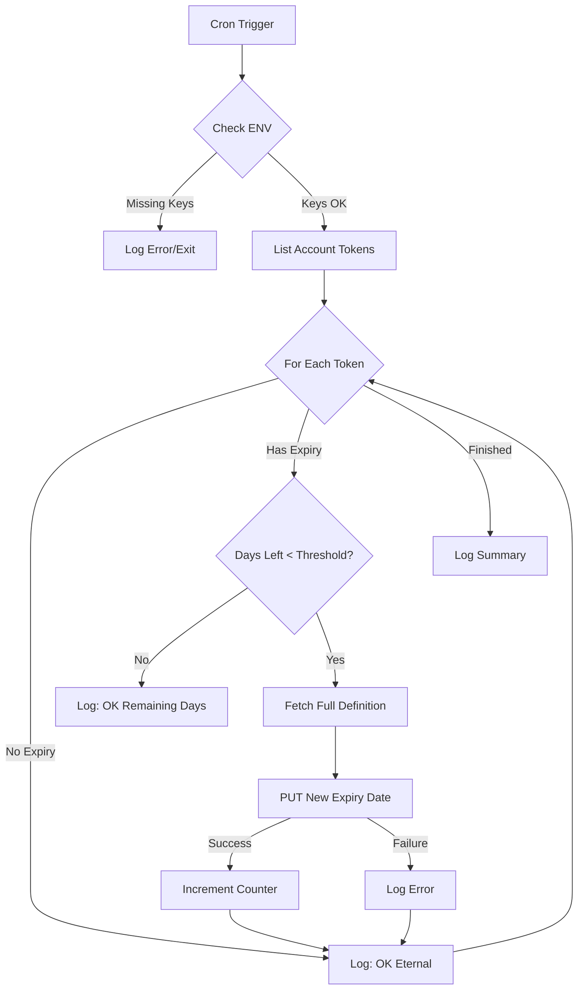
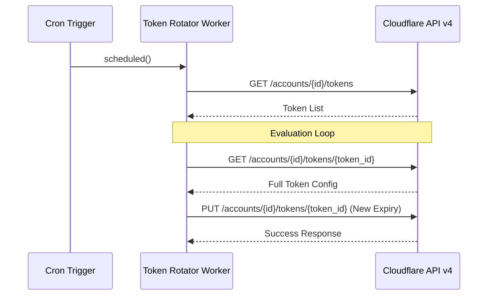

Relevant source files

The following files were used as context for generating this wiki page:

- [token-rotator/src/index.ts](token-rotator/src/index.ts)
- [README.md](README.md)
- [token-rotator/package.json](token-rotator/package.json)
- [DESIGN.md](DESIGN.md)
- [SECURITY.md](SECURITY.md)

# Token Rotator Worker

The **Token Rotator Worker** (internal name: `cf-token-rotator`) is a specialized Cloudflare Worker designed to automate "token hygiene" by ensuring Cloudflare API tokens do not expire silently. It operates as a Cron-triggered process that monitors the account's API tokens and extends their expiration dates if they fall within a configurable threshold. 

This module reflects the logic of the `rotate-keys.py` script from the `~/.claude-admin/` directory but is implemented as a self-sustaining Cloudflare Worker. By utilizing a powerful admin token, the worker can extend its own expiration date and those of other tokens, ensuring continuous operation as long as the Cloudflare account remains active. It contains no HTTP routes to minimize its attack surface, as it carries high-privilege credentials.

Sources: [token-rotator/src/index.ts:1-12](token-rotator/src/index.ts#L1-L12), [README.md:27-27](README.md#L27)

## Architecture and Execution Flow

The worker is built using TypeScript and utilizes the `@sentry/cloudflare` wrapper for error tracking. It relies on the Cloudflare Client API v4 to list and update account tokens. The logic is entirely contained within the `scheduled()` handler, which is triggered by a Cloudflare Cron Trigger.

### Rotation Logic Sequence
1. **Fetch Account Tokens**: The worker calls the `/accounts/${acc}/tokens` endpoint using the `CF_ADMIN_TOKEN`.
2. **Evaluate Expiration**: For each token, it checks if an `expires_on` date exists.
3. **Threshold Check**: If the token is expiring within the `THRESHOLD_DAYS` (default 30), it triggers an update.
4. **Token Update**: It fetches the full token definition (including policies and conditions) and performs a `PUT` request with a `newExpiry` date calculated using `EXTEND_DAYS` (default 365).

The following diagram illustrates the token evaluation and rotation process:

Sources: [token-rotator/src/index.ts:25-88](token-rotator/src/index.ts#L25-L88), [token-rotator/package.json:11-13](token-rotator/package.json#L11-L13)

## Configuration

The Token Rotator is configured via environment variables (secrets) and variables defined in the `wrangler.jsonc` file. It is critical that `CF_ADMIN_TOKEN` is kept secret as it possesses "Account API Tokens Write" permissions.

### Environment Variables

| Variable | Type | Description | Default |
| :--- | :--- | :--- | :--- |
| `CF_ADMIN_TOKEN` | Secret | Cloudflare API Token with permissions to write account tokens. | Required |
| `CF_ACCOUNT_ID` | Variable | The target Cloudflare Account ID. | Required |
| `THRESHOLD_DAYS` | Variable | Number of days remaining before a token is considered for rotation. | `30` |
| `EXTEND_DAYS` | Variable | Number of days to extend the token validity by. | `365` |
| `SENTRY_DSN` | Secret | Optional DSN for Sentry error reporting. | Optional |

Sources: [token-rotator/src/index.ts:16-22](token-rotator/src/index.ts#L16-L22), [token-rotator/src/index.ts:51-54](token-rotator/src/index.ts#L51-L54), [SECURITY.md:14-15](SECURITY.md#L14-L15)

## Security Implementation

Because the Token Rotator manages highly sensitive API credentials, it adheres to several security constraints:
* **No Inbound Routes**: The worker does not export a `fetch()` handler. It cannot be reached via HTTP, preventing external attempts to manipulate the rotation logic or access the admin token.
* **Secret Management**: Tokens must be stored as Wrangler secrets and never committed to version control. The deployment process includes a specific script `secret:set-admin` to securely put the `CF_ADMIN_TOKEN`.
* **Encrypted Storage**: While the rotator manages tokens, all other provider credentials in the wider project are stored encrypted in D1.

Sources: [token-rotator/src/index.ts:9-12](token-rotator/src/index.ts#L9-L12), [token-rotator/package.json:6-6](token-rotator/package.json#L6), [SECURITY.md:14-19](SECURITY.md#L14-L19)

## Technical Specifications

The worker is developed within a TypeScript environment and utilizes specific dependencies to handle Cloudflare types and error monitoring.

### Key Dependencies
* **@sentry/cloudflare**: Used for monitoring and capturing exceptions during the rotation process.
* **@cloudflare/workers-types**: Provides TypeScript type definitions for the Cloudflare Workers runtime environment.

### Deployment Scripts
The `package.json` defines the following operational scripts:
* `npm run deploy`: Deploys the worker using `wrangler deploy`.
* `npm run typecheck`: Runs the TypeScript compiler to validate types.
* `npm run secret:set-admin`: Interactive command to set the administrative token.

Sources: [token-rotator/package.json:4-17](token-rotator/package.json#L4-L17)

## Summary
The Token Rotator Worker serves as a critical maintenance component within the `product-describer-cloudflare` project. By automating the renewal of API tokens, it prevents service disruptions caused by expiration and ensures that the system's "brain" (Cloudflare) remains operational and self-perpetuating. its design prioritizes security by limiting exposure and focusing exclusively on scheduled background tasks.
