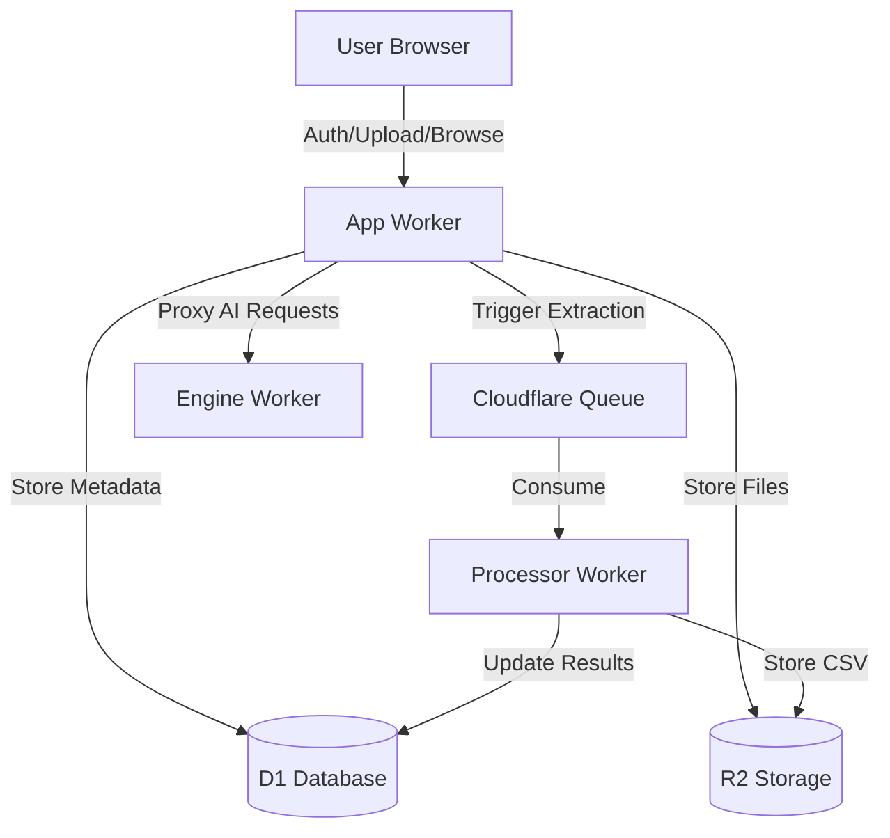
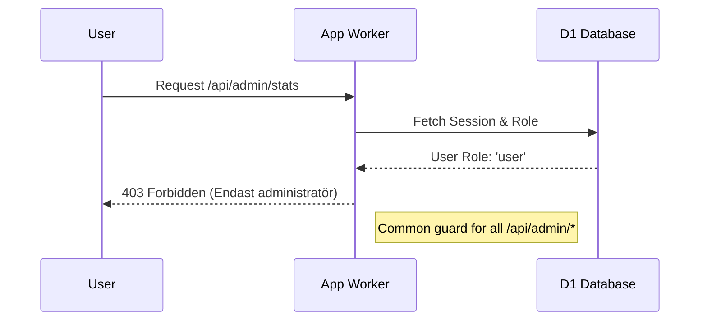

Relevant source files

The following files were used as context for generating this wiki page:

- [app/src/index.ts](app/src/index.ts)
- [DESIGN.md](DESIGN.md)
- [README.md](README.md)
- [PROPOSAL-hopslagen-app.md](PROPOSAL-hopslagen-app.md)
- [app/public/app.js](app/public/app.js)
- [engine/src/index.ts](engine/src/index.ts)

# App Worker API

The **App Worker API** serves as the primary interface for the Product Describer web application. Built on Cloudflare Workers, it handles user authentication, session management, file uploads, and product catalog interactions. It acts as the "brain" of the system, coordinating data between Cloudflare D1 (SQL database), R2 (object storage), and specialized background workers like the `processor` and `engine`.

Sources: [app/src/index.ts:1-15](app/src/index.ts#L1-L15), [README.md:10-15](README.md#L10-L15), [DESIGN.md:55-60](DESIGN.md#L55-L60)

## Architecture and Data Flow

The App Worker follows a serverless architecture where requests are routed based on HTTP methods and pathnames. It interacts with the following Cloudflare resources:
- **D1 Database**: Stores accounts, jobs, products, and configuration.
- **R2 Storage**: Holds uploaded source files and generated output files.
- **Queues**: Orchestrates background processing by sending `extract` messages to the processor worker.

### System Integration Flow
The following diagram illustrates how the App Worker interacts with users and other system components:

Sources: [app/src/index.ts:250-265](app/src/index.ts#L250-L265), [README.md:15-25](README.md#L15-L25), [DESIGN.md:40-50](DESIGN.md#L40-L50)

## API Endpoints

The API is categorized into public authentication routes, user-level catalog and social services (Ansökningsunderlag), and administrative management routes.

### Authentication and Session Management
Authentication transitioned from Cloudflare Access to a native application-level system supporting email/password and OAuth (Google/Microsoft).

| Endpoint | Method | Description |
| :--- | :--- | :--- |
| `/signup` | POST | Creates a new user account with rate limiting (5 per hour). |
| `/login` | POST | Authenticates user and sets a secure HTTP-only session cookie. |
| `/logout` | POST | Invalidates the session and clears the cookie. |
| `/api/oauth/:provider` | GET | Initiates OAuth flow with a state nonce for CSRF protection. |
| `/api/oauth/:provider/callback`| GET | Validates OAuth response and establishes a session. |

Sources: [app/src/index.ts:58-65](app/src/index.ts#L58-L65), [app/src/index.ts:285-305](app/src/index.ts#L285-L305), [PROPOSAL-hopslagen-app.md:20-35](PROPOSAL-hopslagen-app.md#L20-L35)

### Product Catalog and "Ansökningsunderlag"
These endpoints manage the public product catalog and the private list of items users collect for social assistance applications.

| Endpoint | Method | Description |
| :--- | :--- | :--- |
| `/api/catalog` | GET | Searches the D1 product catalog by query and category. |
| `/api/categories` | GET | Returns a list of all available product categories. |
| `/api/produkt/:id` | GET | Retrieves details for a specific product including price history. |
| `/api/produkt/:id/describe`| POST | Triggers or retrieves an AI-generated product description. |
| `/api/bistand` | GET | Lists the current user's saved items for assistance. |
| `/api/bistand` | POST | Adds or updates a product in the user's assistance list. |
| `/api/bistand/bulk` | POST | Adds multiple products filtered by query/category to the list. |

Sources: [app/src/index.ts:115-135](app/src/index.ts#L115-L135), [app/src/index.ts:155-165](app/src/index.ts#L155-L165), [app/public/app.js:180-210](app/public/app.js#L180-L210)

### File Processing and AI Configuration
Administrators use these endpoints to manage the bulk processing of product descriptions via uploaded files.

| Endpoint | Method | Description |
| :--- | :--- | :--- |
| `/api/upload` | POST | Uploads CSV/XLSX/PDF (max 50MB) and queues an extraction job. |
| `/api/settings/key`| POST | Configures encrypted API keys for AI providers (Anthropic, Gemini, etc). |
| `/api/jobs` | GET | Lists all file processing jobs belonging to the account. |
| `/api/jobs/:id/download`| GET | Downloads the resulting CSV file from R2. |

Sources: [app/src/index.ts:100-110](app/src/index.ts#L100-L110), [app/src/index.ts:240-260](app/src/index.ts#L240-L260), [SECURITY.md:15-20](SECURITY.md#L15-L20)

## Security and Authorization

The API implements a role-based access control (RBAC) system with two primary roles: `user` and `admin`.

### Access Control Logic

Sources: [app/src/index.ts:75-95](app/src/index.ts#L75-L95), [PROPOSAL-hopslagen-app.md:30-40](PROPOSAL-hopslagen-app.md#L30-L40)

### Key Security Features:
*  **Encrypted Storage**: AI provider keys are encrypted before being stored in D1, requiring a `PROVIDER_CONFIG_KEY` shared between the app and processor workers.
*  **Rate Limiting**: Critical endpoints like `/signup` and `/login` use a rate-limiting mechanism based on the `CF-Connecting-IP` header.
*  **File Validation**: Uploads are restricted to specific suffixes (`.csv`, `.xlsx`, `.txt`, `.docx`, `.pdf`) and a 50MB size limit.

Sources: [app/src/index.ts:245-255](app/src/index.ts#L245-L255), [app/src/index.ts:315-325](app/src/index.ts#L315-L325), [SECURITY.md:15-22](SECURITY.md#L15-L22)

## Data Models

The API interacts with several key D1 tables. Below are the primary fields managed through the App Worker API.

### Accounts and Products
| Table | Fields | Description |
| :--- | :--- | :--- |
| `accounts` | `id`, `email`, `role`, `describe_mode` | User identity and preference. |
| `products` | `id`, `url`, `title`, `current_price`, `description` | Core catalog data. |
| `jobs` | `id`, `account_id`, `filename`, `status` | File processing task tracking. |
| `price_watch` | `account_id`, `product_id`, `last_alert` | User tracking for price drops. |

Sources: [DESIGN.md:95-115](DESIGN.md#L95-L115), [PROPOSAL-hopslagen-app.md:85-95](PROPOSAL-hopslagen-app.md#L85-L95), [engine/src/index.ts:135-150](engine/src/index.ts#L135-L150)

## Conclusion
The App Worker API provides the structural backbone for the Product Describer, managing the transition from a private scraper to a public-facing utility. By centralizing logic in Cloudflare Workers and utilizing D1 for state, it ensures high availability and zero running costs for basic operations, while delegating heavy lifting to specialized background processors and queues.
