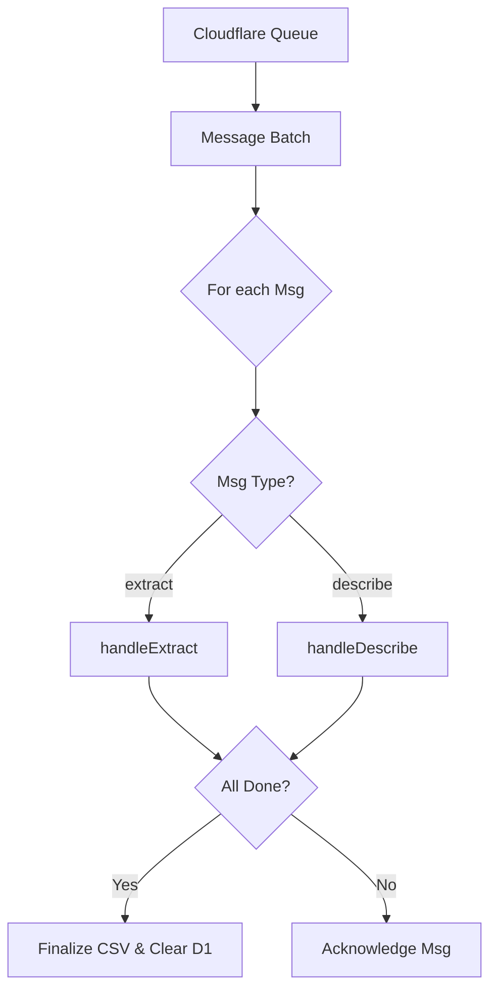
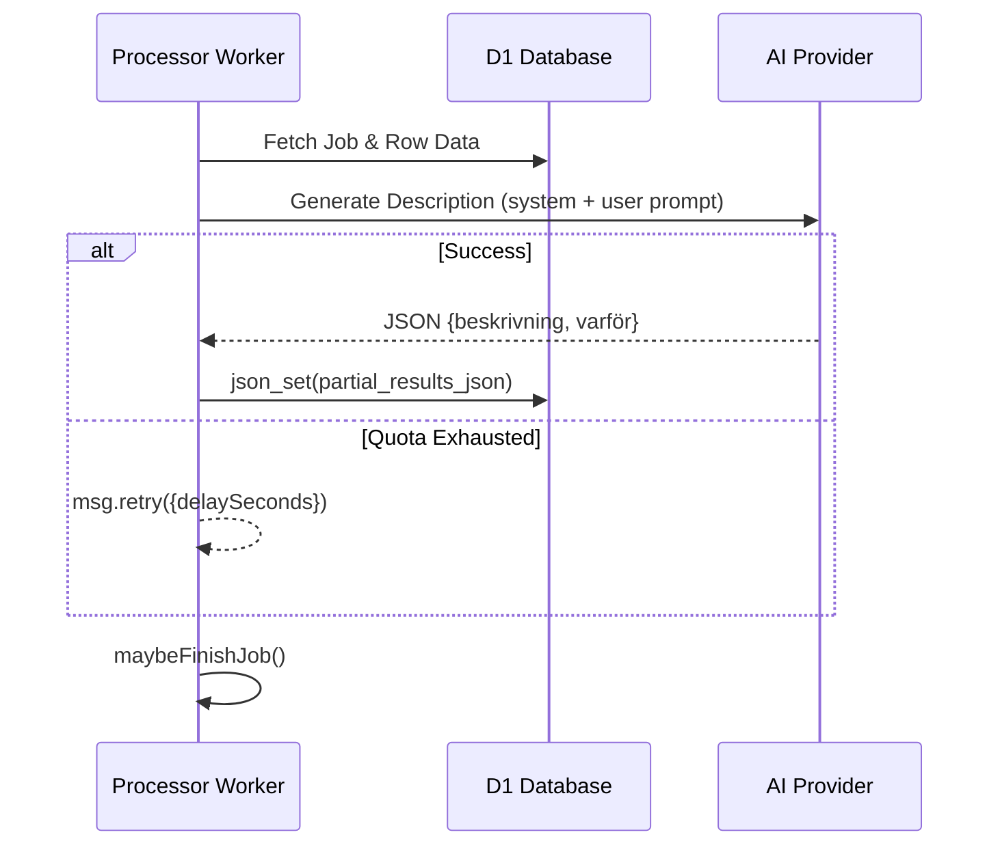

Relevant source files

The following files were used as context for generating this wiki page:

- [processor/src/index.ts](processor/src/index.ts)
- [README.md](README.md)
- [DESIGN.md](DESIGN.md)
- [processor/package.json](processor/package.json)
- [app/public/app.js](app/public/app.js)

# Processor Worker (Queue Consumer)

## Introduction
The **Processor Worker** is a Cloudflare Workers-based queue consumer responsible for the heavy lifting of product data extraction and AI description generation. It replaces the background thread architecture of the original Flask version, utilizing **Cloudflare Queues** to handle long-running tasks that would otherwise exceed standard Worker execution limits.

The worker operates in two primary stages: first, it extracts product rows from uploaded files (CSV, XLSX, TXT, DOCX, or PDF); second, it generates AI-driven descriptions for each individual product row. This asynchronous, message-based approach allows for high concurrency and robust error handling, including automatic retries during AI provider rate-limiting events.

Sources: [README.md:12-16](README.md#L12-L16), [processor/src/index.ts:1-12](processor/src/index.ts#L1-L12)

## Architecture and Data Flow
The Processor Worker is architected as a stateless consumer of a `JobMessage` queue. It interacts with Cloudflare R2 for file storage, Cloudflare D1 for job state persistence, and external AI providers for text generation.

### Message Processing Logic
The worker handles a batch of messages, routing them based on the `type` field in the message body.

The diagram shows the high-level flow of message consumption within the worker.
Sources: [processor/src/index.ts:46-59](processor/src/index.ts#L46-L59)

### Job State Transitions
Jobs move through various statuses in the D1 database as the processor works through the queue.

| Status | Description |
| :--- | :--- |
| `queued` | Initial state after file upload. |
| `processing` | File has been extracted and description tasks are enqueued. |
| `paused` | AI provider quota exhausted; worker is waiting for a retry window. |
| `done` | All rows processed and final CSV generated in R2. |
| `error` | Processing failed due to file errors or configuration issues. |

Sources: [app/public/app.js:148-154](app/public/app.js#L148-L154), [processor/src/index.ts:107-150](processor/src/index.ts#L107-L150)

## Core Functional Components

### Extraction Phase (`handleExtract`)
The extraction phase is the first step triggered by an `extract` message. It retrieves the raw file from R2 and uses specialized extractors to parse product data.

1.  **Job Validation**: Checks if the job still exists in D1.
2.  **File Retrieval**: Fetches the `arrayBuffer` from the `UPLOADS` R2 bucket using the `r2_key`.
3.  **Parsing**: Uses `extractRows` (supporting XLSX, Mammoth for DOCX, and Unpdf for PDF) to convert the file into a structured `ExtractedRows` object.
4.  **Row Persistence**: Saves the extracted rows as JSON in the D1 `jobs` table to ensure the `describe` phase can access specific indices without re-parsing.
5.  **Fan-out**: Enqueues individual `describe` messages for every extracted row.

Sources: [processor/src/index.ts:80-117](processor/src/index.ts#L80-L117), [processor/package.json:16-18](processor/package.json#L16-L18)

### Description Phase (`handleDescribe`)
The description phase processes individual rows. This component utilizes a "Provider Chain" to handle AI requests across multiple models (Anthropic, OpenAI, Gemini, etc.).

The diagram illustrates the asynchronous processing of a single product description and its persistence.
Sources: [processor/src/index.ts:133-176](processor/src/index.ts#L133-L176)

### Job Finalization (`maybeFinishJob`)
Because the description phase runs in parallel (controlled by queue `max_concurrency`), the worker must determine when a job is complete.

*  **Atomic Aggregation**: Uses SQL `json_set` to merge results into `partial_results_json` to avoid race conditions between parallel workers.
*  **Completion Check**: Compares the count of keys in `partial_results_json` against the total expected rows.
*  **CSV Generation**: Once all rows are present, it reconstructs a CSV file including the original headers plus "Beskrivning" (Description) and "Varför" (Why) columns.
*  **R2 Storage**: Saves the final CSV back to R2 and updates the job status to `done`.

Sources: [processor/src/index.ts:182-212](processor/src/index.ts#L182-L212)

## Technical Specifications and Dependencies

### Environment Variables and Secrets
The worker relies on several Cloudflare bindings and secrets configured in `wrangler.jsonc`.

| Name | Type | Description |
| :--- | :--- | :--- |
| `DB` | D1 Database | Persists job status and metadata. |
| `UPLOADS` | R2 Bucket | Stores raw uploads and finished results. |
| `JOB_QUEUE` | Queue | Orchestrates extraction and description tasks. |
| `PROVIDER_CONFIG_KEY` | Secret | Key used to decrypt provider API keys. |
| `SENTRY_DSN` | Secret | Error tracking and logging. |

Sources: [processor/src/index.ts:22-26](processor/src/index.ts#L22-L26), [SECURITY.md:16-20](SECURITY.md#L16-L20), [README.md:46-50](README.md#L46-L50)

### Integrated Libraries
The Processor Worker leverages several libraries to handle diverse file formats and observability.
*  **xlsx**: Parses Excel spreadsheets.
*  **mammoth**: Extracts text from `.docx` files.
*  **unpdf**: Processes `.pdf` documents.
*  **@sentry/cloudflare**: Provides automated error reporting and tracing.

Sources: [processor/package.json:12-19](processor/package.json#L12-L19)

## Error Handling and Resilience
The Processor Worker implements a robust retry strategy, particularly for AI provider limitations.

1.  **Rate Limit Handling**: If an AI provider returns a rate limit error, the worker catches `AllProvidersExhausted`, calculates the `resumeAt` delay, and uses `msg.retry({delaySeconds})` to put the message back in the queue.
2.  **Global Error Catch**: A top-level `try-catch` in the queue handler reports unexpected failures to GitHub via a dedicated error reporting utility, ensuring bugs are tracked as issues.
3.  **Graceful Failure**: Individual row failures in the description phase do not halt the entire job; the worker saves an empty result and moves to the next row to allow the job to complete partially.

Sources: [processor/src/index.ts:60-70](processor/src/index.ts#L60-L70), [processor/src/index.ts:161-167](processor/src/index.ts#L161-L167), [README.md:28-34](README.md#L28-L34)

## Conclusion
The Processor Worker serves as the scalable execution engine for the product-describer system. By leveraging Cloudflare Queues and D1, it transforms long-running file processing tasks into manageable, parallelized units of work. Its design ensures that AI quota issues are handled through delayed retries rather than process failures, providing a resilient background processing layer for the application.
