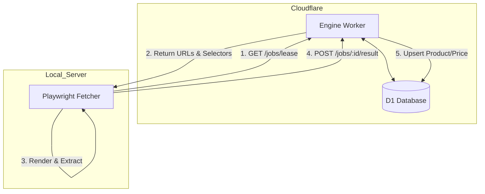
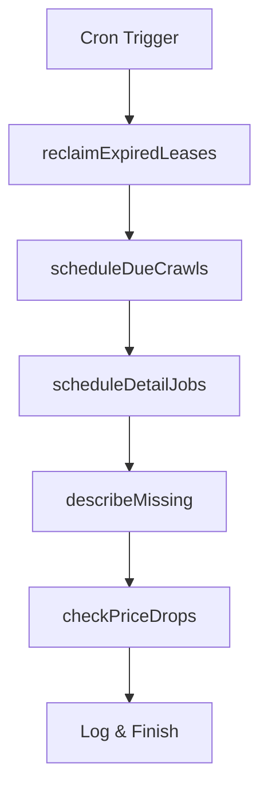

Relevant source files

The following files were used as context for generating this wiki page:

- [engine/src/index.ts](engine/src/index.ts)
- [DESIGN.md](DESIGN.md)
- [infra/schema.sql](infra/schema.sql)
- [README.md](README.md)
- [app/src/catalog.ts](app/src/catalog.ts)
- [PROPOSAL-hopslagen-app.md](PROPOSAL-hopslagen-app.md)

# Engine Worker (Catalog Engine)

The Engine Worker, also referred to as the Catalog Engine, serves as the "brain and memory" of the unified product-describer architecture. It is a Cloudflare Worker responsible for managing the durable product catalog, scheduling web rendering jobs, and driving the automated discovery and description of products. By centralizing logic and state in Cloudflare D1, the system transitions from a fragile server-based setup to a resilient architecture where the local server acts only as a stateless "muscle" for web scraping.

Sources: [DESIGN.md:23-28](DESIGN.md#L23-L28), [README.md:16-19](README.md#L16-L19), [engine/src/index.ts:1-12](engine/src/index.ts#L1-L12)

## Architecture Overview

The Engine Worker operates through two primary interfaces: a set of HTTP endpoints for external communication and a Cron Trigger for internal scheduled tasks. It interacts primarily with a Cloudflare D1 database which stores the master product catalog, site configurations, and a job queue.

### High-Level Data Flow

The following diagram illustrates the relationship between the Engine Worker, the stateless server-side fetcher, and the D1 storage.

The Engine Worker manages the "lease/ack" pattern, replacing traditional message queues to stay within resource limits while ensuring job reliability.

Sources: [DESIGN.md:41-60](DESIGN.md#L41-L60), [engine/src/index.ts:14-25](engine/src/index.ts#L14-L25)

## Job Management & Ingest API

The Engine Worker provides a secure API (protected by `X-API-Key`) for the external fetcher to receive work and report findings. 

### Key API Endpoints

| Endpoint | Method | Description |
| :--- | :--- | :--- |
| `/jobs/lease` | POST | Leases $N$ pending render jobs (list or detail types). Sets `status = 'leased'`. |
| `/jobs/:id/result` | POST | Reports extraction results. Upserts products/prices and closes the job. |
| `/ingest` | POST | Bulk-upserts products into D1 (used for migrations and discovery). |
| `/describe` | POST | Generates an AI description for a specific product on-demand. |

Sources: [engine/src/index.ts:16-25](engine/src/index.ts#L16-L25), [engine/src/index.ts:89-91](engine/src/index.ts#L89-L91), [engine/src/index.ts:167-169](engine/src/index.ts#L167-L169), [engine/src/index.ts:275-277](engine/src/index.ts#L275-L277)

### Lease Logic
Jobs are categorized as either `list` (crawling discovery pages) or `detail` (rendering individual product pages). `list` jobs are prioritized and granted longer lease times (15 minutes) compared to `detail` jobs (2 minutes).

Sources: [engine/src/index.ts:52-53](engine/src/index.ts#L52-L53), [engine/src/index.ts:107-112](engine/src/index.ts#L107-L112)

## The Cron Handler (Sequential Orchestration)

A single Cron Trigger (`*/5 * * * *`) drives the entire catalog lifecycle. It executes multiple periodic tasks sequentially within one invocation to avoid coordination overhead.

### Scheduled Tasks Execution Order

1.  **Reclaim Leases:** Resets jobs that were leased but never reported back (e.g., fetcher crash) to `pending` status.
2.  **Schedule Crawls:** Identifies sites whose `scrape_interval` has passed and creates new `list` jobs.
3.  **Schedule Detail Jobs:** Creates `detail` jobs for products found during crawls that lack `source_text`.
4.  **Describe Missing:** Uses Gemini/Haiku LLMs to generate descriptions for products, limited by a configurable tick-cap.
5.  **Check Price Drops:** Monitors `price_history` for significant drops and triggers alerts.

Sources: [DESIGN.md:129-140](DESIGN.md#L129-L140), [engine/src/index.ts:521-540](engine/src/index.ts#L521-L540)

## Data Schema (D1)

The Engine Worker relies on a relational schema in D1 to manage the state of the catalog and the scraper muscle.

| Table | Key Fields | Description |
| :--- | :--- | :--- |
| `sites` | `base_url`, `scrape_interval`, `detail_selector` | Configuration for target domains. |
| `products` | `url`, `title`, `current_price`, `source_text` | Master product catalog and AI enrichments. |
| `price_history` | `product_id`, `price`, `ts` | Temporal price data for trend analysis. |
| `render_jobs` | `url`, `type`, `status`, `lease_until` | The custom job queue for the fetcher. |
| `price_watch` | `account_id`, `product_id`, `last_alert` | User-defined product alerts. |

Sources: [infra/schema.sql:71-155](infra/schema.sql#L71-L155), [DESIGN.md:92-113](DESIGN.md#L92-L113)

## Price Monitoring & Alerts

The Engine Worker implements price monitoring logic within the `checkPriceDrops` function. It compares the two most recent prices for a product in the `price_history` table. An alert is triggered if:
*  The price drop is $\ge 5\%$ (configurable via `ALERT_MIN_DROP_PCT`).
*  The price drop is $\ge 100$ kr (configurable via `ALERT_MIN_DROP_KR`).
*  The `last_alert` cooldown (default 24h) has expired.

Alerts are dispatched to modular channels including **ntfy**, **Slack**, **Telegram**, and generic **webhooks**.

Sources: [engine/src/index.ts:446-455](engine/src/index.ts#L446-L455), [engine/src/index.ts:474-485](engine/src/index.ts#L474-L485), [PROPOSAL-hopslagen-app.md:52-57](PROPOSAL-hopslagen-app.md#L52-L57)

## AI Description Logic

Descriptions are generated using a `ProviderChain` that abstracts multiple AI backends (Anthropic, OpenAI, Gemini, Azure OpenAI). The engine uses a dual-approach:
*  **Background:** The `describeMissing` function processes products incrementally during the cron tick.
*  **On-Demand:** The `describeProduct` endpoint allows the `app` Worker to request an immediate description when a user views a product, caching the result in D1.

Sources: [engine/src/index.ts:353-370](engine/src/index.ts#L353-L370), [engine/src/index.ts:420-435](engine/src/index.ts#L420-L435), [app/src/catalog.ts:42-50](app/src/catalog.ts#L42-L50)

## Conclusion

The Engine Worker is the central orchestrator that transforms raw web data into an enriched product catalog. By leveraging Cloudflare's D1 and Cron Triggers, it maintains a highly available "brain" that manages a distributed fleet of scrapers while providing reliable, AI-enhanced data to the frontend application. Through its sequential cron execution and D1-backed job queue, it achieves a zero-maintenance, low-cost architectural design.

Sources: [DESIGN.md:23-35](DESIGN.md#L23-L35), [README.md:16-25](README.md#L16-L25)
