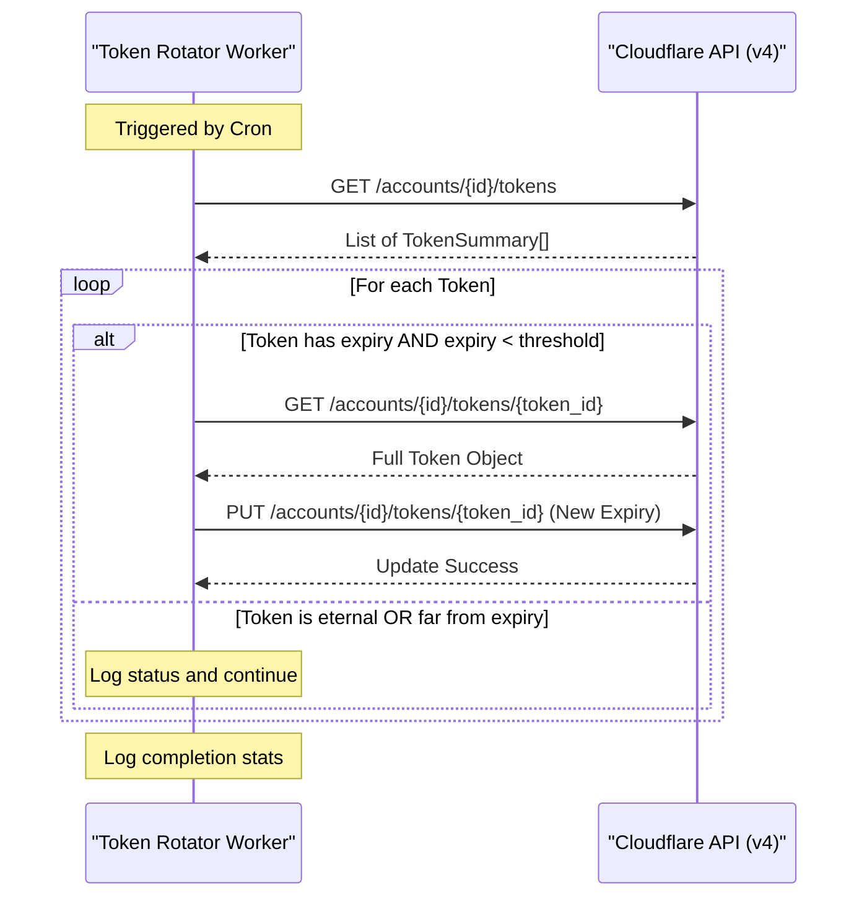

<details>
<summary>Relevant source files</summary>

The following files were used as context for generating this wiki page:

- [token-rotator/src/index.ts](token-rotator/src/index.ts)
- [token-rotator/package.json](token-rotator/package.json)
- [README.md](README.md)
- [DESIGN.md](DESIGN.md)
- [engine/src/index.ts](engine/src/index.ts)
</details>

# Token Rotator Worker

The Token Rotator Worker is a specialized Cloudflare Worker designed to automate the maintenance of Cloudflare API tokens. Its primary purpose is to prevent service interruptions caused by silently expiring tokens. By running as a scheduled Cron Trigger, the worker identifies tokens nearing their expiration threshold and extends their validity, effectively making the account's token hygiene self-sustaining as long as the worker is active and the account remains in good standing.

Sources: [token-rotator/src/index.ts:1-12](token-rotator/src/index.ts#L1-L12), [README.md:19-27](README.md#L19-L27)

## Architecture and Design

The Token Rotator is built as a headless Cloudflare Worker, meaning it contains no HTTP routes and cannot be invoked externally. This design choice minimizes the attack surface, as the worker carries a powerful administrative token. It operates solely through the `scheduled()` handler, triggered by Cloudflare's Cron system.

### Core Logic Flow
The worker follows a sequential logic path during each execution tick:
1.  **Authentication**: Authenticates with the Cloudflare API using a high-privilege administrative token (`CF_ADMIN_TOKEN`).
2.  **Token Discovery**: Fetches a list of all API tokens associated with the specified account.
3.  **Expiry Evaluation**: Iterates through each token to check if it has an expiration date and if that date falls within a configurable "danger zone" (threshold).
4.  **Extension**: For tokens nearing expiration, it fetches the full token definition (including policies and conditions) and performs a `PUT` request to update the expiration date to a future point.

Sources: [token-rotator/src/index.ts:14-16](token-rotator/src/index.ts#L14-L16), [token-rotator/src/index.ts:46-55](token-rotator/src/index.ts#L46-L55)

### Data Flow Diagram

The following diagram illustrates the interaction between the Token Rotator Worker and the Cloudflare Client API.



Sources: [token-rotator/src/index.ts:57-93](token-rotator/src/index.ts#L57-L93)

## Configuration

The worker relies on environment variables (secrets) and internal constants to manage the rotation logic.

### Environment Variables

| Variable | Type | Description |
| :--- | :--- | :--- |
| `CF_ADMIN_TOKEN` | Secret | Cloudflare API Token with "Account API Tokens: Write" permissions. |
| `CF_ACCOUNT_ID` | String | The target Cloudflare Account ID. |
| `THRESHOLD_DAYS` | String | The number of days before expiration to trigger a rotation (Default: 30). |
| `EXTEND_DAYS` | String | The number of days to extend the token by (Default: 365). |
| `SENTRY_DSN` | String | Optional Sentry DSN for error reporting. |

Sources: [token-rotator/src/index.ts:18-24](token-rotator/src/index.ts#L18-L24), [token-rotator/src/index.ts:51-52](token-rotator/src/index.ts#L51-L52), [token-rotator/package.json:8](token-rotator/package.json#L8)

### Key Technical Constants and Interfaces

The worker uses a simplified internal fetch wrapper `cf()` to interact with the Cloudflare API at `https://api.cloudflare.com/client/v4`.

```typescript
interface TokenSummary {
  id: string;
  name: string;
  status: string;
  expires_on?: string;
}
```

Sources: [token-rotator/src/index.ts:28-33](token-rotator/src/index.ts#L28-L33), [token-rotator/src/index.ts:35-42](token-rotator/src/index.ts#L35-L42)

## Error Handling and Monitoring

The Token Rotator Worker integrates with Sentry for automated error tracking. The implementation uses `@sentry/cloudflare` to wrap the exported handler. 

Key error scenarios handled include:
*  **Missing Credentials**: If `CF_ACCOUNT_ID` or `CF_ADMIN_TOKEN` are not provided, the worker logs an error and terminates.
*  **API Failures**: If the worker cannot list tokens or update a specific token, it logs the API error response but continues processing other tokens in the list.
*  **Rate Limiting/Auth Errors**: Errors returned by the Cloudflare API are captured and logged to the console (and Sentry, if configured).

Sources: [token-rotator/src/index.ts:44-50](token-rotator/src/index.ts#L44-L50), [token-rotator/src/index.ts:57-61](token-rotator/src/index.ts#L57-L61), [token-rotator/src/index.ts:88-91](token-rotator/src/index.ts#L88-L91)

## Deployment and Maintenance

The worker is deployed using `wrangler`. A specific script is provided in `package.json` to manage the administrative secret.

| Script | Command | Purpose |
| :--- | :--- | :--- |
| `deploy` | `wrangler deploy` | Deploys the worker to Cloudflare. |
| `typecheck` | `tsc --noEmit` | Validates TypeScript types. |
| `secret:set-admin` | `wrangler secret put CF_ADMIN_TOKEN` | Safely uploads the high-privilege admin token. |

Sources: [token-rotator/package.json:5-9](token-rotator/package.json#L5-L9)

## Conclusion
The Token Rotator Worker is a critical utility within the `product-describer-cloudflare` ecosystem, ensuring that the background processes (like the `engine` and `processor`) maintain valid authentication without manual intervention. By self-perpetuating its own administrative token, it provides long-term stability for the project's infrastructure on Cloudflare.

Sources: [token-rotator/src/index.ts:5-12](token-rotator/src/index.ts#L5-L12)
