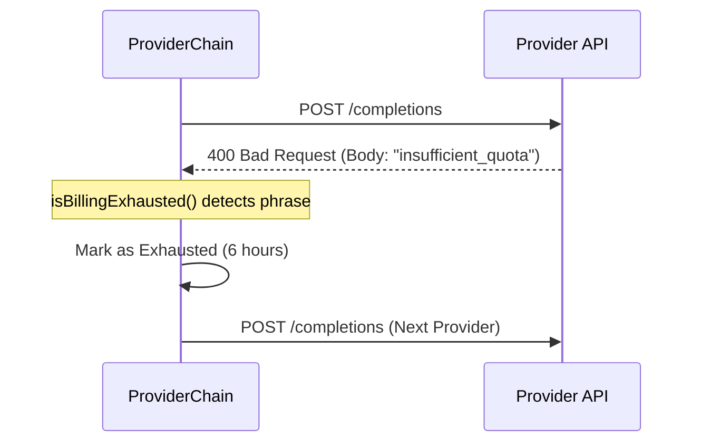

<details>
<summary>Relevant source files</summary>

The following files were used as context for generating this wiki page:

- [shared/providers.ts](shared/providers.ts)
- [README.md](README.md)
- [engine/src/index.ts](engine/src/index.ts)
- [processor/src/extractors.ts](processor/src/extractors.ts)
- [infra/schema.sql](infra/schema.sql)
- [app/public/app.js](app/public/app.js)
</details>

# Supported AI Providers

The Product Describer project utilizes multiple Large Language Model (LLM) providers to generate high-quality product descriptions and extract structured product data from unstructured documents. Because the system runs on Cloudflare Workers, it bypasses official SDKs in favor of raw `fetch()` calls to provider REST APIs to remain compatible with the Workers runtime.

Sources: [shared/providers.ts:1-6](shared/providers.ts#L1-L6), [README.md:12-14](README.md#L12-L14)

## Architecture and Implementation

The project implements a provider-agnostic interface that allows it to switch between different AI services seamlessly. This is primarily managed through the `ProviderChain` class, which handles failover logic and rate limit management across a sequence of configured providers.

### Core Components

| Component | Description |
| :--- | :--- |
| `ProviderChain` | Manages a list of `ProviderSpec` objects and executes requests using an available provider, handling failover on errors. |
| `generate()` | A polymorphic function that routes requests to specific provider implementations (Anthropic, OpenAI, Gemini, Azure). |
| `ProviderCreds` | Interface for storing API keys and endpoint configurations. |
| `RateLimitExceeded` | Custom error thrown when a provider returns a 429 status or indicates quota exhaustion. |

Sources: [shared/providers.ts:11-20](shared/providers.ts#L11-L20), [shared/providers.ts:50-65](shared/providers.ts#L50-L65), [shared/providers.ts:133-145](shared/providers.ts#L133-L145)

### Data Flow for Request Execution

The following diagram illustrates how the `ProviderChain` selects a provider and handles potential rate limits or billing exhaustion before successfully returning a generated description.

```mermaid
flowchart TD
    Start[Request Received] --> CheckIndex{Available Provider?}
    CheckIndex -- No --> Error[Throw AllProvidersExhausted]
    CheckIndex -- Yes --> Call[Execute generate()]
    Call --> Success{Success?}
    Success -- Yes --> Return[Return Response]
    Success -- No --> IsRateLimit{Rate Limited?}
    IsRateLimit -- Yes --> MarkExhausted[Mark Provider Exhausted]
    MarkExhausted --> CheckIndex
    IsRateLimit -- No --> Fatal[Throw General Error]
```

Sources: [shared/providers.ts:153-176](shared/providers.ts#L153-L176)

## Supported Model Providers

The system explicitly supports four major AI providers. Default models are configured for each to ensure immediate functionality upon providing an API key.

### Provider Comparison

| Provider | Supported Models | Configuration Requirements |
| :--- | :--- | :--- |
| **Anthropic** | Claude Sonnet 4-6, Haiku 4-5, Opus 4-8 | `apiKey` |
| **OpenAI** | GPT-4.1, GPT-4.1-mini, GPT-4o | `apiKey` |
| **Gemini** | Gemini 2.5 Flash, Flash-Lite, Pro | `apiKey` |
| **Azure OpenAI** | User-defined deployments | `apiKey`, `endpoint`, `deployment` |

Sources: [shared/providers.ts:39-45](shared/providers.ts#L39-L45), [shared/providers.ts:47-51](shared/providers.ts#L47-L51)

### AI-Powered Features

The AI providers are used in two primary contexts within the application:

1.  **Product Description Generation:** Used in `engine/src/index.ts` and `app/public/app.js` to create creative descriptions from raw source text.
2.  **Product Extraction:** Used in `processor/src/extractors.ts` to identify and parse products from `.txt`, `.docx`, and `.pdf` files into structured JSON data.

Sources: [engine/src/index.ts:251-285](engine/src/index.ts#L251-L285), [processor/src/extractors.ts:109-130](processor/src/extractors.ts#L109-L130)

## Error Handling and Quota Management

The system treats billing exhaustion and rate limits similarly to ensure high availability. When a provider returns specific error phrases related to "insufficient quota" or "billing," the system triggers a `RateLimitExceeded` error with a default retry delay of 6 hours.



Sources: [shared/providers.ts:24-34](shared/providers.ts#L24-L34), [shared/providers.ts:121-127](shared/providers.ts#L121-L127)

## Storage and Configuration

Provider configurations are stored in the `provider_configs` table in D1. To ensure security, these configurations (including API keys) are AES-GCM encrypted.

### Database Schema for Providers

```sql
CREATE TABLE provider_configs (
  account_id TEXT NOT NULL REFERENCES accounts(id),
  provider TEXT NOT NULL,
  encrypted_config TEXT NOT NULL,
  PRIMARY KEY (account_id, provider)
);

CREATE TABLE provider_order (
  account_id TEXT PRIMARY KEY REFERENCES accounts(id),
  order_json TEXT NOT NULL
);
```

Sources: [infra/schema.sql:24-35](infra/schema.sql#L24-L35)

## Conclusion

The "Supported AI Providers" system provides a robust, fail-safe layer for AI interactions. By abstracting the complexities of multiple REST APIs into a unified `ProviderChain`, the project ensures that product descriptions and data extraction remain functional even if individual providers hit rate limits or experience service interruptions.

Sources: [shared/providers.ts:133-145](shared/providers.ts#L133-L145), [README.md:12-18](README.md#L12-L18)
